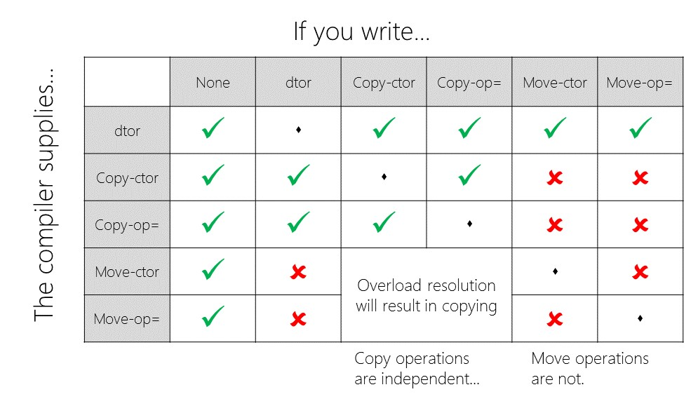

# Technical Note. From C++1998 to C++2020

[Konstantin Burlachenko](https://burlachenkok.github.io/)

[King Abdullah University of Science and Technology](https://www.kaust.edu.sa/en), Thuwal, Saudi Arabia.

Correspondence to: konstantin.burlachenko@kaust.edu.sa


**Editors:**

* [Vadim Sofin](https://github.com/sovadim) ex-[HUAWEI](https://www.huawei.ru/) / ex-[Yandex](https://yandex.ru/).
* [Mikhail Filimonov](https://github.com/dosvidos) from [NVIDIA](http://nvida.com/).
* [Dmytro Ovdiienko](https://github.com/ujos) Principal Software Engineer *Low Latency Systems* from Quiet Light Trading.

----

Revision Update: July 2, 2023

© 2022-2023 Konstantin Burlachenko, all rights reserved.

----

**Table of Content**

- [Introduction](#introduction)
- [Prepare Environment](#prepare-environment)
- [Glossary](#glossary)
- [Motivation](#motivation)
  - [Downsides of Interpretable Languages](#downsides-of-interpretable-languages)
  - [Downsides of C/C++](#downsides-of-cc)
- [Deep Principles of the Language](#deep-principles-of-the-language)
- [Why learn C++ if I know Python (Toy Example)](#why-learn-c-if-i-know-python-toy-example)
- [Standards for the Language](#standards-for-the-language)
- [Language Guarantees](#language-guarantees)
- [Stages of Source Code Translation in C++](#stages-of-source-code-translation-in-c)
  - [The Compiler and Linker. Briefly](#the-compiler-and-linker-briefly)
  - [The Compiler and Linker. Details](#the-compiler-and-linker-details)
    - [Initial Textual Source Code Processing and C Preprocessing](#initial-textual-source-code-processing-and-c-preprocessing)
    - [Lexical Analysis](#lexical-analysis)
    - [Syntax Analysis](#syntax-analysis)
    - [Semantic Analysis](#semantic-analysis)
    - [Code Optimization](#code-optimization)
    - [Code Emitting](#code-emitting)
    - [Calling Assembler Program](#calling-assembler-program)
- [Linkage](#linkage)
- [What is Impossible Even in C/C++](#what-is-impossible-even-in-cc)
- [For People New to C++](#for-people-new-to-c)
- [About C/C++ Preprocessor](#about-cc-preprocessor)
  - [Include Search Order](#include-search-order)
  - [Include Files Naming](#include-files-naming)
  - [Predefined Identifiers and Macros](#predefined-identifiers-and-macros)
- [Language Rules](#language-rules)
  - [Names Overloading](#names-overloading)
  - [Literal Constants](#literal-constants)
  - [Prefixes for Strings from C++11](#prefixes-for-strings-from-c11)
  - [Function Call Nuances](#function-call-nuances)
  - [Requirements for C++ Expressions](#requirements-for-c-expressions)
  - [Exceptions to the One Definition Rule](#exceptions-to-the-one-definition-rule)
  - [Integer Arithmetic and Enumerations](#integer-arithmetic-and-enumerations)
  - [Integer Types Nuances](#integer-types-nuances)
  - [Auto Type Deduction](#auto-type-deduction)
  - [Range-Based For Loop](#range-based-for-loop)
- [Technical Differences between C and C++](#technical-differences-between-c-and-c)
- [Memory](#memory)
  - [Memory Types and Pointers](#memory-types-and-pointers)
  - [Used Memory for Types and Their Layout](#used-memory-for-types-and-their-layout)
  - [New Operator](#new-operator)
  - [Placement New](#placement-new)
  - [Pseudo Destructor](#pseudo-destructor)
  - [Aggregates](#aggregates)
  - [POD or Plain Old Datatype (C++03)](#pod-or-plain-old-datatype-c03)
  - [Standard Layout (From C++11)](#standard-layout-from-c11)
- [Built-in Type Conversion](#built-in-type-conversion)
  - [Prohibited Conversions](#prohibited-conversions)
  - [The Sequence of Type Conversions Rules in C/C++](#the-sequence-of-type-conversions-rules-in-cc)
- [Namespaces](#namespaces)
  - [Basics about Namespaces](#basics-about-namespaces)
  - [Namespace Lookup Rules](#namespace-lookup-rules)
  - [Examples of Using Keyword using](#examples-of-using-keyword-using)
- [Exceptions](#exceptions)
  - [Basics about Exceptions](#basics-about-exceptions)
  - [Extra about Exceptions](#extra-about-exceptions)
- [Overloading](#overloading)
  - [Functions and Operator Overloading Precedence](#functions-and-operator-overloading-precedence)
  - [Template Function Overloading](#template-function-overloading)
  - [Resolving the Overloaded Binary Operator for x(op)y](#resolving-the-overloaded-binary-operator-for-xopy)
  - [Operators Overloading Rules in C++](#operators-overloading-rules-in-c)
- [Keyword typename](#keyword-typename)
- [Class Constructor and Destructors](#class-constructor-and-destructors)
  - [Logic behind executing Constructors](#logic-behind-executing-constructors)
  - [Logic behind Executing Destructors](#logic-behind-executing-destructors)
  - [Deleting Object of Incomplete Type](#deleting-object-of-incomplete-type)
  - [Generate And Suppress Generation of Special Class Members](#generate-and-suppress-the-generation-of-special-class-members)
  - [Some Class Special Members (since C++11)](#some-class-special-members-since-c11)
- [Initialization](#initialization)
  - [C++ Variable Initialization](#c-variable-initialization)
  - [std::initializer_list<T>](#stdinitializer_listt)
  - [Various Constants Flavors](#various-constants-flavors)
    - [const (C++03)](#const-c03)
    - [constexpr (C++11)](#constexpr-c11)
    - [consteval (C++20)](#consteval-c20)
    - [constinit (C++20)](#constinit-c20)
- [Compute Optimization Relative Information](#compute-optimization-relative-information)
  - [Return Value Optimization](#return-value-optimization)
  - [Inline Function Call](#inline-function-call)
  - [Force Inline Function Call](#force-inline-function-call)
  - [Allowable Reformulations](#allowable-reformulations)
  - [Compiler Implementation Relative Questions](#compiler-implementation-relative-questions)
  - [std::aligned_storage](#stdaligned_storage)
  - [Memory Aliasing and restrict](#memory-aliasing-and-restrict)
  - [Clobbered by call](#clobbered-by-call)
  - [Popular Compiler Flags for Optimization](#popular-compiler-flags-for-optimization)
  - [Several Principles for Code Optimization](#several-principles-for-code-optimization)
- [Lambda Functions](#lambda-functions)
- [Move Semantics](#move-semantics)
- [Virtual Functions and Polymorphism in C++](#virtual-functions-and-polymorphism-in-c)
  - [General Rules from C++03](#general-rules-from-c03)
  - [Override Specification (from C++11)](#override-specification-from-c11)
  - [Final Specification](#final-specification)
  - [Connection of Virtual Function with Default Values](#connection-of-virtual-function-with-default-values)
- [Miscellaneous Features of C++11](#miscellaneous-features-of-c11)
  - [1. emplace_back](#1-emplace_back)
  - [2. vector::shrink_to_fit](#2-vectorshrink_to_fit)
  - [3. noexcept function specification](#3-noexcept-function-specification)
  - [4. static_assert expression](#4-static_assert-expression)
  - [5. alignas operator](#5-alignas-operator)
  - [6. alignof operator](#6-alignof-operator)
  - [7. Default Member Initializers (C++11)](#7-default-member-initializers-c11)
  - [8. User-Defined Literals (UDL)](#8-user-defined-literals-udl)
  - [9. noreturn Attribute](#9-noreturn-attribute)
  - [10. Anonymous Unions](#10-anonymous-unions)
  - [11. Type Alias](#11-type-alias)
  - [12. Static Variables are Always Initialized Thread Safe](#12-static-variables-are-always-initialized-thread-safe)
  - [13. Delegating constructors](#13-delegating-constructors)
  - [14. Inheriting Constructors](#14-inheriting-constructors)
  - [15. Destructors are Implicitly noexcept](#15-destructors-are-implicitly-noexcept)
  - [16. Fixed Width Integer Types](#16-fixed-width-integer-types)
  - [17. Concurrency Support](#17-concurrency-support)
  - [18. Explicit Conversion Functions](#18-explicit-conversion-functions)
  - [19. Current Exception. Internal Details.](#19-current-exception-internal-details)
  - [20. The Trailing Return Type For Functions.](#20-The-trailing-return-type-for-functions)
  - [21. Return Type Deduction.](#21-return-type-deduction)
- [Miscellaneous Features of C++14](#miscellaneous-features-of-c14)
  - [1. deprecated Attribute](#1-deprecated-attribute)
  - [2. Return Type Deduction](#2-return-type-deduction)
  - [3. Binary Literals](#3-binary-literals)
  - [4. Variable Templates](#4-variable-templates)
  - [5. Delimiter Inside Numeric Literals](#5-delimiter-inside-numeric-literals)
  - [6. std::make_unique<T>](#6-stdmake_uniquet)
- [Miscellaneous Features of C++17](#miscellaneous-features-of-c17)
  - [1. Structured Binding](#1-structured-binding)
  - [2. Deduce Template Parameters from Ctor. Arguments](#2-deduce-template-parameters-from-ctor-arguments)
  - [3. Compile Time if](#3-compile-time-if)
  - [4. __has_include Macro](#4-__has_include-macro)
  - [5. std::byte](#5-stdbyte)
  - [6. Fallthrough Attribute](#6-fallthrough-attribute)
  - [7. Initialization Statements in if/switch/for](#7-initialization-statements-in-ifswitchfor)
  - [8. std::optional](#8-stdoptional)
  - [9. std::string_view](#9-stdstring_view)
  - [10. Inline Variables](#10-inline-variables)
  - [11. The Exception Specification has been Removed](#11-the-exception-specification-has-been-removed)
- [Miscellaneous Features of C++20](#miscellaneous-features-of-c20)
  - [1. no_unique_address Attribute](#1-no_unique_address-attribute)
  - [2. Spaceship operator](#2-spaceship-operator)
  - [3. likely and unlikely Attribute](#3-likely-and-unlikely-attribute)
  - [4. std::format()](#4-stdformat)
  - [5. source_location::current()](#5-source_locationcurrent)
  - [6. nodiscard(reason) Attribute](#6-nodiscardreason-attribute)
  - [7. Only one Signed Integer Representation](#7-only-one-signed-integer-representation)
  - [8. Right Shift is Arithmetic Right Shift](#8-right-shift-is-arithmetic-right-shift)
  - [9. Abbreviated Function Templates](#9-abbreviated-function-templates)
  - [10. Automatic generation of `!=` from `==`.](#10-automatic-generation-of--from-)
  - [11. Designated initializers](#11-designated-initializers)
  - [12. __has_cpp_attribute feature test](#12-__has_cpp_attribute-feature-test)
  - [13. Feature Test Macro](#13-feature-test-macro)
- [Modules (from C++20)](#modules-from-c20)
  - [Single Module Interface File/Module Unit](#single-module-interface-filemodule-unit)
  - [Module Interface File With Implementation inside it](#module-interface-file-with-implementation-inside-it)
  - [Module Interface File With Separate Implementation](#module-interface-file-with-separate-implementation)
  - [What you can not Define in a Module Implementation File](#what-you-can-not-define-in-a-module-implementation-file)
  - [Using Modules](#using-modules)
  - [Splitting Modules](#splitting-modules)
- [Templates](#templates)
  - [Template Parameters](#template-parameters)
  - [Template Syntax Remarks](#template-syntax-remarks)
  - [Template Instantiation](#template-instantiation)
  - [Variadic Templates](#variadic-templates)
  - [Template Specialization](#template-specialization)
  - [Templates Miscellaneous](#templates-miscellaneous)
  - [Reference Collapsing Rules and Universal Reference](#reference-collapsing-rules-and-universal-reference)
- [Variants of Casting](#variants-of-casting)
- [Concepts (from C++20)](#concepts-from-c20)
  - [Define Concepts](#define-concepts)
  - [Use Concepts](#use-concepts)
- [Coroutines (C++20)](#coroutines-c20)
- [Acknowledgements](#acknowledgements)
- [References](#references)

- [Appendices](#appendices)
  - [Virtual Inheritance Inside](#virtual-inheritance-inside)
  - [Object Orientated Design](#object-orientated-design)
  - [Object Orientated Design Patterns](#object-orientated-design-patterns)
  - [Performance optimization for general purpose CPU](#performance-optimization-for-general-purpose-cpu)

*[Table of contents generated with markdown-toc](http://ecotrust-canada.github.io/markdown-toc/)*

----

# Introduction

On that technical note, we would like to share complete information regarding the C programming language and all primary C++ programming language standards: C++03/98, C++11, C++14, C++17, and C++20. If you do not know C/C++, this note is less likely for you because it contains subtle technical details for people who are at least familiar with it a bit. Here "know" has a weak sense. We have also tried to appeal in that note to people with a not-so-big background in C/C++.

Do not get us wrong. If you have never seen the C/C++ language to obtain knowledge, we recommend first dedicating some time to reading original books by Bjarne Stroustrup. It would be only more effective for you. In recent years, Bjarne Stroustrup has made a lot of effort by providing easy-to-read books such as ["Principles and Practice Using C++"](https://www.stroustrup.com/programming.html) and ["A Tour of C++ (Second Edition)"](https://www.stroustrup.com/Tour.html). We highly recommend for whom this language is new to first read any of those books.

If you're unsure whether you should learn C++ or not, then maybe the example presented in section *[Why learn C++ if I know Python (Toy Example)](#why-learn-c-if-i-know-python-toy-example)* of this document will bring some consideration to your mind. C++ is complex, but currently, it's one of the fastest (in terms of execution speed in CPU) high-level, general-purpose programming languages in the world. It can be observed from comparison tests such as [benchmarksgame-team.pages.debian.net/benchmarksgame](https://benchmarksgame-team.pages.debian.net/benchmarksgame/performance/binarytrees-cpu.html) and checking the language in which compute demanding applications in your domain have been written. In our experience in most cases, it will be C/C++.

Sometimes you must write software for a software platform (Java Virtual Machine, JavaScript Engine, Python interpreter). This is the case for instance when you can not execute real code in a target computing machine for some reason. In such circumstances, the defacto standard can be another programming language: not C/C++ at all or a dialect of C/C++. Analyzing when it is good or bad to limit users from using C++ or in fact any compiled language is out of the scope of that technical note. 

However, it is important to note that there is a notion of a programming language (in a very strong sense) that converts algorithms into the language of a computing machine. If Language always requires a software platform to operate - it is not a programming language (See https://www.stroustrup.com/bs_faq.html#Java for a discussion about this).

This note is mainly based on materials from the [references](#references) section and personal experience. We think that information can be helpful for three categories of people:

* People who want to refresh or go deep into several language constructions of C++
* Obtain a pretty in-depth overview of new features from C++11/14/17/20
* People who need to support (legacy) C++03 or C99 code base

Finally, we welcome anybody who wants to make this note cleaner. We appreciate the style of *language lawyer* and *practical applicability*, but we don't want to have any of the extremes of both types.

# Prepare Environment

To reproduce code snippets you need to have a C++ IDE or command line environment in which you will compile and link code snippets. Because currently there are plenty of versions of C++ programming language, you will need to provide compiler information about the version of the standard that you're going to use. 

It can be accomplished in the following way:
* **Visual Studio/MSVC.** Specify `/std:c++20` or `/std:c++latest` for 
[MSVC](https://learn.microsoft.com/en-us/cpp/build/reference/std-specify-language-standard-version?view=msvc-170) compiler.
Use *MSVC 19.30* or higher. Visual Studio 2022 Community Edition is distributed with *MSVC 19.32* at the moment of writing this text. 

* **GCC**. Specify `-x c++ --std=c++20` if you're using Gnu Compiler Collection ([GCC](https://gcc.gnu.org/onlinedocs/gcc-3.3.6/gcc/G_002b_002b-and-GCC.html)). Please use *GCC 10.1* or newer.

* **CLANG**. Specify `--std=c++20` if you're using ([CLang](https://clang.llvm.org/)). Please use *Clang 10.0.0* or newer.


# Glossary

**C/C++**. By C/C++, we mean C or C++ programming languages.

**A Shallow Copy.** A shallow copy contains copies of all members of an object one by one. If the copied members are pointers to dynamic memory, then only pointers by themselves are copied. Objects to which data pointers refer are not taken into consideration during shallow copying.

**A Deep Copy.** A deep copy copies all dynamic memory objects referred to by any pointer members and data fields/members of object as well.

**Upcast.** Casting object to its base class

**Downcast.** Casting object to the derived class.

**Function Signature.** The combination of the function name and the parameter list is called the signature of a function.

**Function Prototype (function declaration).** The language statement that describes a function sufficiently for the compiler to be able to compile calls to it.

**Template Type Parameter.** Type placeholder used in class or function template, typically denoted by T. Example:
```cpp
template <class T>
class MyClass{};
```

**Template Type Argument.** The type assigned to a template type parameter T during template class/function instantiation.

**Function Object (functor).** Object of a class that overloads the function call operator. Example:

```cpp
class Area {
public:
  double operator()(double w, double h) const {
    return w * h;
  }
};
```

**Pure Virtual Function.** The purpose of virtual function is to enable the derived class versions of the function to be called polymorphically. The purpose of a pure virtual function is have polymorphically bahaviour in case when the implementation of that function in the base class is absent. Example:
```cpp
class Shape {
public:
   virtual double area() const = 0;
};
```

**Abstract Class.** A class that contains at least one pure virtual function.

**LValue (expression)**. An `LValue` evaluates during compile time to some persistent value with an address in memory where you can store something. Informally that is something to the left of the operator equals.

**RValue (expression)**. An RValue evaluates a result that is stored only transiently. An expression from which the address cannot be taken. Also, this is something that, at least in principle, can be encoded in the code of generated instructions for the processor. In 99% of cases, these are unnamed temporary variables. But a good counterexample of something that is an *RValue* but has the name `this.`

> Unfortunately, starting from C++11, the *object type* and *reference type* do not match each other due to a more complicated picture with values (expressions) and references.

**XValue (expression)**. Objects in memory that would be destroyed very soon. It's an object for which it is reasonable to use move semantics to take data via `T&&` notation from C++11. The **X**Value stands for expiring value.

**LValue Reference (for all C++)**. Typically, an LValue reference is an alias for another variable. Lvalue object may be bound to the LValue reference through the following syntax which essentially creates one more name (alias) to a variable:
```cpp
X&x = obj; // X is the datatype of obj
```

**RValue Reference (only for C++98/03)**. In C++98/03, it is a usual const regular reference to a temporary object or expression that can be used from the right-hand side of the operator `=`.

**RValue Reference (starting from C++11)**. The goal of an RValue reference is to have a moving candidate for functions like `void f(T&&)`. In practice, RValue reference is either:

* A reference to an object that soon will be deleted (xvalue expression)
* Explicitly unconditionally casted reference to the object through `std::move` to an RValue reference. 

The `std::move` after moving, brings object for moving is applied to a valid but undefined state:

> Reusing an object after moving from is *legal* and *valid*. In one of the talks in CppCon [Nicolai M. Josuttis](https://www.josuttis.com/) member of C++ Standard Committee, explicitly highlighted it. In that case, you should reinitialize the object using class API or the logic behind the class.

> What was known in C++03/98 as *RValue Reference* starting from C++11 has been renamed into *Const LValue Reference*.


**Token**. In the terminology of Programming Languages, tokens are separate words of a program text. One easy case is when such words (tokens) are split between each other by spaces. A more hard case is to identify tokens when there are no whitespaces.

**Pure Function**. The pure function is a type of function (used in the case of using `constexpr`) in C++ when function implementation *make C++ function coincident with mathematical function*. Specifically, we can name the function as **pure** if the following holds:

1. Function produces the same output if called with the same arguments in the future.
2. There are no side - effects in the program environment.
3. The function does not change the state of the program.

**Incomplete Type.** In C and in C++ there are two cases when you can use a type with a not yet undefined size - creating a pointer for a type and creating an alias name via a *typedef* or *using* Keywords. Essentially it is possible because the size is not required for a declaration of a pointer and alias name. [2, p.150]

```cpp
class A;

typedef A B;    // Typedef for C++98/03

using BB = A;   // Type Alias (also known as smart typedefs) for C++11

A* ptr;
```


----

# Motivation

The C/C++ programming language represents a pretty thin abstraction over the underlying hardware. The software level below C/C++ is Assembly Language for your computing device. Why computing is critical is excellently motivated by Prof. [Charles E. Leiserson](https://people.csail.mit.edu/cel/) from MIT, in his undergraduate course about [Algorithms and Data structures](https://ocw.mit.edu/courses/6-046j-introduction-to-algorithms-sma-5503-fall-2005/). In the first lecture. Prof. Charles E. Leiserson in 2005 ( [MIT Introduction to Algorithms 2005, Lecture 1](https://youtu.be/JPyuH4qXLZ0?list=PLJoUgeodwOzMqSSlI_Iy-RvCOrPNXNsku&t=1147) ) highlighted that there are a lot of things that are more important than performance: Modularity; Correctness; Maintainability; Functionality; Robustness; User Friendliness; Programmer time; Simplicity; Extensibility; Reliability; Security; Scalability; etc.

The **Performance** is the goal in case of having real-time requirements for the software. If the software is not fast enough - it's just not a choice to use or buy in such circumstances. 

But in fact, if think deeply then performance due to Prof. Charles E. Leiserson in fact is the currency (money) under which it's possible to buy other features from the list above because these features are not coming for free. 

Nowadays, in 2022 due to [Tobex Index July 2022](https://www.tiobe.com/tiobe-index/), the interpretable programming language [Python](https://www.python.org/) is the most popular in that world. From the graphics, you can observe that Python is slightly beyond C in terms of popularity. Interestingly, Python has been designed originally only as a replacement for Bash. That has been described in that [Blog Post](https://l.facebook.com/l.php?u=https%3A%2F%2Fpython-history.blogspot.com%2F2009%2F01%2Fpersonal-history-part-1-cwi.html%3Ffbclid%3DIwAR1v3C4KHiJtBbG4NYVY2o__lMchCNVKQGe2ozoI-gcxnwCYNvcdxzD_sHU&h=AT1quzeQEvwmfgFXMnWscdzCzWIJrbgoyQKX22c6w2yzVSaUt9LBMdrL66UgpJaz3rh_-BLBa8FVu3sdV_NzuiuSTU4XPZ5zADu4wGoASMxLcRR-n7Emwogq664lszQUbTZM&__tn__=-UK-R&c[0]=AT3TC-zKWleGu9UDUQg6mUKEWZ-El56OnANy8jfnUXLhGPAIHIfrXp6ZVEhtbJztlbUu_3OhD9sRJ7JA_F3ETiL3BsR0dKi58KfhLRwPsHtyRauqYQXDGtxnIeFWRyAxyop0WlHBapKPdoYnVar9DUy3pudNCdWdZ1c4wlxvNA3qoA) written by author of Python Programming Language:

> "...My original motivation for creating Python was the perceived need for a higher level language in the Amoeba project. I realized that the development of system administration utilities in C was taking too long. Moreover, doing these in the Bourne shell wouldn't work for a variety of reasons. The most important one was that as a distributed micro-kernel system with a radically new design, Amoeba's primitive operations were very different (and finer-grain) than the traditional primitive operations available in the Bourne shell. So there was a need for a language that would "bridge the gap between C and the shell..." - [Guido van Rossum](https://en.wikipedia.org/wiki/Guido_van_Rossum).

It is not a secret that today people try to apply [Python](https://www.python.org/) beyond launching scripts but creating other user space applications. When (a) Underlying Algorithms that you need are implemented in C++ or inside Hardware; (b) They are available via Python bindings; (c) The overhead of Python Interpreter is negligible; (d) There is a big part of the system has already been implemented in Python - It may be a choice to use Python in that case.

We think the main reason for the popularity of Python is primarily due to the fast-learning curve measured by three days (only Language, no external libraries, frameworks, or middleware). At the same time, it's impossible to learn C++ in 3 days. We think the C++ community should think about it for its survival.

But any interpretable languages are not a choice when actual time matters or subtle control over the memory in DRAM or any memory/compute inside any device connected to the computer matters, even for programming only in user space.

## Downsides of Interpretable Languages

1. The interpreter parses the program's text (source code) line by line (that is represented or in text form or extremely high-level instructions), which is highly inefficient. As a consequence, Interpretable languages provide algorithms that can be even up to 50'000 times slower in computing than highly optimized C/C++/ASM code. The interpreter is the worst possible that can be for execution time from all possible three choices for converting source code into the program: (Interpreter, Just In Time compiler, Compiler).

    > For a concrete example, please look at Lecture 1 from [6-172. Performance Engineering of Software Systems at MIT](https://ocw.mit.edu/courses/6-172-performance-engineering-of-software-systems-fall-2018/) with Prof. [Charles E. Leiserson](https://people.csail.mit.edu/cel/). The overview of that course is also available here: [About Performance Engineering course 6.172 at MIT](https://burlachenkok.github.io/About-Compute-Performance-Optimization-at-MIT/).

2. Interpretable languages do not provide subtle interfaces to Operation Systems such as [POSIX API](https://pubs.opengroup.org/onlinepubs/009695399/idx/index.html), [Windows API](https://docs.microsoft.com/en-us/windows/win32/apiindex/windows-api-list) or other OS-dependent APIs. It provides bindings for API that the team that developed the interpreter had time to finish, and they are provided in highly simplified form.

3. To some extent, interpreters provide portability in the source code for user space applications. Still, it comes with the cost of reducing the number of possible calls to OS. Creating portability at the source code level between different OS is a big thing, and people thought about that in the past. The problem understanding led to the creation of [POSIX](https://en.wikipedia.org/wiki/POSIX), which was a way to provide portability between different OS via the standardization of many everyday routines for OS API. If the goal is portability between different OS, more correctly is to solve it via standardization of API to OS. Creating extra software layers, especially in the form of interpreters, is a suboptimal decision if speed or memory matters.


4. During work with interpretable languages, you don't have a real interface to work with the devices' memory inside the computer and devices in general in all possible ways provided by OS. In fact, you do not even have enough tools to precisely handle just the usual *virtual memory* in your process.

5. The interpreter as a computer program adds an extra level of abstraction. The standard implementation Python interpreter is CPython (https://github.com/python/cpython). It is called CPython because it has been implemented in C/C++. Such software as an interpreter improves the time for completing the project from social point of view, but implementation is suboptimal.

6. The absence of a compiler has *pros* - you do not spend time on a compilation, but there are *cons* - now, the compiler will not tell you about errors in the code because there is no compiler.

7. Uncontrollable memory allocations in a program that should work for a long time and during runtime require extra memory allocation and may lead to memory fragmentation and other memory problems. In Python, you don't have control over the memory in your application. And these uncontrollable memory allocations can happen in Python runtime or inside external C/C++ libraries under which Python depends.

8. Compiler optimization tricks such as code inlining are out of the scope of any interpretable language because for performing such optimization you should have a compiler. The elimination of the compiler stage will make such optimizations impossible.

9. During creating multithread implementation, you should be careful about memory fences, synchronization, data races, atomic operations, absence of storing some objects in registers. In reality, the implementation of interpreters is typically highly leveraged into existing C/C++ libraries because creating such modules of functionality in an interpreter by itself is not effective enough. But it is not true that all C/C++ libraries are thread-safe. And so, creating a true multithreading environment inside an interpreter can be tricky. If you want to learn more about how really Concurrency in Python is implemented (and want to know more about Global Interpreter Lock (GIL)) we recommend talks by one Python enthusiast, David Beazley: [An Introduction to Python Concurrency, David Beazley](https://www.dabeaz.com/tutorials.html). (Do not get us wrong. Developers of the Python interpreter did their best, but the problem is not so easy).

10. Garbage Collector (GC) brings various limitations to any programming language. For example, GC disallows any pointer arithmetic. (For details, please look at Lecture 11 from [6-172. Performance Engineering of Software Systems at MIT](https://ocw.mit.edu/courses/6-172-performance-engineering-of-software-systems-fall-2018/)).

11. Due to high abstraction, Interpretable Languages violate memory locality principles because almost every object is allocated on the heap. Memory Locality is an essential principle because on that principle all memory caches in all levels of various memory storage are working inside modern computing devices.

12. Processors have a limited number of registers in their front end. If you have too many objects with too many wrappers around them the useful load for a real final computer device is smaller and degrades. (The fun and relative term from Communication for this phenomenon is a *goodput*, which is throughput from which all service information has been removed).

13. There is no way to use special registers or special instructions of the processor from typical interpretable language (Bash, Python)

14. The modern CPU devices (after 1980) and GPU compute devices are pretty complicated pipelined devices with different Functional Units (FU). Also, such devices have L1, L2, L3 Data, and Instruction Caches. 
To utilize these Caches the program should execute instructions in ISA for the CPU. Unfortunately, if you will execute the interpreter, it's very likely that caches will hold data and instructions of the Interpreter itself.

The interpretable language is excellent for prototyping. But any interpreter, any user space algorithm in it, can be beaten already by C++/ASM implementation both in used memory and compute time on the same hardware. At least be aware of that.


## Downsides of C/C++

1. C++ is pretty complex if considering all language details. That aspect is not suitable for spreading the language in society fast.

2. Powerful expressivity of C++ is a technical power. At the same time, it's its weakness in obtaining new adepts. Without new adepts, any concept will die.

3. Due to the high entry level for C++ in Academia, high momentum belongs to Python, not to C++ at all. And C++ is used only when necessary (E.g., you need to work with the hardware directly; you need to have algorithms/mathematical model that operates in real-time; you need to be careful in terms of consumed memory).

4. The speed of development of the prototype is faster in Python for typically user space applications.

5. C++, to some extent, forces you to be aware of the hardware level. It's not clear whether it is good or bad:

   * On one side, when you want to try an idea, interpretable language provides a fast way to do that.
   * On the other hand, widespread usage of interpretable languages will lead to situations in which many people will not know how the computer works. You will lose the ability to distinguish a big lie from a small lie and truth in the context of computing machines.

People continue to predict that C++ will die. It's an ongoing three decades process, but it is not happening. It seems that the fundamental things of the language make it immortal, even though the language tends to be more complex.

# Deep Principles of the Language
The Language started as a project in Bell Labs in 1979 ([3]). The principles of C++ language, which B.Stroustrup put into the Language, were documented between 1981 and 1991. They existed even before the decision of standardization that took place in 1989. More importantly, principles of the Language, even in 2022, are still inside it, and they are the heart of the Language ([3]):

1. No implicit violation of static type system.
2. Provide good support for user-defined types similar to built-in types.
3. The locality of memory access patterns for variables and arrays is suitable for hardware in the long term.
4. Zero-Overhead principle:

    * a. What you don't use, you should not pay for.
    * b. If something is built-in in the Language, it's impossible to write it better by hand.

Some language decisions due to B.Stroustoup:

- *"C++ does not have a universal class Object. It's so because, in C++, we don't need one: generic programming provides statically type safe alternatives in most cases. Also, there is no valid universal class; in fact, using a universal base class implies the cost."*

- *"Templates are not Generics (from C# or Java). Generics are primarily syntactic sugar for abstract classes. With generics (whether Java or C# generics), You program against precisely defined interfaces and typically pay the cost of virtual function calls and/or dynamic casts to use arguments."*

# Why learn C++ if I know Python (Toy Example)

Sometimes while making programs in Python, you need to write programs directly in Python, not only call external C++ libraries from it. Possible reasons why you can implement the algorithm in Python:

* Algorithm is short and suitable for CPU.
* Library does not exist, or Library exists but does not provide Python bindings.
* Library does not provide enough configuration and you need it.
* You need to change something fundamental inside C++ Library. You don't know C++, and due to lack of knowledge you use Python.

Creating a CPU-effective algorithm in Python is difficult when wall clock time matters. As a concrete example, Let's compare the wall clock time of two programs written in C++11 and Python3 under the following assumptions:

* Both programs use single-core CPU
* C++ program does not use any special optimization techniques. It's usual C++ code.

The test compares wall clock time of the following:

1. Python with native Python lists
2. Python implementation with NumPy arrays
3. Cython(a programming language that mixes C and Python)
4. Flat C/C++ arrays used in C/C++.

The task is performing setup elements in the array with 10M elements as an arithmetic sequence, performing their summation, and converting the result to `double` (fp64). Our OS is Ubuntu 18.04.6, x86_64.

**1. Native Python implementation**

```Python
#!/usr/bin/env python3
# Plain Python Code
import time

start = time.time()
a = [0] * 10*1000*1000
s = 0.0

for i in range(10*1000*1000):
    a[i] = i
    s += float(a[i])
end = time.time()

print(f"Processing {len(a)/1000000}M elements takes: ", (end - start) * 1000.0, " milliseconds")
print(str.format("Sum is {0:g}" , s))
```

**Output for Python 3.6.9:**

```txt
Processing 10.0M elements takes:  2193.230390548706 ms
Sum is 5e+13
```

**2. Python implementation using numpy**

```Python
#!/usr/bin/env python3
# Python Code that leverages Numpy Library 1.22.4
# pip install numpy

import time
import numpy as np

start = time.time()

a = np.zeros(10*1000*1000, dtype=np.int32)
for i in range(10*1000*1000):
    a[i] = i
s = a.sum(dtype=np.double)
end = time.time()

print(f"Processing {len(a)/1000000}M elements takes: ", (end - start) * 1000.0, " milliseconds")
print(str.format("Sum is {0:g}" , s))
```

Output for Python 3.6.9:

```txt
Processing 10.0M elements takes:  1051.522970199585  milliseconds
Sum is 5e+13
```

**3. Cython implementation**

```python
#!/usr/bin/env python
# filename: setup.py
# Cython version 0.29.24
# pip install Cython

from setuptools import setup
from Cython.Build import cythonize

setup(
    name        = 'Reduction Test',
    ext_modules = cythonize("*.pyx"),
    zip_safe    = False,
)
```

```python
#!/usr/bin/env python3
# filename: test_cython.pyx
import time

start = time.time()

cdef int i
cdef double s
cdef int[10*1000*1000] a

for i in range(10*1000*1000):
    a[i] = i
    s += float(a[i])
end = time.time()

print(f"Processing {len(a)/1000000}M elements takes: ", (end - start) * 1000.0, " milliseconds")
print(str.format("Sum is {0:g}" , s))
```
**Build and launch**

```txt
$ python setup.py build_ext --inplace
$ python -c "import test_cython"
```

----

**Output for Python 3.6.9:**

```txt
Processing 10M elements takes: 19.9463367 milliseconds
Sum is 5e+13
```

----

**4. C/C++ implementation**

```cpp
#include <iostream>
#include <chrono>
#include <iterator>

using std::cout;

namespace chrono = std::chrono;

static int a[10'000'000] = {};

int main() {
  auto const start = chrono::steady_clock::now();

  double s = 0.0;
  for (size_t i = 0; i < std::size(a); ++i) {
    a[i] = i;
    s += double(a[i]);
  }

  auto end = chrono::steady_clock::now();

  cout << "Processing " << std::size(a)/1'000'000.0 << "M "
       << "elements takes " << chrono::duration_cast<chrono::milliseconds>(end - start).count() << " ms\n"
       << "Sum is: " << s << "\n";

  return 0;
}
```

**Building command line for g++ 7.5.0:**
```
$ g++ -O3 -DNDEBUG -Wall --std=c++17 -s test2.cpp -o testcpp
$ ./testcpp
```
---

**Output:**

```txt
Processing 10M elements takes 16 ms
Sum is: 5e+13
```

----

**Comment:** In Python the `float` type is equivalent to `double` in C/C++. (See [sys.float_info](https://docs.python.org/3/library/sys.html#sys.float_info) in Python3 Library documentation).

----

**Results.** From that benchmark, we see that the C++ implementation:

* Works *x137* times faster than plain Python implementation.
* Works *x65* times faster than Python implementation that uses [Numpy](https://numpy.org/).
* works *x1.18* faster compare to [Cython](https://cython.readthedocs.io/en/latest/index.html) implementation.

If you need to have a highly effective algorithm implementation in Python without using translation from Python to C++ (via such language as Cython), then it's not easy to be better even than usual C++ code, even in simple things.

> [Cython](https://cython.readthedocs.io/en/latest/index.html) is a Python language with C data types. While using Cython, the source code is translated from Python into C/C++, and finally, the code is compiled as Python extension module. As you see, compilable languages bring an extremely significant speedup. Almost any piece of Python code is also valid Cython code (See [Cython limitations](https://cython.readthedocs.io/en/latest/src/userguide/limitations.html)).
>
> Cythons has two primary use cases:
> 1. Extending the CPython interpreter with fast binary modules
> 2. Interfacing Python code with external C libraries.
>
> As we have observed, Cython provides a way to speed up simple single-file Python code. But usage of Cython brings you to a situation where you are not using an interpreter anymore. Nevertheless, it can be helpful to be aware of such a possibility to improve the speed of Python.

# Standards for the Language

Both compiler writers and people who use the C++ language as writers should obey the international standard ISO/IEC for the language. C/C++ Standardization has a long history:

* [C ISO/IEC 9899:1999](https://www.iso.org/standard/29237.html). Standard C99: [link](https://www.dii.uchile.cl/~daespino/files/Iso_C_1999_definition.pdf)
* [C\+\+1998 standard - ISO/IEC 14882-1998](https://www.iso.org/ru/standard/25845.html). Draft of C++1998: [link](https://open-std.org/JTC1/SC22/WG21/docs/wp/pdf/nov97-2/).
* [C\+\+2003 standard - ISO/IEC 14882:2003](https://www.iso.org/standard/38110.html). Standard C++2003: [link](http://staff.ustc.edu.cn/~zhuang/cpp/specs/ISO_IEC%2014882%202003.pdf).
* [Technical Report on C++ Library Extensions - ISO/IEC TR 19768:2007](https://www.iso.org/standard/43289.html).
* [C\+\+ 2011 standard- ISO C\+\+ standard (ISO/IEC 14882-2011)](https://www.iso.org/standard/50372.html). Draft of C++2011: [link](https://open-std.org/jtc1/sc22/wg21/docs/papers/2012/n3337.pdf).
* [C\+\+ 2014 standard - ISO C\+\+ standard (ISO/IEC 14882:2014)](https://www.iso.org/standard/64029.html). Draft of C++2014: [link](https://timsong-cpp.github.io/cppwp/n4140/draft.pdf).
* [C\+\+ 2017 standard - ISO C\+\+ standard (ISO/IEC 14882:2017)](https://www.iso.org/standard/68564.html). Draft of C++2017: [link](https://open-std.org/jtc1/sc22/wg21/docs/papers/2017/n4659.pdf).
* [С\+\+ 2020 standard - ISO C\+\+ standard (ISO/IEC 14882:2020)](https://www.iso.org/standard/79358.html). Draft of C++2020: [link](https://open-std.org/jtc1/sc22/wg21/docs/papers/2020/n4861.pdf).

[Scott Meyers](https://en.wikipedia.org/wiki/Scott_Meyers) gave a presentation about C in YANDEX back in 2014. His point of view was that C++03 can be considered a bug fix release of C++98, and C++14 completes C++11.

# Language Guarantees

Fundamental code guarantees of C++ :

1. **Basic guarantees** - no leaks and standard libraries supported.

2. **Strong guarantees** - operation is fulfilled completely or not.

All containers in C++98 provide a basic guarantee. Some operations (for example, `std::vector<T>::push_back`) give a strong guarantee.

# Stages of Source Code Translation in C++

## The Compiler and Linker. Briefly

The compiler converts text in a high-level language into instructions for a specific Instruction Set Architecture (ISA) of the Computing Device or another machine-dependent representation. It saves the results of processing each source file into a correspondent *compiled object file*.

*Compiled object files* augmented with another binary file from static libraries are linked into the final executable. The language does not specify the internal details of the compilation or linkage - it's the responsibility of the creators of toolchains.

The final binary format ([ELF](https://refspecs.linuxfoundation.org/elf/elf.pdf) for Linux and [PE](https://docs.microsoft.com/en-us/windows/win32/debug/pe-format) for Windows) is also not under the obligation of creators of Language or user space developers. It's under the responsibility of the creators of the Operation System.

There are situations when the target device in which the program will be executed has no operating system. The case of launching the program on a target device with no Operation System sometimes is denoted as *"Launching on Bare Metal"*. In that later case, the format of binary files is typically under the Device Vendor's responsibility (example: [PTX](https://docs.nvidia.com/cuda/parallel-thread-execution/index.html), [SASS](https://docs.nvidia.com/cuda/cuda-binary-utilities/index.html) for NVIDIA GPU is provided by NVIDIA).

## The Compiler and Linker. Details

A high-level overview is presented above, but if you are curious about how a compiler compiles source then welcome to this section. It's possible to be productive even without the knowledge below, especially during creating only user space applications. If you want to know how things are working and you have that curiosity - you're welcome to read the text below. In another case - just skip it. 

A source code for C/C++ consists of source files. 

Each source file is translated (or processed) through the following sequence of steps.

----

### Initial Textual Source Code Processing and C Preprocessing
1. The input file is read into memory and the file is broken into lines.

2. Processing trigrams. All available C trigrams can be obtained from [2,p.15]. Processing trigrams are required for code substitution for the following code snippet:

  ```cpp
  #include <iostream>

  int main() {
    std::cout << "Do you know C++? Are you sure ??)";
    return 0;
  }
  ```

3. Line splicing. Joining strings through the backslash character.

4. Replace comments with white space.

5. Split program text by preprocessor tokens. The tokens for the C preprocessor are mainly like the tokens used by the C compiler, except for some differences. Example: Token `##` is a concatenation operator for words in a source code. It is the valid operator for the C preprocessor, but it is an invalid token for the operator in a proper C/C++ program.

6. Processing the program code by the preprocessor. The preprocessor can be built-in into the compiler, or it can be an independent program. For details about available preprocessor language, please read [2, p.43] or documentation for any de-facto standard toolchain like [GCC](https://gcc.gnu.org/onlinedocs/cpp/Macros.html#Macros).

The output of preprocessing of the source file is named as *preprocessed source* and typically has the extension `*.i`. For example, obtaining such a source file from [clang](https://clang.llvm.org/get_started.html) can be achieved via `clang -E.` After the initial textual phase and C preprocessor phase, the next phase for compilation is Lexical Analysis.

### Lexical Analysis

The essence of Lexical analysis of the program is in splitting the program source code text into tokens. Separate words or atoms of a program source code text are some words of the source text that cannot be divided further.

An important aspect of C/C++ is that the C/C++ compiler always tries to assemble the longest valid token (in terms of the number of single characters) by processing the text from left to right character by character, even if the result is an unbuildable program. Example from [2, p.20]:
```cpp
int a = 1, b = 1, c = 3;
c = b--a;    // Compile error
// ..
// Invalid tokenization: tokens (b, --, a)
// Valid tokenization: tokens(b, -, -, a)
// ...
// But C/C++ compiler does not do that c = b - -a;
```
The concept of whitespace in C/C++ includes different keyboard spaces and comments. In C/C++ and most programming languages, the tokens fundamentally can be one of the following types:
* a. Operators
* b. Separators
* c. Identifiers
* d. Keywords
* e. Literal constants

After finishing, the Lexical analysis, the program consists of a sequence of tokens.

### Syntax Analysis
The compiler is based on the language rules typically described by Backus–Naur forms for Context-Free-Grammars (CFG). The Grammars by themselves are studied in a mathematic area called *Formal Languages and Grammars Theory*. That area of mathematics is essential for Compiler's Fundamental aspects.

Based on the grammar of the C or C++ programming language, the syntax analyzer constructs the Abstract Syntax Tree (AST) for the program's source text.  The exact Grammar rules can be found in the Appendices of corresponding Language Standards.

### Semantic Analysis
Some rules of the language can not be expressed only by using CFG. Examples: multiple declarations of a variable in one scope, usage of not yet declared variables, access to a plain C array via an index that is out of range, etc. For handling such analysis, the semantic analyzer inside the compiler is used.

### Code Optimization

At this moment, we constructed AST for a program and augmented it with information from the semantic analysis stage. Also, we can traverse AST and translate this code into a more low-level construction expressed as Assembly Language or Intermediate Representation (IR). Compilers' innovations based on various fields of science and engineering that mainly bring considerable speedup are exploited in this stage.

Typically, compilers perform a sequence of transformation passes. Each transformation pass analyzes and edits the code to optimize performance. A transformation pass might run multiple times. Steps run in a predetermined order that usually seems to work well. Some examples of optimization technics that are happening at this moment:

* Convert one arithmetic operation into cheaper operations by using bit tricks and logic/arithmetic shifts.
* Replace stack allocation storage with storing variables in the processor's register.
* Optimization for structure/class memory layout.
* Transform data structures to have the ability to store elements of it as much as possible in CPU registers when some function obtains input in the form of a pointer/reference of an object of the structure/class type.
* Remove dead-end code never executed in the program's control flow across compiled source files.
* Function inlining. The compiler uses its heuristics to decide what to inline and what to not. Sometimes there is a toolchain extension that forces that or provides means to tune heuristics slightly.
* In the case of using a global program optimization compiler and linker jointly may want to try inline even function definition from another compilation unit.
* Remove Hoisting (also known as loop-invariant code). Try to remove recomputing loop-invariant code inside the loops.
* Vectorization. Leverage into vector registers (like SSE2, Arm Neon, etc.) when possible.
* Loops optimization: unrolling; loop fusion (also known as jamming) to combine multiple loops over the same index range; eliminating wasted iterations in the loop.
* Figure out with Memory Aliasing and apply optimization for non-aliased pointed expression (For details please check [Compute Optimization Relative Information](#compute-optimization-relative-information)).

Various things of optimization are out of the scope of the compiler. And can only be solved by the creator of the Algorithm/Method. Even we think there is a possibility of research to provide that information for the compiler.

### Code Emitting
In the end, at least conceptually, the compiler emits final instructions for the target Assembler. How exactly to emit code is under the decision of the compiler and toolchain creators.

However, in reality, it's possible to have three different scenarios of what exactly compilers emit:
1. Compiler emits the final binary code for the target Instruction Set Architecture (ISA). (Example: Microsoft Visual C compiler does that.)

2. Compiler emits the program text written in Assembly. But in fact, the process of producing the final binary code is under the responsibility of the Assembler program. You can obtain such assembly source from preprocessed file manually for [clang](https://clang.llvm.org/get_started.html) toolchain via invocation of `clang <source_file.i> -S -o -`.

3. With the coming [LLVM](https://llvm.org/) project there is in fact intermediate layer between High-Level Language (such as C++) and ASM for the target device (described by ISA). This layer is called Intermediate Representation (IR). And contains three stages of conversion:

    * At the *first stage* the input preprocessed code is converted into a pseudo-assembly called [LLVM-IR](https://llvm.org/docs/LangRef.html) producing files with extensions `*.ll`. You can obtain unoptimized LLVM-IR code in [clang](https://clang.llvm.org/get_started.html) toolchain via invocation of `clang <source_file.i> -S emit-llvm -o -`.
    * At the *second stage* LLVM-Optimizer works under such representation and produces optimized `*.ll` source code.
    * At the *third stage* the **LLVM code generator** generates real Assembly representation.

For further study as an introduction to LLVM-IR, we recommend [Lecture 5](https://ocw.mit.edu/courses/6-172-performance-engineering-of-software-systems-fall-2018/resources/mit6_172f18_lec5/) from MIT course [6.172 Performance Engineering of Software Systems](https://burlachenkok.github.io/About-Compute-Performance-Optimization-at-MIT/).

----

### Calling Assembler Program
Assembler(ASM) Language is the lowest possible level that can still be readable, but understanding it (without extra tools and extra documentation) is not easy in a big program. ASM language has a close relation to target computing devices. 

One instruction in C++ code can correspond to several( 1,2,3, etc.) ASM code instructions. On the other hand, the same instruction in C/C++ can be emitted (materialized or generated) into different instructions in ASM Language. 

An Assembler is a program that finally converts ASM instructions obtained from a compiler into binary native code for the target device. The machine instruction emitted by ASM is described by the target Instruction Set Architecture (ISA). In Assembly literature, the process of converting ASM instructions into machine code is named `encoding.` An inverse process of reconstructing ASM code from binary code is called `decoding` or `disassembly.`

For [GCC](https://gcc.gnu.org/onlinedocs/gcc/index.html#Top) toolchain the standard de-facto Assembler is [GAS](https://www.gnu.org/software/binutils/). The output of Assembler is saved into *object files*.

The Assembly code by itself obeys Instruction Set Architecture *ISA*. The *ISA* specifies instructions, register, memory architecture, data types, and control flow mechanisms. The ISA connects physical Hardware designed by Electrical Engineering (EE) with the software constructed by Computer Science (CS). The particular implementation of ISA is called Microarchitecture in Electrical Engineering(EE) terminology. Different vendors can provide the support of the same ISA, but Microarchitecture is typically under NDA.

The Microarchitecture is the lowest level of computation and it's under the responsibility of Electrical Engineers, not Computer Science people.

There are online tools such as [11] [Compiler Explorer](https://godbolt.org/) that provide a demonstration of the generated Assembly code while using various compilers and target platforms for C++ online. It can be very useful for educational and analytical purposes because using color shows the correspondence between C++ code and Assembly code.

# Linkage

The linker constructs the final program or dynamic (shared) library from compiled source files in the form of *object files*, obtains additional input archives of object files (called static libraries), obtains information about used dynamic library dependencies, performs other semantic checks (for example via finding undefined references for C/C++ entities), using specially provided flags, perform a whole-program/global program optimization or optimization specified via command links.

The nuances of compiler/linker organization are out of the scope of C++ language and can vary from vendor to vendor. For example, for [GCC](https://gcc.gnu.org/onlinedocs/gcc/index.html#Top), the Assembler is a separate program from the C compiler physically. In another toolchain, e.g., from Microsoft Visual C compiler, the translation to the final binary code is inside their C compiler.

The name of the linkage program typically in toolchains has a name such as [ld](https://linux.die.net/man/1/ld) or [link](https://docs.microsoft.com/en-us/cpp/build/reference/linker-options?view=msvc-170).

----

# What is Impossible Even in C/C++

* *Address individual bits*. Few machines can directly address an individual bit. Even if the device allows it, it is out of the scope of C/C++, to be honest. Of course, you can operate on bits, but not directly.

* *Define your operators syntactically with their syntax.* B.Stroustroup, in his [Technique FAQ](https://www.stroustrup.com/bs_faq2.html) ([8]), said that the possibility had been considered several times, but each time they decided that the likely problems outweighed the potential benefits.

# For People New to C++
If you have arrived from another programming language and are only a bit familiar with C++, we would like to first enumerate several, not complicated things for you.

1. The logical operators `&&` and `||` are called short-circuit evaluation due to their behavior of evaluating subexpression in the chain of logical operations only when needed for the logic expression evaluation. However, the bitwise operators `&` and `|` do not short-circuit.

2. The difference between the two pointers at the level of the C/C++ languages is measured in terms of elements, not in terms of bytes.

3. In nested statements, an `else` always belongs to the nearest preceding `if`. The potential confusion here is known as the *dangling else problem*.

4. Every heap memory allocation `new` must be paired with a single `delete`. Every `new[]` must be paired with a single
`delete[]`. Any other sequence of events leads to either undefined behavior or memory leaks.

5. Substrings are always specified using beginning index and length, not beginning and ending indexes as in some other languages. Keep this in mind when migrating from other languages.

6. Never return the address of an automatic, stack-allocated local variable from a function.

7. When a non-static class member function executes, it automatically contains a hidden pointer with the name `this`, which includes the address of the object for which the function was called.

8. You can only call `const` member functions for `const` objects. You should therefore specify all member functions that do not change the object for which they are called `const`.

9. Static member functions cannot be `const`, because a static member function is not associated with any class object, it has no `this` pointer, and `const` property is not applied to them.

10. The primary purpose of operator overloading is to increase the ease of writing and the readability of code that uses your class.

11. The notation for calling the base class constructor is the same as that used for initializing member variables in a constructor.

12. Every derived class constructor is called a base class constructor. If a user-defined derived class constructor
does not explicitly call a base constructor in its initialization list, the default constructor will be called.

13. A table of virtual function pointers is created for each
class and contains a table of virtual function pointers. The only time you should even debate whether the overhead of a virtual function is worthwhile to optimize it is when you have to manage many objects of the corresponding type.

14. The general form of a pointer to a function definition is as follows: 
> `return_type (*function_pointer_name)(parameter_types);` [4, p.733].

15. There are names reserved for the compiler implementations. It's all names that:

    * Starting with a double underscore `__`
    * Names that start with a single underscore `_` followed by an uppercase letter `_[A-Z]`, e.g., _Foo.

That name should not be used by non-compiler and non-STL writers both for C and C++ languages. With that rule for a long time, people escape conflicts between the naming of compiler-specific entities and entities of the construct program.

> Sometimes compiler writers violate this principle.
For example, [The Linux Programmer's Guide](https://tldp.org/LDP/lpg/node148.html) mentions standard predefined macro uses `unix` and `linux` during compilation for the Linux platform. These special names are not the names that follow C/C++ conventions to distinguish names used in the program and for compiler writers.

> Sometimes, it's possible to observe defined guards at the beginning of the buildable program's header files via `#ifndef/#define` that uses names starting with `__.` These special names are not the names that followed the mentioned rule and are incorrect usage of identifiers.

16. In C/C++, postfix operators have higher priority than unary operators.

    ```cpp
    *p++; // *(p++)
    ```

17. In C/C++ unary operators have higher priority than binary operators.

18. Operators `==`, `!=` have higher priority than logical connectives.

19. The C++ standard guarantees that the life of a temporary object if it is **LValue** (i.e., that temporary object occupies memory) is extended to the life of any reference that refers to it, **including the constant**. In simple cases, based on this trick, you can capture returned temporary objects from a function by constant reference to reduce the number of copy constructors.

20. References to **RValue** objects whose address cannot be obtained do not extend the lifetime of temporary objects. However, the compiler can only detect simple constructions with **RValue** objects. For example, if you create a temporary object and call a method from this temporary object, that will return a reference to itself. The compiler will no longer be able to determine that this reference is not valid after removing the temporary object.

# About C/C++ Preprocessor

C++ 1998 and C++2003 use the C89 preprocessor, although the C language also has evolved: Tradition C, C89, C95, C99, C11, and C17. For a detailed description of the C preprocessor, please read Chapter 3 in ([2]).

Preprocessor macro extensions in C/C++ have the following important property. Once an extension replaces a macro call, the macro call search process starts from the beginning of the expanded extension for further replacement.

During this process, macros referenced in their own expansion are not re-expanded, and that preprocessor macro extension does not lead to infinite recursion.
```cpp
#define sqrt(x) (x<0 ? sqrt(x) : sqrt(-x))
```

For the C/C++ preprocessor, any undefined identifiers that appear after the conditional directives `#if` and `#elif` are replaced with the number 0.

## Include Search Order

The original C specification says that the actual directory in which the compiled source file is located is used to look for a user-defined *include file*. But nowadays an enumeration order of include paths varies between compiler toolchains, so you may figure it out for a particular toolchain by experiment.

## Include Files Naming

1. For each "C" standard library `<X.h>` header file, there is a corresponding C++ standard header file `<cX>` in C++. A standard header file whose name begins with the letter `c` is equivalent to a standard header file in the C library. (B. Stroustrup, Spec. Edition, p. 487, 16.1.2). Those header files expose different behaviors in terms of using their names from the global namespace.

2. Standard headers with naming as `<X.h>` define function names in the `std` namespace and also **import those names into the global namespace**.

3. Standard headers with naming as `<cX>` define function names only in the `std` namespace. ([1], 9.2.2, page 247).

## Predefined Identifiers and Macros

| Macros | Meaning  |
|---|---------------|
| `__func__` | In C99, a predefined identifier with the name of the current function. C++11 officially supports that too.|
| `__LINE__`, `__FILE__` | Current line number, and current source file name. |
| `__DATE__`, `__TIME__` | Date and time of source file compilation.|
| `__STDC__ ` | Compiler conforms to the C standard. |
| `__VA_ARGS__` | Only C++11 and C99 formally support that, but informally `__VA_ARGS__` is often supported. This built-in name can be used for macros with an arbitrary number of the argument. When the macro is invoked, all the tokens in its argument list `...`, including any commas, become the variable argument.
| `__cplusplus` | Version of C++ standard that is being used. For MSVC you should provide a compiler option
`/Zc:__cplusplus`.|
| `__STDC_VERERSION__` | Version of standard C. |

Example with using `__VA_ARGS__`: 
```cpp
#define my_printf(...) \
do{ fprintf(stdout, __VA_ARGS__); }while(0)
```

Example of checking the version of C/C++ compiler  mostly based on [2, p.53]:

```cpp
#include <stdio.h>

int main() {
#ifdef __cplusplus
  printf("C++ version %li\n", __cplusplus);

#elif defined(__STDC__)
#   if defined(__STDC_VERERSION__) && __STDC_VERERSION__ > 199901L
  printf("C99 standard\n");

#   elif defined(__STDC_VERERSION__) && __STDC_VERERSION__ > 199409L
  printf("C89 with additions 1\n");

#   else
  printf("C89\n");

#   endif
#else
  printf("C not standartizied\n");
#endif

  return 0;
}
```

# Language Rules

## Names Overloading

In C/C++ and other programming languages, the same identifier can be associated with more than one object at a given moment. This situation is called *name overloading* or *name hiding* ([6], chapter 13).

Next, creating two declarations of the same name in the same overload class in the same visibility block or at the top level is an error.

| # | **Overloading class name**       | **Identifiers included in the class**                                                                         |
|---|-----------------------------------|----------------------------------------------------------------------------------------------------------------|
| 1 | Preprocessor Macro Names          | The names used by the preprocessor are independent of any other identifiers.                |
| 2 | Operator labels/tags              | The labels used immediately follow the `goto` statement.                                                          |
| 3 | Structures, Union, and Enum tags | They are part of a structure, union, or enumeration and immediately follow the keywords: `struct`, `union`, `enum`. |
| 4 | Components namespace              | Defined in the namespace(or name scope) associated with the corresponding structure or union type.             |
| 5 | Another namespace                 | Name of the following objects: *Variables*, *Functions*, *Typedef names*, *Enumeration constants*.                 |

C++ introduces structure and union tags, and enumeration names are implicitly declared via `typedef` in the namespace *"Another"* where there are also usual variables.

If you explicitly use a `typedef` for a structure followed by a variable declaration, it will lead to an error.

However, tag names can be hidden by subsequent variable or function declarations or by an enumeration member of the same name in the same scope.

Interestingly, according to ([6], Section 3.3.7), functions/variables take precedence over type tags in any order.

## Literal Constants

In C/C++, in a literal expression, you can encode the type of literal:

| # | **Type**      | **Suffix**   | **Alternative suffix**   |
|---|---------------|--------------|--------------------------|
| 1 | `long`          | `l`          | `L`                      |
| 2 | `long long`     | `ll`         | `LL`                     |
| 3 | `unsigned`      | `u`          | `U`                      |
| 4 | `unsigned long` | `ull`        | `ULL`                    |
| 5 | `float`         | `f`          | `F`                      |
| 6 | `double`        | no suffix    |                          |
| 7 | `long double`   | `l`          | `L`                      |
| 8 | `std::string`   | `s`          |                          |

Suffix `s` has been made available since C++17 and other suffixes are available since C89.

## Prefixes for Strings from C++11

Starting from C++11, you can use the following prefixes for strings:

| # | **Suffix** | **Description** |
|---|------------|----------------|
| 1 | `L'a'`       | wchar_t symbol. For Windows it's UTF-16, for Linux it's UTF-32. |
| 2 | `u'a'`       | UCS2 symbol. Pretty like UTF-16, but surrogate pairs are not supported in UCS-2.      |
| 3 | `u"a"`       | UTF-16 string. With support for surrogate pairs.                      |
| 4 | `U'a'`       | UCS4 (UTF-32) symbol. |
| 5 | `U"a"`       | UCS4 (UTF-32) string                    |
| 6 | `u8"UTF8_string"`      | UTF-8 string            |
| 7 | `R"(asd\n)"`  | Raw string. Analogue of Python's `r"""str str"""`. Multiline is supported for such lines and special character sequences \n are not special.             |
| 8 | `R"*(asd\n)*"`  | Raw string literal with custom delimiters.         |

The UTF-8 and UTF-16 are variable-width encodings for characters. Not all letters in Unicode can be represented by a single 8-bit character for UTF-8 or a single 16-bit character for UTF-16.

## Function Call Nuances

1. There are only two kinds of function and function calls in C++:
    * *Ordinary function call.*
    A static member function is an ordinary function ([6], 9.4).
    * *Member function call*.

2. In functions with `void` return types or when the return type is absent (e.g., in constructors/destructors), you can have the absence of a `return` statement in a function body. It is equivalent to an explicit `return;` at the end of the function body.

3. Due to ([6], 6.6.3) *"Flowing off the end of a function is equivalent to a return with no value; **this results in undefined behavior in a value-returning function**."*

4. In C++, the `main` function cannot be called recursively.

5. Starting from C++11, there is a suffix syntax for the function return type. It is not primarily about templates and type deduction; it is about scope. One more example of when it was useful [C++11 Far from B.Stroustroup](http://www.stroustrup.com/C++11FAQ.html) ([9]).

    ```cpp
    template<class T, class U>
    auto mul(T x, U y) -> decltype(x*y) {
      return x*y;
    }
    ```

    The notation of auto means *"return type to be deduced or specified later"*.

6. A non-constant reference cannot refer to a temporary variable.

7. Although temporary objects can only be passed as `const T&` or `T.` However, calling non-const methods on temporary objects is allowed. The initializer for `const T&` does not need to be an LValue and even be of type T. In such cases, a temporary variable is created to hold the initializer, lasting until the end of the scope of the reference.

8. Linkage rules cover name mangling and the call convention. Due to ([6], 7.5.3), there is the following requirement for the linkage aspect of functions:

    *Every implementation shall provide for linkage to functions written in the C programming language, "C," and linkage to C++ functions, "C++"*. To link functions in C++ style:
    ```cpp
    extern "C++" void f()
    ```

## Requirements for C++ Expressions

1. In C++98/03, you cannot modify a variable more than once without a sequence point in C++03/98. *Sequence point* - semicolon, function return, function jump, and some others.

2. C++11 introduces the term *order of evaluation*. The term *sequence point* is no longer used. But the rule is the same.

3. In C++17, the statement in which you modify the variable more than once is a bad practice. But in fact, the C++17 standard added the rule that **all side effects of the right side of an assignment** are fully committed before evaluating the
left side and the assignment operator.

That means that the following statement is legal starting from C++17:
```cpp
int k = 0;
k = k++ + 5; // Valid from C++17
```

## Exceptions to the One Definition Rule

You can read about that in detail in ([1], 9.2.3 p. 248) There can be more than one definition of the following things in different translation units (cpp source files):

1. class type
2. enumeration type
3. inline function with external linkage
4. class template
5. non-static function template
6. static data member of a class template
7. member function of a class template
8. template specialization for which some template parameters are not specified

The same definitions are acceptable when:

1. They are in different translation units
2. They are identical token by token
3. The meaning of token is the same in both translation units (Checking this is not included in the capabilities of the programming language itself but is assigned to the toolkit)

Details about exceptions to the One Definition Rule are described in ([6], C++2003, p.23, §3.2/5).

## Integer Arithmetic and Enumerations

In C and C++98/03/11, there are three allowable implementations for signed integers consisting of $n$ bits.
For details, we recommend looking at [2, p.125], but short information about them is presented below:

* *Two's complement (or twos-complement-notation)*. The range is: $$[-2^{n-1}, 2^{n-1}-1].$$
  
  Positive numbers are represented in the usual way. The most significant bit of the sign is set to 0. 
  Negative numbers are obtained via reversing(flipping) all bits of positive number representation plus 1. In Assembly for x86 that can be achieved via using [NEG](https://c9x.me/x86/html/file_module_x86_id_216.html) operation.
  
    `1000 ... 0000 0000 (bin)` is the maximum negative number that has no positive equivalent.
  
* *One's complement (or ones-complement-notation)*. The range is: $$[-2^{n-1}+1, 2^{n-1}-1].$$

  Negative numbers are the complement of all bits of the corresponding positive number. In this representation, positive and negative zero are possible. As implication that representation has one number less than *Two's complement*.

* *Signed integer representation (or sign-magnitude-notation)*. The  range is: $$[-2^{(n-1)}+1, +2^{(n-1)}-1].$$

  The representation of the modulus of negative and positive numbers is identical bit to bit. But the sign of the number is stored in the most significant bit.

The most famous representation for signed integers by hardware vendors is *two's complement* notation.

> Starting from `C++20`, there is only one signed integer representation and its twos-complement-notation.

A particular dedicated type for enumerating integer constants from C89/99/11 and C++98/03/11 is called `enum`. There are some subtleties with it:

* In C98/C99, the `enum` type is a synonym for integer with type `int`.
* Unlike C98/C99, the C++ language treats each enumerated type as a specific type and from integers as well.

In reality, that underlying type for C++ has some underlying integer type to store values, but it has not been specified.

Starting from C++11 now we have two types of `enum`:

* Strongly typed enums(or scoped enumerations)
* Usual enums (or unscoped enumerations).

Strongly typed `enum` do not support implicit conversion to `int`. It's possible to specify for them the underlying type. The underlying default type for strongly typed `enum` is `int`. Example:
  ```cpp
  enum class Color : int{red,green,blue};
  ```

For ordinary `enum` in C++ 11, as in C++ 98, nothing is said about the underlying type by default. If the underlying type is specified, you can make a forward declaration for `enum`.

For the usual `enum` starting from C++ 11, it's possible to specify explicitly the underlying type.
```cpp
enum Color : int{red,green,blue};
```

B.Stroustrup, in his blog, notes that it is now possible to explicitly (optionally) use the name of a regular and scoped `enum` as a namespace to refer to its elements, as it were, through the namespace of a new type. Starting from C++11 for `enum` of known size can be forward-declared.

## Integer Types Nuances

1. The compiler's use of `unsigned` or `signed` in the absence of an explicit type specification is not defined for `char`.

2. The compiler's use `unsigned` or `signed` in the absence of an explicit type specification is not defined for bit fields.

3. In general, the result of doing the right shift for signed integer types in the case of negative numbers is undefined before C++20. The compiler implementer can perform either a logical right shift or an arithmetic shift ([2], p. 252).

> Since C++20 right-shift on signed integral types is an **arithmetic right shift**, which performs sign-extension.

## Auto Type Deduction

The `auto` in C++98/03 was an explicit memory type for local objects, but starting from C++11, it's a type automatically deduced similar to `template` arguments.

Also, `auto` never deduces to a reference type, always to a value type. This implies that the value still gets copied even when you assign a reference to `auto`. To make the compiler deduce a reference type, you can use `auto&` or `const auto&` [4, p.309].

The `auto` works in usual functions for variables and for arrays. For auto, the deduction is identical to the output for `template` function arguments.
```cpp
auto v1(expr); // Direct initialization
auto v2=expr;  // Copy initialization
int arr[] = {1,2,3};
for (auto x:arr) {
  printf("%i\n", x);
}
```

You need to be careful when using braced initializers with the `auto` keyword because it will deduce to std::initializer_list:
```cpp
auto x1 = {1,2,3,4}; // x1 is an initializer_list<int>

// Bracket/Uniform initialization via using {}
// In the form of list initialization does not allow narrowing
```

The `auto` can be used jointly with constant volatile type qualifiers (cv) and with reference and pointers. Example:

```cpp
int ii= 1;
const auto* p_ii = &ii;
const auto& p_ref = ii;
const volatile auto* p_iii = &ii;
```
The  *volatile* is a type qualifier that denotes that that type can alter its value not due to C++ language, but for other system reasons. And so C++ implementation should be careful with optimization access for that variable through registers. In C++ the usage of `volatile` does not imply a memory fence, so be careful with creating multithreaded code and use memory fences appropriately.

The close-by conception for auto is [decltype](https://en.cppreference.com/w/cpp/language/decltype). It provides the ability to derive the type of expression without evaluating it.  There are some subtleties with `decltype`. The `decltype(x)` and `decltype((x))` are often different types. If the argument for `decltype` is an unparenthesized expression `decltype(x)` unparenthesized class member access expression, then [decltype](https://en.cppreference.com/w/cpp/language/decltype) yields the type of the entity named by this expression. The inner parentheses `decltype((x))` cause the statement to be evaluated as an expression itself. Example:

```cpp
int main()
{
    double z = 1.0;
    struct Point 
    {
        double x;
        double y;
    };
    const Point a = {10.0, 11.0};


    decltype(a.x) x4;     // type is double; decltype(expression) is the type of the expression
                          
    decltype((a.x)) x5=z; // type is const double&
       
    x4 = 123.0;
    // x5 = 567.0; // compile-time error
    
    int x;
    const int *ptr = &x;
    decltype(x) x1 = 1;       // x1: int
    decltype(ptr) p1 = 0;     // p1: const int*
    //decltype((ptr)) p2 = 0; // p2: const int*& compile-time error
    decltype((ptr)) p3 = ptr; // p3: const int*& 

    return 0;
}
```
Extra parentheses are used to preserve the `const` property for the type of expression.

Documentation: [cpp reference decltype](https://en.cppreference.com/w/cpp/language/decltype)

## Range-Based For Loop

Starting from C++11 there is a new syntax for `for` loop named *"range based for loop"*. Example:
```cpp
for (auto i : v)
  std::cout << i;
```
Range-Based Loops are valid for any type supporting the notion of a range. To support range-based for loops one of the following constructions should be valid:
* `obj.begin()` and `obj.end()`
* `begin(obj)` and `end(obj)`
* Container should be a built-in array

# Technical Differences between C and C++
Many times in the past, people aware of C/C++ talked that C++ and C are different. Let's take a look at what it means concretely. All differences are pretty subtle, but there are plenty of them. The text below covers the difference between C99 and classical C++03.

----

1. Old C-style function declarations are not allowed in C++
    ```cpp
    /* Obsolete function definition for C++ */
    double alt_style( a , real )
        double *real;
        int a;
    {
        return (*real + a);
    }
    ```

2. C programs should not use names that are keywords in C++ if one wants to be compatible with portability to C++.

3. C++ style comments `//` only appeared in C99.

4. C++03 has new operations `.*, ->*, ::` which are not available in C.

5. Different memory for char literal in C and in C++
    ```cpp
    sizeof('a') == sizeof(char) // C++
    sizoef('a') == sizeof(int)  // C
    ```

6. C++ 1998 uses the C89 preprocessor, although the C language has changed: Tradition C, C89, C95, C99, C11, C17.

7. Struct tags in C++ are included in the "other names" namespace. In this space are:
* variables
* functions
* typedef names
* enum constants

  Therefore, `struct n{}; typedef double n;` is correct in C but not in C++. However, there is one exception described in the next bullet point.

7. Although for C++ type tag names (struct, union, `enum`) are implicitly declared using `typedef`, they can still be hidden by variables in the same scope `S S;`.

8. C99 has pointer qualifier `restrict`, which is not in the official specification of C++98/03/ and is supported by C++ compilers typically as `__restrict` or `__restrict__` extension.

9. Support of **flexible array type** array. In C99 such a concept is defined in (ISO/IEEC 9899 C99, 6.7.2.1). Essentially it's the situation when the last element of a structure has an incomplete array type.
    ```cpp
    struct s { 
      int n; 
      double d[]; 
    };
    ```
    In the case of evaluating the size of structure `s` - the size of the structure's element *d* is omitted. However, it's possible to access elements of array `d` through the pointer or reference to structure `s`. In that case, you should understand what you're doing - the structure has a memory layout that maps it into the underlying buffer correctly.

10. In C99 (**but not in C++**), there is support for `variable-length array` (defined in ISO/IEEC 9899 C99, 6.7.2.1) that arrays with a size specified via a non-const variable.
Such a concept allows a portable way to perform varying allocations of automatic variables in the stack.

11. Different initialization of the char array. In C++, the array must be of sufficient size to hold the "\0" character
    ```cpp
    char a[3]="12"; char aEquiv[]="12"; // Ok in C/C++
    char a[3]="123";                    // Ok in C, but not in C++
    ```

12. C99 has named initializers for structures and positional initializers for arrays. C++03 does not have them. In C++20 the **named initializers** from C99 came with the name [designated initializers](https://en.cppreference.com/w/cpp/language/aggregate_initialization).

13. The definitions of `struct` and `union` in C++ have block scope.

14. Type of memory.
* The `const` variable declarations are `static` by default in C++, but `extern` in C. 
* The `non-const` variables declared on the namespace level have extern linkage by default in C++. (Appendix C. C++2003) 7.11.6, C++2003:

    *"A name declared in a namespace scope without a storage-class-specifier has external linkage unless it has internal linkage because of a previous declaration and provided it is not declared const. Objects declared `const` and not explicitly declared extern have internal linkage."* 


15. C++ declaration `void f()` is equivalent to void `f(void)` in C. The declaration in C `void f()` states that function has an indefinite number of arguments.

16. If the array is multidimensional, then in all cases, only the leftmost index can be omitted to determine the array's size. Also, in C99, component-wise initialization is allowed, which is not permitted in C++.

17. In C, but not in C++, you can write, although this is strange: `sizeof(struct S{int a;});`

18. Implicit cast from integer type to `enum` is allowed in C but not in C++. ([6], p. 113. 7.2.5):

    *"The type of an `enum` is an integer type that must support all underlying values. In C, enum has a synonym for int."*

19. In C++, converting a *void pointer* to any reference type requires an explicit cast operation. In C, this is done implicitly.

20. Unconditional branching through `goto` is allowed in the middle of a nested block in C (while initialization of automatic variables is not guaranteed), This is not allowed in C++ in general, but there is an exception. The exception is for POD types - you may skip their initialization. However, there are no guarantees for the initialization of them.

21. In C++, there are more stringent requirements for inline functions - an `inline` function must be declared as such in all source files. In C99 this is not the case.

22. In C++, an `inline` function, in terms of code, can have an address and static variables inside. In C, it is not allowed.

23. In C99, the compiler must see the function definition, i.e., the function should be defined so that it is `inline` in `*.h`. The compiler can choose to actually what to do:

    * inline calls
    * not inline
    * partially inline.

24. C++ allows declaration in conditions, and it's not allowed in C.

25. There is no such type as a reference in C. (References are described in "С++2003, 8.3.2. References").

26. There are no overloaded functions in C.

27. C++ has default parameters, and they are not allowed in C.

28. In C++, there is a namespace mechanism with namespace, which does not exist in C.

29. In C, you can use `exit()` and `abort()` with no problems, but in C++, the destructors of local objects are not called in this case.

30. Overloading of operators and functions is allowed only in C++.

31. C does not support general-purpose programming with templates.

32. C99 has a predefined identifier `__func__`. This identifier is implicitly defined by the compiler at the beginning of the function body as static const char `__func__[] = "function-name"`. Such an identifier was absent in C++98/03.

33. In C++, operators not presented in C language usually have the highest precedence, except for ` throw` which is only above the comma operator `,`.

34. In C, there must be at least one element in the initialization list when a structure or array is initialized. For C++ if empty initialization parethesis for built-in array the array will be zero initialized [zero initializated](https://en.cppreference.com/w/cpp/language/zero_initialization).

35. Before C99, i.e. in C89, C89 with the extension, there was a restriction on where automatic (stack) variables can be defined - only at the beginning of a local block. In C++98, you can declare local variables anywhere in the local scope.

# Memory

## Memory Types and Pointers

1. An ordinary string literal has the type *"array of n const char"* and static storage duration.

2. About a pointer to constant data and a constant pointer it's possible to read from ([2], p. 105) In principle, a possible trick to remember this is to read the expression from right to left and to which *"const"* type or variable is closer to that and apply this modifier.
```cpp
int* const const_pointer;
const int* pointer_to_const;
```

3. Quite a lot of important information is contained in ([6],  5.3.3 `sizeof`) including the following:

    * `sizeof(char)` with all variations of char is always one byte.
    * `sizeof(bool)` is implementation-defined.
    * `sizeof(wchar_t)` is implementation-defined.

4. Also, `sizeof` of structures in C/C++ is equal to the amount of memory to store all components, space for padding between components, and space for padding after structures.

5. The `sizeof` operator applied for an array of structures and to other types, the following rule must be fulfilled: *The size of an array of N elements in bytes is equal to N times the size of the array element.*

6. In C/C++, a function pointer expression can be used to call a function without explicitly dereferencing the pointer, i.e., you can call the function by using the function pointer `f` via `(*f)()` or via `f()`.

## Used Memory for Types and Their Layout

1. The representation of an object in memory is a sequence of bits. The representation does not have to include all the *bits*, but the size of an object is the number of *memory units* of memory it occupies.

2. The amount occupied by one char character is taken as a memory unit. The number of bits in character is specified in the `CHAR_BIT` macro in C Language. All objects of the same type by C/C++ rules occupy the same amount of memory. In practice, however, one char is "always" one byte, i.e., the *8 bit* number.

3. Computers are classified into two categories in the order of bytes in a word:

    - *Right to left*, or *Little - Endian* - the address of a 32-bit word matches the address of its least significant byte (Examples of CPU architectures are Intel x86, Pentium)
    - *From left to right*, or *Big - Endian* - the address of a 32-bit word matches the address of its high-order byte (Motorola). 

Some systems support two modes at the same time.

4. In some computers, data can be located in memory at any address; in others, alignment conditions are imposed on certain types.

5. A typical data type to store the address to some object/data is a pointer. To store (or serialize the value of pointer) in some integer variable, you can use `uintptr_t`. The `uintptr_t` integer type was introduced in C99. The `uintptr_t` is sufficient to store a pointer to any data, but formally not to a function.

6. A special value in C/C++ called a null pointer equal to a null pointer constant. A null pointer can be converted to any other type of pointer.

7. A null pointer in C/C++ is:

    * An integer expression that yields zero.
    * Or an integer expression cast into a pointer.

    The expressions below will not result in a compilation error, as much as we would like to:
```cpp
          void y(int*){}
          y(0);
```

    In C++11, in addition to NULL, you can use `nullptr`. That keyword stands for null pointer variable with type `std::nullptr_t.` The `nullptr` is convertible to **any pointer** type and to `bool`.
```cpp
    const int *x = nullptr;
```

8. When using `union` for a mixture of structures that start the same way, there is a guarantee in C/C++ of an identical physical mapping of components "from this beginning".

9. In C and C++ there are the following guarantees for components of the variable with structure type (`struct`):
    * The components (members, fields) of the variable with structure type obtain addresses in ascending order as they are defined in the structure type.
    * The address of the first component is the same as the address of the beginning of the structure. It is regardless of what endian the computer has where the program will run.

10. Structs are not allowed to perform comparisons with `==` or with `>`. The fundamental nature of this restriction in C/C++ is that, for objects, there may be holes in their memory layout that are filled randomly.

11. In C++, for the definition (not just declaration) of a variable in global scope, you can use `extern int a = 0;`. But in fact, `extern` is ignored, because according to (7.11.6, C++2003):
    > "A name declared in a namespace scope without a storage-class-specifier has external linkage unless it has internal linkage because of a previous declaration and provided it is not declared const. Objects declared const and not explicitly declared extern have internal linkage."

12. A compile-time string literal in C/C++ is statically allocated so that it is safe to return one from a function.

## New Operator

In C++, before the introduction of the exception mechanism, the `new` operator returned 0 when the memory allocation failed.
In the C++ standard, `new` by default throws a `std::bad_alloc` exception. As a rule, striving for similarity to the standard is best. Better to modify the program to catch `bad_alloc` rather than check the return for 0. In both cases, doing anything other than throwing an error message is not easy on most systems. See paragraph 5.3.4. Subparagraph 13: http://www.ishiboo.com/~nirva/c++/C++STANDARD-ISOIEC14882-1998.pdf


* The [new(std::nothrow)](https://en.cppreference.com/w/cpp/memory/new/operator_new)
 available in standard C++ does not throw an exception.
* Regular [new](https://en.cppreference.com/w/cpp/memory/new/operator_new) - throws an exception.

## Placement New

Essentially there are such variations of the new operator:

1. Usual placement `new`. Creation of an object, but using the already prepared address space. If the implementation needs to store some meta-information, then it can be the case that `b != address`. Example:

    ```cpp
        #include <new>
        int *b = new(address) int(init_value);
    ```

2. Overloaded operator new as a new global function. Example:

    ```cpp
        void* operator new(size_t sz) {return a.allocate(sz);}
        void operator delete(void* ptr)
    ```

3. Overloading `new` with custom parameters. The first argument to the operator is the size in bytes and calculated automatically via `sizeof`. After that, there is a list of arguments that you decide clients should pass. Example:
    ```cpp
        void* operator new(size_t sz, Arena& a, float b)
        { return a.allocate(sz);}
        
        new(arg2, arg3) SOMETYPE()
    ```

4. Operator overloading in a class. You can define new/delete within a class. It's good practice to make new/delete `static`. However, the operator will be implicitly static even if static is not explicitly specified.

## Pseudo Destructor

When you need to call the destructor explicitly, and when you understand what you're doing, you can actually call in the C++ destructor via using **pseudo-destructor**. Moreover, the **pseudo-destructor** can be virtual. Of course, you need to do that in very rare cases.

```cpp
#include <stdio.h>
class A {
public:
   A()          {printf("A()" "\n");}
   virtual ~A() {printf("~A()" "\n");}
};

class B : public A {
public:
   B()           {printf("B()" "\n");}
   ~B()          {printf("~B()" "\n");}
};
int main() {
  A* a= new B;
  a->~A();
}
```

## Aggregates

Formal definition from the C++ standard (C++03 8.5.1 §1):
*An aggregate is an array or a class (clause 9) with no user-declared constructors (12.1), no private or protected non-static data members (clause 11), no base classes (clause 10), and no virtual functions (10.3).*

Aggregate types are unique in that objects of such types can be initialized in C++98/03 using the curly brace syntax, just as structures are initialized.

## POD or Plain Old Datatype (C++03)

An aggregate class is called a POD if it has no user-defined copy assignment operator and destructor and none of its non-static members is a non-POD class, array of non-POD, or a reference.

If you want to write a more or less portable dynamic library that can be used from C and even .NET you should try to make all your exported functions take and return only parameters of POD-types.

The lifetime of objects of non-POD class type begins when the constructor has finished and ends when the destructor has finished. For POD classes, the lifetime begins when storage for the object is occupied and finishes when that storage is released or reused.

For objects of POD types, it is guaranteed by the standard that when you `memcpy` the contents of your object into an array of char or unsigned char and then `memcpy` the contents back into your object, the object will hold its original value.

As you may know, it is illegal (the compiler should issue an error) to make a jump via `goto` from a point where some variable was not yet in scope to a point where it is already in scope. This restriction applies only if the variable is of non-POD type. It is guaranteed that there will be no padding at the beginning of a POD object.

## Standard Layout (From C++11)

C++11 introduces relaxed POD type definition - standard layout types. To have a standard layout, the following rules should be satisfied for your type:

* No virtual functions in your class/struct
* No virtual base class/struct
* Zero or more base classes of standard-layout class types
* No two base classes of the same type
* All data members should have the same access control
* All data members are defined in the most base class or most derived class.
* No restriction for static member functions and static members

# Built-in Type Conversion

Before going into technical details about type conversion, let me be honest - it's hard to remember them, so possibly it is better to observe the big picture first:
```
The general requirement when converting integer types is the mathematical equivalence of the source and target values.
```

Now let's go into technical details.

## Prohibited Conversions

1. Converting a pointer to a function, a pointer to a data, and the other side direction is not allowed in C/C++.
2. Built-in conversion to a `struct`, or to the `union` is not allowed.
3. C++ treats `enum` as distinct from each other and from integer types as well.
4. In C, implicit conversion from integer to enumerated types is allowed because in C, `enum` is a synonym of `int`. In C++ it is prohibited.
4. In C and C ++, implicit conversion from enumerated types to integer types is allowed.
6. Converting a pointer to a function to a pointer to data and the other side is not allowed in C++.


## The Sequence of Type Conversions Rules in C/C++

1. Trivial transformation. Conversion to identical types. A conversion from "function ..." to "function pointer ...."

2. If an overflow occurs during conversion to a signed type, then the value is considered overflowed and technically **undefined**.

3. If an overflow occurs during conversion to an unsigned type, the final value equals the "unique value" mod $2^n$ of the result. When using two's complement presentation, converting to/from signed to unsigned integers of the same size does not require any bit change.

4. If the final type is shorter than the original and both types are unsigned, the conversion can be performed by discarding the appropriate number of the most significant bits. The rule is also applicable to integer types in 2-s complement notation.

5. When converting from float values to `int`, the final value should be equal to the initial value if possible. The nonzero fractional part is discarded.
(The result is **undefined** if the value cannot even be approximated)

6. In C, conversion to floating-point types is possible only from arithmetic types. During converting from double to float, the final value must equal one of the two values closest to the original value.
(The choice of rounding is implementation-dependent)

7. If it is impossible to convert from double or int to float, then the value is **undefined**.
(Example: If the range of the target double type does not match)

8. Conversion from the type array of type T to a pointer to type T is performed by substituting the pointer for the first element of the array.

9. A value of any type can be converted to `void`.

10. Conversion to `void *` and back guarantee the restoration of the original pointer value

11. In C, `void *` can be **implicitly** converted to a pointer to any type. In C++, **an explicit cast** is required. (Appendix C, 4.10, C ++ 2003 standard)

12. On the operands of unary operations, ordinary unary conversions are performed. The goal is to reduce the number of arithmetic types.
   * An array of type T $\to$ pointer to the first element (not applied for arguments of `operator &` and `sizeof` operators).
   * Function $\to$ function pointer.
   * Conversions from an integer type of rank below int $\to$ to `in`.
   * Conversions from unsigned integer types lower than `int`, `int` represent all values $\to$ values are cast ​​to integers.
   * Conversions from unsigned integer types lower than `int`, but `int` does not represent all $\to$ values are cast ​​to `unsigned int`.

13. On the operands of a binary operation, the usual unary conversions are performed separately for each argument, and after that, the regular binary conversions are applied.

14. If some operands of the binary operator have the type `long`, `double`, `double`, `float`, and the second operand has a rank lower, then it is cast to the type with the highest rank.

15. If both operands are unsigned, then both are cast to a higher-rank unsigned type.

16. If both operands are signed, then both are cast in the signed type of the higher rank.

17. Unsigned operand and lower-ranked signed operand $\to$ unsigned type.

18. Unsigned operand and signed type operand of higher rank $\to$ signed type.

19. If the prototype is controlled by an ellipsis `...`, i.e., the function obtains varying argument numbers, then the usual unary conversions are performed on the operands. Also, besides that, `float` is always promoted to `double`. The float is not converted into a double if there is no ellipsis and the call is fully prototype-driven.

# Namespaces

## Basics about Namespaces

The namespace is a mechanism for reflecting logical grouping. If some declarations can be combined according to some criteria, they can be placed in the same namespace to reflect this fact.

**Namespace advantages:**

* Logical structure reflection
* Avoidance of name conflicts
* Express a coherent set of tools
* Prevent users from accessing unnecessary tools
* Do not require significant additional effort when using

**Namespace disadvantages:**

* Waste of time analyzing the assignment of objects to different namespaces
* Various additional nuances:
  - A local variable or a variable declared via `using` hides external variables in relation to the block of visibility.
  - When libraries that declare many names are made available through the `using` directive, it is important to understand that unused name conflicts are not considered errors.
  - Elements of the same namespace can be in different files.


## Namespace Lookup Rules
A namespace is a named scope. Unlike a class definition, a namespace is open to new features being added to it. The `using` directive applies more to namespaces than to classes.

1. If the function is not found in the context of its use, then an attempt is made to search in the namespace of the arguments. This rule does not pollute the namespace.
```cpp
namespace NameSpace {
  struct Type{};
  void func(Type x)
  {}
}
...
func(NameSpace::Type());
```
This mechanism is called an Argument-dependent lookup (ADL). It's useful, for example, when calling some overridden operator on your type in a situation where you decide to define an operator in the namespace your type is in.

Some nuances I've come across: [https://stackoverflow.com/questions/45713667/unqualified-lookup-in-c](https://stackoverflow.com/questions/45713667/unqualified-lookup-in-c)
Various nuances of working with namespaces are covered in ([1] B.10, page 924).

2. A locally declared name and a name declared with a `using` directive hide a non-local declaration.

3. Local name declaration takes precedence over NS name, but the global declaration does not take precedence over variables imported from NS::*

4. Collisions of unused names are not treated as errors

5. Global names are in the "global namespace". It's just global. It differs from all namespaces (including the unnamed one).
The global namespace differs from those defined through namespace only because it is not necessary to write its name.
It's only worth thinking about when you need to use ::global_var when you have a problem (3). The operator `::` stands for scope extension.
With this construction, you will always look first in the global namespace and then in the namespaces imported into the global namespace.

6. If the name is declared in the enclosing scope or the current scope, then the name can be used without problems, without a full qualifier.

7. Continuous repetition of a qualifier distracts attention. Verbosity can be eliminated using the declaration:
7.1 Creating a synonym for a variable through `using NS::x;` It's called **using declaration**.
7.2 Creation of synonyms for all variables from namespace - through `using namespace NS;`. It's called **using directive**.

8. Placing 7.2 inside another NS opens up the way to combine/mix features from different namespaces.

9. Creating an unnamed namespace implies auto-generating its name by the compiler and insertion `using namespace GEN_NAME;` to the source file with that unnamed namespace.

10. Names explicitly declared in a namespace and also made available by using declarations i.e. via `using NS::x;` take precedence over names made available via using directives i.e. `using namespace NS;`

11. Namespaces can be nested. To create an alias, you can use a construct like the following:
```cpp
namespaceAA = NameSpace::NameSpace2;
```
12. Namespace Search Rules in case of using nested namespace

Example with a variable "i" in ANSI ISO IEC 14882, C++2003, 3.4.1, (6) (page 30).
```cpp
namespace A {
  namespace N {
    void f();
  }
}
void A::N::f() {
    i = 5; // <<<
}
```
Because you access `i` by name it's an unqualified name lookup, because a name that does not appear to the right of a scope resolution `operator ::` [unqualified_lookup](https://en.cppreference.com/w/cpp/language/unqualified_lookup)

The following scopes are searched for a declaration of i:
  1) Innermost block scope of A::N::f, before the use of i
  2) Scope of namespace N
  3) Scope of namespace A
  4) Global scope, before the definition of A::N::f

13. One subtle addition to function names.
Function names obtained from ADL (argument-dependent lookup) are looked up in the namespaces of their arguments in addition to the scopes and namespaces considered by the usual unqualified name lookup.

## Examples of Using Keyword using

```cpp
// Make cout available without qualification
using std::cout;
// Make all names in std available without qualification
using namespace std;

// Defines Big as a type alias
using Big = unsigned long long;
// Defines BigWithTypedef as an alias for long long (Typedefs in C++20 are obsolete).
typedef unsigned long long BigWithTypedef;
```

# Exceptions

## Basics about Exceptions
When a program is constructed from separate modules, and especially when these modules are in independently different libraries, it is convenient to divide error handling into two parts:
* Generation of information about the occurrence of an error situation that cannot be resolved locally.
* Handling Errors Found Elsewhere

*Error handling code can be shorter and more elegant using a return value, but this solution does not scale well.*

Generally, separating error handling code from "normal" code is a good strategy. Throwing an exception may leave the object in an invalid state.

Throwing an exception can be a source of memory and other resource leaks. It's best to rely on the properties of constructors and destructors and their interactions with exception handling to deal
appropriately with an object. (Escape from a block by throwing an exception cleans up all created local automatic things in reverse order of creation). Writing correct exception-safe code using explicit tries can be a difficult task.

## Extra about Exceptions

* You can group exceptions by inheritance relation.
* Exceptions at the time of generation are copied. The `const` modifier in the catch block does not affect anything. However, the presence of a `T&` or `T` type signature is affected. The latter causes the copy constructor to execute. For `throw T();` you can't see the copy constructor run in VS 2012. But can be seen for:
```cpp
{T e; throw e;}
```
* Exiting a destructor by throwing an exception is against the requirements of the standard library.
* The process of calling destructors for automatic objects constructed on the path from a try block to a throw expression is called **"stack unwinding"**.
> *How memory for exception objects is allocated?*
>
> Unfortunately answer for it is pretty vague and it depends on the toolchain (see that [cppreference note](https://en.cppreference.com/w/cpp/error/current_exception)):
*"On the implementations that follow Itanium C++ ABI (GCC, Clang, etc.), exceptions are allocated on the heap when thrown (except for bad_alloc in some cases), and this function creates the smart pointer referencing the previously-allocated object,
On MSVC, exceptions are allocated on the stack when thrown, and this function performs the heap allocation and copies the exception object."*

* If a destructor called during stack unwinding exits with an exception, terminate is called (C++2003, 15.5.1). So, destructors should generally catch exceptions and not let them propagate out of the destructor.
* If an exception is thrown but not caught, `std::terminate` is called. You can set your behavior with `std::set_terminate`.
* It is possible to rethrow an exception with `throw;`.
* When an exception is thrown in a constructor, the object's destructor is not called.
* If an exception is thrown in the destructor during the call to the destructor during exception handling, then this is considered an error in the exception handling mechanism, and `std::terminate()` is called.
To distinguish the behavior of executing destructor due to the normal call of the destructor or during stack unwinding, you can use: `uncaught_exception()` in the destructor.

* The basic errors classes are `exception`, `logic_error`, `runtime_error`. Some other classes: `bad_alloc`, `bad_cast`, `bad_typeid`, `bad_exception`, `out_of_range`, `invalid_argument`, `overflow_error`, `ios_base::failure`.

* If a function tries to throw an exception it didn't declare, it will result in a call to `std::unexpected`, which by default pulls std::terminate (p.429, B. Stroustrup, special edition)

```cpp
intf(); /* Can throw any exception */
int f() throw(); /* Throw no exceptions */
int f() throw(x2, x3); /* Throws only exceptions x2, x3 */
```

Starting from C++11, it's possible to use an empty exception specification `throw()` defined in an alternative way via  `noexcept`.

```cpp
void g1(int) throw() {}
void g2(int) noexcept {}
```
If you see a `noexcept` in a functions header, you can be sure that this function will never throw an exception.

Construction of interception of exceptions from the initialization list. Example:
```cpp
#include <stdio.h>

class C
{
public:
  C() try : a()
  { puts("C()");  }
        catch(...)
  { puts("WOW!"); }
  int a;
};

int main() {
  C c;
  return 0;
}
```

----

# Overloading

## Functions and Operator Overloading Precedence

The function's return type is not part of the function's signature. To decide which function overload
to use, the compiler looks only at the number and types of the function parameters and arguments.

1. Exact type matching, or the matching achieved by trivial conversion (array name to a pointer, function name to function pointer, type `T` to `const T`).
2. Correspondence is achieved by the promotion of integral types and the promotion of real numbers to integers. (`char` to `int`, `float` to `double`).
3. Correspondence achieved by standard conversions (`int` to `double`, `double` to `int`), pointers to derivatives to pointers to base classes. Pointers to arbitrary types to pointers to `void*`.
4. Correspondence achieved with user-defined transformations
5. Correspondence due to ellipsis `...` in the function definition.
6. Overload the function with references in form `A&&` has priority under constant reference `const A&`.

If a match can be achieved in **two ways** at the same criteria level, the challenge is considered ambiguous and is rejected.

In the context of overloading class member functions there is one problem when we want to take into overload resolution not only members from the current class but also member functions of a base class. 

C++ treats differently the class scope of the base and derived class in context if function names are identical. A very popular fix to the standard behavior of the compiler, not trying to find an overloaded function in B is the following:
```cpp
class B  {
public:
  void f(int i) { std::cout << "f(int)\n"; }
};

class D : public B {
public:
    // Fix "strange" behavior
    using B::f;
    void f(double d) { std::cout << "f(double)\n"; }
};
```
Starting from C++11 `using` keyword is also used for Base Constructor inheritance. Please check section *"Miscellaneous Features of C++11"* of this document.

## Template Function Overloading
Template function overloading searches for a set of suitable specializations according to steps (1-4) described below:

1. All specializations that can potentially be called.
2. If any specialization is the more specialized of the two, the less specialized is discarded.
3. Overloading allowed for functions from steps 1-2 and regular functions
4. If a regular function and a template function match equally well, the regular function takes precedence.

The call is considered an error if the function passed 1-4 is not found.

## Resolving the Overloaded Binary Operator for x(op)y

1. If x has type X, then find out if the operator is defined as a member of class X or a base class of X.
2. View operator declaration in the context of x(op)y expression.
3. If X is declared in namespace N, look for operator declaration in namespace N.
4. If the type of y is Y and Y is declared in namespace M, look for the operator declaration in namespace M.

## Operators Overloading Rules in C++

Please check the details in Standard. C++ 2003. p. 233. 13.5.1 - 13.5.7.

According to the Standard, operators cannot be overloaded as static methods of a class. It is possible to overload them:
* As functions
* As non-static class methods. (The operators `=`, `[]`, `->` can be overloaded only in this way).

Next, you cannot overload the following operators: `.`, `::`, `.*`, `->*`, `sizeof`, `typeid`, `?:`.

# Keyword typename
The typename keyword must be used in three tasks.

1. Replacing the keyword class with the word `typename` in the argument type declaration for a template class/function/method.

    ```cpp
    template <typename> struct S{}
    ```

2. Accessing type names through the scope of the class is the template argument.
    ```cpp
    template <class T> struct S {
      typename T::SomeType a;
    }
    ```
    Comment by B. Stroustrup *"In some cases, a smart compiler could guess, but in general, it's not possible"*.

3. The `typename` keyword is required if the type name depends on the selected template parameter.
    ```cpp
    template <class T> T findMax(const std::vector<T>& vec){
      typename std::vector<T>::const_iterator max_i = vec.begin();
      for (typename std::vector<T>::const_iterator i =
      vec.begin() + 1;
      i != vec.end();
      ++i)
      {
        if (*i > *max_i)
          max_i = i;
      }
      return *max_i;
    }
    ```
    There is also a very detailed description of the `typename` keyword here:
    [http://stackoverflow.com/questions/610245/where-and-why-do-i-have-to-put-the-template-and-typename-keywords](http://stackoverflow.com/questions/610245/where-and-why-do-i-have-to-put-the-template-and-typename-keywords).

# Class Constructor and Destructors

## Logic behind executing Constructors
The order of working out the initialization of a class object in C++ is described in C++ Standard - ANSI ISO IEC 14882 2003; 12.6.2, p.230.

The order of initialization of classes and execution of constructors:

1. Depth-first, left-to-right constructors of virtually inherited classes whenever they are located in the inheritance tree.

2. Execution of constructors of directly base classes in the order from left to right from the class description (and **not in the order specified in the initialization list**).

3. Initialization of class members in the order specified in the class description (and **not in the order specified in the initialization list**).

4. Execution of the function body of the constructor.

5. The constructor also introduces an implicit conversion. To suppress implicit conversion, the constructor must be declared with the `explicit` parameter. ([1], p.333)

6. In C/C++, when using custom conversions via constructors without an `explicit` keyword or defined `type conversions` - only one level of implicit conversions is allowed.

Example:


```cpp
#include <stdio.h>

class A {
public:
  A(){printf("A()\n");}
};

class B: virtual public A {
public:
  B(){printf("B()\n");}
};

class C: /*virtual*/ virtual public A {
public:
  C(){printf("C()\n");}
};

class Branch {
public:
  Branch(){printf("Branch()\n");}
};

class D: public Branch, virtual public B, virtual public C {
public:
  D(){printf("D()\n");}
};

int main() {
    D d;
    return 0;
}
```

Surprisingly, it will not be Branch() that will be printed first, but the output will be like this:
```
A()
B()
C()
Branch()
D()
```

## Logic behind Executing Destructors

When processing the destructor, identical actions behind the logic of the constructor's execution are performed but in reverse order.

1. Execution of the destructor body of the class destructor.
2. Working out the body of the destructor for class members
3. Destructor of direct non-virtual base classes
4. If the object is the object of the "deepest" class in the inheritance graph, then virtual base destructors are called

## Deleting Object of Incomplete Type

Deleting an object with an incomplete type.
```cpp
class My;
My* ptr;
delete ptr; // undefined behavior for incomplete types
```
For POD and an object without a destructor, something like C runtime free will be done, which does not need to know about the object's size.
In this case, you're lucky, and you can typically delete dynamically allocated objects, but in general, it results in undefined behavior. (5.3.5 Delete C++2003).

## Generate and Suppress the Generation of Special Class Members

You can explicitly force the compiler to generate default code for a method for which this behavior can take place through `=default`.  It can be used to change normal accessibility, for example:

```cpp
// Make destructor virtual
class MyClass {
public:
  virtual ~MyClass() = default;
};
```

For un-suppressing implicitly generated special member functions.
```cpp
class MyClass
{
public:
MyClass(const MyClass&);
// copy constructor prevents implicitly-declared
// default ctor and move constructor

MyClass() = default;
MyClass(MyClass&&) noexcept = default;
};
```

You can disable using (any) function/method by specifying `= delete`. Example:
```cpp
// g callable with any pointer type
void g(void*);

// g uncallable with const char*
void g(const char*) = delete;
```

## Some Class Special Members (since C++11)
```cpp
#include <iostream>

class X {
public:
  // "ordinary constructor": create an object
  X(int a)
  { std::cout << "X::X(int)" << std::endl; }
  
  // Default constructor
  X()
  { std::cout << "X::X()" << std::endl; }
  
  // Copy constructor
  X(const X&)
  { std::cout << "X::X(const X&)" << std::endl; }

  // Move constructor
  X(X&&) noexcept
  { std::cout << "X::X(X&&)" << std::endl; }

  // Copy assignment: clean up the target and copy
  X& operator=(const X&)
  { std::cout << "X::operator=(X&)" << std::endl; }

  // Move assignment: clean up the target and move
  X& operator=(X&&) noexcept
  { std::cout << "X::operator=(X&&)" << std::endl; }
  
  // Destructor: clean up
  ~X()
  { std::cout << "~X()" << std::endl; }
};
```

Now let's discuss the rules of the C++ compiler for generating special members.

First, every class should have a constructor to construct objects of the class and as a consequence:

> Rule - 1: If the class has no user-declared constructors, then the compiler will try to generate a default constructor.

The existence of a user-defined destructor means that the class has special logic to destroy the object, and as a consequence, the class may have some invariants in the class. In this case, it's dangerous for the compiler to generate a move constructor:

> Rule - 2: If a class has a user-declared destructor, the compiler will not generate the move operator and move assign operation.

On another side if the user declares copy constructor or `operator=` by himself it also means that some special logic is required for the move:

> Rule - 3: If a class has a user-declared copy constructor or `operator=` compiler will not generate the move operator and move assign operator.

The C++11 will try to generate a move if no user-defined copy or move, and no user-declared destructor(dtor). The same logic is for generating copy operation:

> Rule - 4: no user-declared move constructor and move assign operator, then the compiler will generate copy constructor and copy assign operation.

To experiment with these rules you can play with the following code snippet:

```cpp
#include <iostream>

class X {
public:
    // "ordinary constructor": create an object
    X(int a) {
        std::cout << "X::X(int)" << std::endl;
    }

    // Default constructor
    X() {
        std::cout << "X::X()" << std::endl;
    }

    // Copy constructor
    X(const X&) {
        std::cout << "X::X(const X&)" << std::endl;
    }

    // Move constructor
    X(X&&) noexcept {
        std::cout << "X::X(X&&)" << std::endl;
    }

    // Copy assignment: clean up the target and copy
    X& operator=(const X&) {
        std::cout << "X::operator=(X&)" << std::endl;
    }

    // Move assignment: clean up the target and move
    X& operator=(X&&) noexcept {
        std::cout << "X::operator=(X&&)" << std::endl;
    }

    // Destructor: clean up
    ~X() {
        std::cout << "~X()" << std::endl;
    }
};

class Y: public X {
public:
    ~Y(){}
};

int main(int argc, char** argv) {
    Y a;
    Y b(std::move(a));
}
```


There is one [blog post](https://blog.feabhas.com/2015/11/becoming-a-rule-of-zero-hero/) resource that shows when the compiler generates special member functions in C++11. For convenience, we present a table from this blog post here:




# Initialization

## C++ Variable Initialization

1. There are a lot of types of initialization in C ++

```cpp
const int v1(expr);   // direct initialization
int v2 = expr;        // copy/assignment initialization
int arr[] = {1,2,3};  // bracket initialization
int a {15};           // bracket initialization
int count(4);         // functional notation for initialization
int z{};              // zero initialization

const int k1 {5};      // brace/uniform initialization (form-1)
const int k2 = {15};   // brace/uniform initialization (form-2)

class X {
public:
  // Brace initialization from C++11.
  // In C++03/98 such initialization was impossible
  X()
    // brace/uniform initialization (form-1). [OK].
    : x {1, 2, 1}
    // brace/uniform initialization (form-2). [Compile Error].
    // : x = {1, 2, 1}
  {}
private:
  const int x[3];
};
```

2. Static variables are initialized to zero for the corresponding type. If the initialization list is empty, the array and structure variables are initialized to zero.

3. A reference in C++ shall be initialized to refer to a valid object or function. In particular, a null reference cannot exist in a well-defined program.

4. Types of most popular initialization types in C++:
* [default_initialization](https://en.cppreference.com/w/cpp/language/default_initialization)
* [value_initialization](https://en.cppreference.com/w/cpp/language/value_initialization)
* [zero_initialization](https://en.cppreference.com/w/cpp/language/zero_initialization)

More about initialization: 8.5, 8.5.1 Initializers from C++2003-10-15.

5. If, for an array or structure, the number of initialization values is less than the dimension of the array or structure, the rest of the elements are initialized with the default value for the corresponding type (as in the case of initialization of static variables).

6. In C++98/03, a `union` cannot have as a member an object with a user-defined constructor.

## std::initializer_list<T>

In C++98 constant member arrays are impossible to initialize, but in C++11, there is an idea to bring bracket initialization to everything.
```cpp
int a[] {1,8,8}
```
Here `{1,8,8}` - is an initialization list. This construction implicitly casts right-hand side to `std::initializer_list<T>`. Ctor. with initialization, the list argument has priority during overloading.

Type deduction in template functions does not work for `std::initializer_list` type. But for auto works fine.  **It is one place where auto != template**. Example
```cpp
// gcc -x c++ -std=c++11 t.cpp
#include <stdio.h>
#include <initializer_list>

template <class T>
void f1(T a) {}

void f2(std::initializer_list<int> a) {}
int main() {
//  f1({1,2,3}); // DOES NOT COMPILE
  f2({1,2,3});
  auto f3 = {1,2,3};
  return 0;
}
```

The `std::initializer_list` stores initializer values in the underlying array. This type has these member functions:
* **size**: The number of elements in the array.
* **begin**: Pointer to the first array element.
* **end**: Pointer to a one-beyond-last array element.

7. In ([1], 10.4.6.2) for C++2003: *"You can initialize a class member that is a static constant of an integral type. If and only if you do so, you need to declare this member once somewhere."*. Somewhere in this context means some compilation unit.

## Various Constants Flavors

### const (C++03)
The keyword `const` prevents `const` objects from getting mutated. But `const` - can be initialized by something that is not a constant expression. The `const` member function cannot change the state of the object.

### constexpr (C++11)

Documentation: [cpp reference details](https://en.cppreference.com/w/cpp/language/constexpr).

The `constexpr` is a modifier of a function or a variable. The `constexpr` indicates that it *should be possible* to evaluate the function or expression at compile time if given constant expressions as arguments.

**It can be run in compile time and in runtime.** 

The main idea of B. Stroustrup is that it brings type-rich programming in compile-time. The deep reason that includes this in the language is that many communities ask B. Stroustrup to have something that will make table lookup easier in languages. And because it's near impossible to be faster than table lookup, this concept can make sense.

C++11 `constexpr` functions had to put everything in a single return statement. C++14 `constexpr` functions, not necessarily have to put everything in a single return statement. Example:
```cpp
constexpr int sum(int a, int b) 
{  
    return a + b; 
}
```

```cpp
constexpr int a = 12;
constexpr int sum(int a, int b) { return a + b; }
```
Also, `constexpr` is implicitly thread-safe.

The `constexpr` function can be run in compile time and in runtime. In C++20 there is a way to distinguish between compile time and runtime by using `std::is_constant_evaluated()` inside the function with `constexpr` modifier.

The `constexpr` functions requirements:

* Must resolve dependencies at compile time.
* Can not have `static` or `thread_local` variables inside.
* Function should not have side effects (pure in the mathematical sense).
* Have *the potential* to be run at compile time.
* Function with `constexpr` modifier is **pure** function.

### consteval (C++20)

The `consteval` is a modifier of a function. The `consteval` expressions generated an immediate function, which **can only be run in compile time.** 

If `consteval` function cannot be run during compile time, it leads to compile time error.

Every call to `consteval` generates a constant expression that is executed at compile time. The `consteval` function has the same requirements as `constexpr` functions:

* Must resolve dependency at compile time
* Can not have `static` or `thread_local` variables inside
* Function should not have side effects (pure in the mathematical sense)

### constinit (C++20)

The order of initialization of usual `static` variables from different translation units in C++03/11 is undefined. And even more in C++03/11 `static` variables initialization in fact can happen in *compile-time* or in *run-time*.

The `constinit` is a modifier of a variable with static storage duration.

The `constinit` guarantees that a variable with static storage duration (global variables and static variables inside the functions) is initialized at *compile time*. 

The variable can be mutable and is not necessarily a `const`, but initialization must be performed in compile time.

The `constinit` modifier can only be applied for a variable with static storage duration.


```cpp
int sqrRuntime(int x){return x*x;}
constexpr int sqrCompileOrRunTime(int x){return x*x;}
consteval int sqrCompileTime(int x){return x*x;}

static constinit double kPi = 3.14159256;
```

# Compute Optimization Relative Information

## Return Value Optimization
In a return statement, a compiler is allowed to apply the return value optimization (RVO), provided the returned name is the name of a locally defined automatic variable.

## Inline Function Call

Working with inline functions is described here: https://isocpp.org/wiki/faq/inline-functions. How to work with inline functions
```cpp
// inline.h
#include <stdio.h>

void f();

inline void f() {
  printf("F inline");
}
```
And
```cpp
// main.cpp
#include "inline.h"

int main() {
  f();
  return 0;
}
```

Reasons why the compiler can not inline function:

* During the compilation of a source file the definition of function is not available (unless you do not use whole program optimization in modern compilers).

* The compiler performs a cost-benefit analysis to decide whether to inline a function or not. Specifically, the inlining function has some **cost** and compilers have a threshold for **inlining**. The underlying reason is that if inline code infinitely then it affects the size of the code, and it affects performance as well.

* The compiler designers may have problems with inlining recursive function calls (except the tail recursion).


## Force Inline Function Call
One way to force the inline of some function change `inline-threshold` in your toolchain. 

The alternative is to use `__forceinline`. Example:

```cpp
// MSVC
__forceinline static int max(int x, in y) { 
  return x > y ? x : y; // always inline if possible 
}

// GCC/CLANG
inline __attribute__((always_inline)) int max(int x, int y) {
  return x > y ? x : y; // always inline if possible 
}
```

The `__forceinline` due to the first two underscores is a compiler extension. This asks the compiler to insert a copy of the function body into each place the function is called. This can make the program faster by eliminating the overhead of function calls, but it can also increase the code size. The `__forceinline` overrides this analysis. You should use `__forceinline` only when you are sure that inlining the function will improve the performance of your program. For example:

* In GCC instead of `inline` use `inline __attribute__((__always_inline__))`.
* In MSVC instead of `inline` use `__forceinline`.

However `__forceinline` still does not guarantee inlining e.g. in MSVC there are various reasons when inline can not be done [__forceinline in msvc](https://learn.microsoft.com/en-us/cpp/cpp/inline-functions-cpp?view=msvc-170#inline-__inline-and-__forceinline).

The underlying reason for using force inline is that compilers use only heuristics to make a decision about inlining, and sometimes these heuristics are wrong.

## Allowable Reformulations
In C++ and C, the order in which subexpressions are evaluated is not defined `A(F(), G())`.

The compiler is allowed to evaluate the operands of a binary operation in an arbitrary order and perform optimizations depending on the associativity and commutativity of the operation.

## Compiler Implementation Relative Questions

What does it mean `A(*B)`? It can be declaring a variable or calling a function. This ambiguity makes the C grammar context-sensitive and not LALR(1).

In C++, access control is later than ambiguity.
```cpp
class A {
public:
  int a;
private:
  int a;
};
A z;
z.a = 1; // Compilation error
```

## std::aligned_storage
In C++11 there a type [aligned_storage](https://en.cppreference.com/w/cpp/types/aligned_storage). It can be used for aligned but uninitialized memory buffers:
```cpp
typedef std::aligned_storage<sizeof(X), alignof(X)>::type XArrayType;
XArrayType buffer;
```

The `buffer` can hold an X object. Size and alignment are fine.
```cpp
X* x = new (&buffer) X(); // construct X in buffer
```
* Facilitates use of stack-based buffers (buffer is not on the heap)
* Like [alloca](https://man7.org/linux/man-pages/man3/alloca.3.html) in POSIX, except standardized
* Limitation - buffer size must be known during compilation.

Documentation: [cpp reference aligned_storage](https://en.cppreference.com/w/cpp/types/aligned_storage).

## Memory Aliasing and restrict
Example:
 ```cpp
void f(int* a, int* b)
{}
 ```
In C/C++, when you deal with pointers, for example, in a function mentioned above, it can be two possibilities:
* Pointers `a` and `b` refer to the exact location in memory, at the start of function execution or at some moment during the runtime of function execution. It's legal for such a function signature.
* But maybe pointers `a` and `b` never point or refer to the same location.

Without any extra help, the compiler has serious problems deciding what the case is for function `f`. And by default compiler assumes (1) case. 

However, in C99 there is a way to specify pointers as `restrict` via the following syntax:
 ```cpp
void f(int* restrict a, int* restrict b)
{}
 ```
C++ does not have such a keyword even up to C++20, but toolchains typically provide C++ extension via the `__restrict`  extension (it is supported in GCC, MSVC, CLANG with this name).

The essence of `restrict` is described in [2,p.94], and here we repeat it shortly. Restrict means that within the scope in which such a pointer (and reference in the context of C++) is defined, the pointers are the only way to access the object where the pointer is pointed. For function parameters in the form of pointers with `restrict,` means that within the function scope, pointers `a` and `b` always point to different memory locations. An essential aspect of the `restrict` pointer is that due to [2,p.95] and the formal definition of `restrict` from C99, it would have an effect if the use of pointed objects as LValues, i.e., memory in pointers are pointed is used for the *write*. In the case of using objects by `RValue,` the restriction does not impose any semantic restriction of memory not overlapping where pointed objects are located.

With aliasing there are several problems. To explore problems with restriction one way is to use the tool [OptView](https://github.com/OfekShilon/optview2) from Ofek Shilon. [OptView](https://github.com/OfekShilon/optview2) is in the process of merging to the LLVM master. This tool is a step forward to dialog with the compiler.

**Clobbered by Store or Load.** To visualize this effect you can use the following code snippet and compile it with [godbolt](https://godbolt.org/) for clang with flags `--std c++20 -O3`:
```cpp
#if 0
// First way to get rid of aliasing
void f1(int* out, const int & __restrict input_to_add, int n)
{
    for (int i = 0; i < n; ++i)
    {
        out[i] += input_to_add;
    }
}
#endif

#if 0
// Second way to get rid of aliasing
void f2(int* out, const int & input_to_add_, int n)
{
    int input_to_add = input_to_add_;
    for (int i = 0; i < n; ++i)
    {
        out[i] += input_to_add;
    }
}
#endif

#if 0
// Alliasing
void f3(int* out, const int & input_to_add, int n)
{
    for (int i = 0; i < n; ++i)
    {
        out[i] += input_to_add;
    }
}
#endif 
```

To observe CLang compiler optimization problems with [godbolt](https://godbolt.org/) please select **New->Optimization**.

Clobbered by Store/Load - is a compiler problem that occurs due to aliasing in C++. The compiler protects himself from cases when there is a sequence of *writes* and one of these writes can potentially overwrite read arguments for a function. A problem can occur with a variable from which the read happens through a reference or pointer. In example below it will happen if `{a[0],...,a[n-1]}` and `&input_to_add_` overlaps in memory. 

There are several ways to resolve this problem:
1.	One way declare pointer and reference by `restrict`.
2.	The second way is to copy the variable that causes aliasing into a temporary variable. It's bad for code readability, but good for compiler.
3.	In C++ objects of different types will never refer to the same memory locations (objects are not aliased). In practice, it may not work. This solution is called *strict aliasing*.

## Clobbered by call

This section is based on the presentation [LLVM Optimization Remarks - Ofek Shilon - CppCon 2022](https://www.youtube.com/watch?v=qmEsx4MbKoc&t=2407s&ab_channel=CppCon) in which author presents [OptView](https://github.com/OfekShilon/optview2). 

If a function obtains an argument by reference or pointer then the potential object can potentially be escaped and the technical term of this situation is *pointer escape*. Once a function obtains an argument by reference or pointer the function can (potentially) store its address in some global state and this value may be used in future calls. Once the pointer is escaped a lot of things can happen unfortunately, e.g. some global function can read/write this state during calls, even if this global function has no arguments. If you have such a function and you want to optimize it there are several things to do:

**1. Make a promise that the function does not modify the global state (pure).**

In toolchains, there exists a C++ extension devoted to function attributes. 

* In GCC and CLANG the function attributes are introduced by the `__attribute__` keyword in the declaration of a function, followed by an attribute specification enclosed in double parentheses. See [Function-Attributes in GCC](https://gcc.gnu.org/onlinedocs/gcc/Function-Attributes.html). How to make it in GCC/CLANG:
  ```cpp
  int f(int& a) __attribute__((pure));
  int f(int& a)
  {return a + a;}
  ```

**2. Make a promise that the function does not modify and even does not read the global state (const).**
In GCC and CLANG:
```cpp
int f(int& a) __attribute__((const));
int f(int& a)
{return a + a;}
```

**3. Make a promise that the address of the function argument does not escape from the function call(noescape).**

In GCC this function attribute is not supported. In CLANG it is supported:
```cpp
int f(int& a) __attribute__((noescape));
int f(int& a)
{return a + a;}
```

**4.	Other ways**

Create a temporary object and transfer the temporary object into a function by reference. Temporary objects can also be useful in situations for moving load from loop invariant code. This is considered bad practice.

**About MSVC**

One header-only library that contains various compiler-specific extensions is [Hedley](https://github.com/nemequ/hedley/blob/master/hedley.h). Please take look into this library in your projects. 

The MSVC does not provide *pure*, *noescape* function semantics. 

It provides with [__declspec(noalias)](https://learn.microsoft.com/en-us/cpp/cpp/noalias?view=msvc-170) semantics similar to  `__attribute__(const)`. Example:
```cpp
__declspec(noalias) void multiply(float* a, float* b);
void multiply(float* a, float* b)  {
    a[0] *= b[0];
}
```
According to the Microsoft documentation, we can use `__declspec(noalias)` in the function declaration to indicate that the function does not modify memory outside the first level of indirection from the function's parameters. However, there are several differences between GCC/CLANG:

1. Grammatical difference. Grammatically in MSVC decl specifier `__declspec()` should come before function declaration. In GCC/CLANG the function attributes should come at the end of a function declaration.

2. Semantic Difference. There is a difference with the first level of indirection. The following example is not a valid GCC/CLANG code: 
    ```cpp
    void multiply(float* a, float* b) __attribute__((const));
    void multiply(float* a, float* b) {
        a[0] *= b[0];
    }
    ```
    The attribute((const)) syntax is used to indicate that the function results are entirely dependent on the provided arguments and do not mutate any external state. But `multiply` in this example modifies the value of *a, which violates the `const` attribute semantics in GCC/CLANG.

## Popular Compiler Flags for Optimization

Below are compiler flags for GCC/CLANG which can be useful for your code optimization:
* [-O0](https://gcc.gnu.org/onlinedocs/gcc/Optimize-Options.html#index-O0) : Do not optimize
* [-Og](https://gcc.gnu.org/onlinedocs/gcc/Optimize-Options.html#index-Og): Flag for debugging purposes
* [-O1](https://gcc.gnu.org/onlinedocs/gcc/Optimize-Options.html#index-O): Optimize
* [-O2](https://gcc.gnu.org/onlinedocs/gcc/Optimize-Options.html#index-O2): Optimize even more. 
* [-O3](https://gcc.gnu.org/onlinedocs/gcc/Optimize-Options.html#index-O3): Aggressive optimization.
* [-OS](https://gcc.gnu.org/onlinedocs/gcc/Optimize-Options.html#index-Os) : Optimize to limit code size
* **-march=core2:** Tune for a specific architecture.
* **-march=native -mtune=native:** Automatic detection of current processors' features and tune for it.
* [-ftree-vectorize](https://gcc.gnu.org/onlinedocs/gcc/Optimize-Options.html#index-ftree-vectorize): Automatic use of SSE.
* [-funroll-loops](https://gcc.gnu.org/onlinedocs/gcc/Optimize-Options.html#index-funroll-loops): Loop unrolling.
* [-ffast-math](https://gcc.gnu.org/onlinedocs/gcc/Optimize-Options.html#index-ffast-math): Unsafe floating-point optimizations.
* **-fno-rtti**: Turn of RTTI (no dynamic_cast, typeid)
* **-fno-exceptions:** Turn of exception support from C++
* [-flto](https://gcc.gnu.org/onlinedocs/gcc/Optimize-Options.html#index-flto): Turn on global program optimization (link-time optimization). LTO can help with aliasing, inlining theoretically, however, in practice, it is not always the case.

## Several Principles for Code Optimization
* Sometimes recomputing is faster than saving/loading
* Avoid branches inside the internal loop
* Use local variables to expose independent computations
* You should decide what to use for function calculation or table of precomputed values
* You can make several (independent) passes over a data structure or one combined pass
* Dense operations or operation that exploits sparsity
These principles have been taken from a course [12] at Cornell University.

Another two important aspects of code optimization during compilation:
* The `const` of references or pointers garantees almost nothing.
* The `private, protected` class fields garantees nothing.

# Lambda Functions

Lambda expressions offer a convenient, compact syntax to quickly define callback functions. Basic syntax:
```cpp
[] (int x, int y) { return x < y; }
```
Terminology:
* `[]` - The opening square brackets are called the lambda introducer.

* `(int x, int y)` - lambda parameter list between round parentheses. You may omit the empty parameter list for lambda functions without parameters and write: `[] {...}`.

* *Closure in Math* - In math, it is (i) a set with its boundary (*functional analysis*) or (ii) family function, which can be achieved via constructing all possible formulas under the basis function (*discrete math*).

* *Closure in C++* - in C++ *lambda closure* is a functional object (instance of the class) with the defined:
  ```cpp
  ret_type operator()(<list of arguments>) const
  ```
  C++ does not specify the closure type name, but you automatically deduce it for a specific variable using `auto`. Example:

  ```cpp
  auto isOdd = [](int x) { return x % 2 == 1;};
  ```

The compiler creates the *closure object* during parsing lambda expression. So essentially Lambda's in fact generate C++ classes with overloaded `operator()`.

It's possible to add the keyword `mutable` to the definition of a lambda expression right after the parameter list. Doing so causes the compiler to omit the `const` keyword from the function call operator of the generated class.

You can refer to variables with static storage duration in Lambdas. They are available inside the closure. The technical term for this is that they are *captured*.

You can use lambda to capture values **by value**. In such a case, captured variables will be copied to a function object (closure). Example: 
```cpp
[captureVar1,captureVar2](int arg1){}
```

You can capture variables **by reference**. To do this use `&`. In the context of lambda `&` means capture by reference, not dereferencing operator. Example: 

```cpp
[&captureVar1,&captureVar2](int arg1){}
```

Next, exists a notation to capture all non-static variables by value, or by reference:

```cpp
[=](int arg1){} // capture all not-static vars by value
[&](int arg1){} // capture all not-static vars by reference
```

Next, a notation exists to capture all non-static vars by value or reference and specify something for other variables. Example:
* Capturing all not-static vars by reference,
* Capture by value Param2

```cpp
[&,Param2](int arg1){}
```

The important thing, the capture default (`=` or `&`) if used, should always come first in Lambda introducer. [4, p.752].

The lambda return type can be deduced if lambda is one expression in C++11. Or you can explicitly specify it:

```cpp
[=](int arg1)->trailing_return_type
{
  return trailing_return_type();
}
```

If lambda has more than one expression, then the return type must be specified via the trailing return type in C++11, and it will be deduced in C++14.  A similar trailing syntax can be applied to `auto` and usual `member` functions.

You can capture only local vars, not member variables of the object. Also, you can allow lambda to modify captured values with mutable modifiers as has already been mentioned:

```cpp
int x = 12;
auto a = [=]() mutable  ->void  { x = 1; };
```

You can capture this pointer explicitly
```cpp
auto a = [this]() ->void  { aa = 1; };
```
or implicitly, because default capture also makes this available.
```cpp
auto a = [=]() ->void  { aa = 1; };
```

Even though the lambda closure will be an object of a class, its function call operator will still have access to all protected and private members of the class provided with `[this]` pointer to the object. Example:

```cpp
class X {
private:
    int x;
public:
    int f() {
        auto z = [this]() {return x; };
        return z();
    }
};
```
Even lambda is not a function pointer, and it is not an anonymous function, but **capture-less** lambdas can be implicitly converted to a function pointer. Example:

```cpp
int a;
auto f1 = []() {return 123; };
auto f2 = [&a]() {return a; };

int (*f1_ptr)() = f1;    // OK
// int (*f2_ptr)() = f2; // Compile time Error
```

Starting from C++14, there is an extra feature for Lambdas **"init capture"**. It allows performing arbitrary declaration of closure data members:

```cpp
auto interpolate =
[min = toFloat(0), max = toFloat(255)](int value)->float { return (value - min) / (max - min);};
```

Starting from C++14, you may not want to specify types of arguments. It's called **generic lambdas**. A **generic lambda** is a lambda expression where at least one placeholder type such as `auto`, `auto&`, or `const auto&`. 

That turns the function call operator of the generated class for lambda into a template call operator. Example:

```cpp
auto test = [](const auto& x){std::cout << x;};
```

Starting from C++20, the same `auto` syntax can be applied to generic functions. Both of those things are just shorthand for template methods.

Starting from C++20, it's possible to be more explicit about the type and define what is called **lambda templates**. Example:

```cpp
auto multiply = []<class T>(T a, T b) {return a*b;};
```

# Move Semantics

The move semantics has been born due to realizing at some moment of time in C++ design that copy operation (especially deep copy) and move ownership of data are in fact two different operations. Examples where move semantics will help:

* Your function returns a container or another object with the state in the heap by value from a function call.

* You implement a container and internally your container has a dynamic array that changes its size once it's filled or based on 
another criteria. The internal memory storage of the container, when resizing happens, almost always consists of several steps: allocate new memory, copy objects to a new memory, destroy old objects, and release old memory. With **move** semantics the authors of containers can leverage the move mechanism and remove unnecessary copying.

* Swapping of two objects in practice may happen through using intermediate variable *tmp*. But if you swap two contents of two objects where objects have a state in the heap, then you can easily benefit from moving semantics to avoid two copies.

Move semantics is language construction to represent such action, but adding it to the language increases the complexity of references. Move semantics is one of the main innovations of C++11. The move is useful for objects that store part of their state in a heap. Moving is never slower than copying and is usually faster. In addition for some objects, there is only moving semantics, e.g., thread.

The move brings the object to a valid, but unspecified state. What is less well known is that objects, in fact, can be reused after movement,
however, in practice, it does not happen frequently. One more time reusing an object after moving from is legal and valid because the object's content should be in a valid state after the moving operation if the content has been moved from this object.

It doesn't make sense to implement a **move** functionality for a class/struct if:

* (1) Its speed is worse or the same as copying
* (2) This operation is not on the critical execution path in the program. 
* (3) Object does not have any state in the heap.
* (4) You shouldn't use `std::swap` to implement the move. It doesn't make any sense.
* (5) It makes no sense to implement a move if it's the same as copy.

The move semantics essentially means that you want to grab the content of the object. The object from which you want to grab the content (or moved from) should have an rvalue reference `A&& a = b;`. As it has been mentioned in [glossary](#glossary) there are two sources for rvalue reference:
  * A reference to an object that soon will be deleted (xvalue expression), which is typically an unnamed object.
  * Explicitly unconditionally cast the reference to the object through `std::move`.

**Why is it so ?**
It is unsafe to move from the LValue reference. LValue reference is a live object and it's very unlikely that you want to grab it's content. In contrast, a reference to an object that soon will be deleted is something from which we can grab the content because, in fact, nobody will know will we still have the content or not. And so e.g. unnamed objects are very nice candidates for moving. This is a reason why language is constructed in this way.


**Important rule: Move from LValues is never executed. It is copied.**

An RValue reference is denoted as `T&&`. You can overload any function or method in the class for the situation when it obtains as input LValue reference (`T&`) or RValue reference (`T&&`). As a rule of thumb *RValue references* are more important for overload resolution.

The C++ compiler will try all possible functions. For `LValue` objects call overload function which obtains RValue reference is illegal and this consideration is discarded. If you call function `f()` with passing xvalue (the temporary object that soon will be destroyed) then in principle both variants can be called:
- `void f(T&&)`
- `void f(T&)`

But the construction `void f(T&&)` takes precedence over `void f(T&)` if both can be called. If function `void g(T&&)` has only a signature for rvalue reference and you call it with lvalue object then it leads to a compilation error.

Using of const rvalue reference forms a valid C++ code, however, in practice it is useless:
```cpp
class A {};
void f(const A&&) {}
```

**Some details about move semantics**

1. Commonly it's a good idea to declare a function, constructors, and operators that use move semantics as `noexcept`. But it's not a requirement from C++ language. However, it's very often in practice, because `noexcept` gives more compile time optimization opportunities in this case. Move operations need not be `noexcept`, but it's preferable.

2. C++11 considers `noexcept` calling any destructor or memory allocation.

3. Move to self is a situation when underlying pointers point to the same memory location. Move self to self - usually not checked because this is not normal behavior. C++11 defines that behavior is undefined in case it moves to itself. 

**The First Scary Thing of C++11: Handling RValue Refs with std::move**

The move constructors and move equal operators for your classes should be written carefully. 
```cpp
class M {
public:
    M() { std::cout << "M::M()" << std::endl; }
    M(const M&) { std::cout << "M::M(const M&)" << std::endl; }
    M(M&&) { std::cout << "M::M(M&&)" << std::endl; }
};

class MyClass {
public:
    MyClass(M&& theM)
    //: m (theM)         // Copy - not move
    : m(std::move(theM)) // Move
    {}
};
```

The fact is `M&& theM` is an RValue reference, but in the context of the function body `T&& arg` can be observed as variable, and it makes `theM` an LValue. So you should be careful when you write your initializer list and call the base class. This is the most confusing thing about C++11 due to Scott Meyers. 

Therefore, for example, in the initialization list in your copy constructor, you need to write in the initialization list `Base(std::move(rhs))`.

The `std::move` is a need utility function that turns any LValue expression into an RValue reference, `std::move` could be called `RValue_cast`.

* In fact `std::move()` does not move anything.

* Simplified implementation:
```cpp
template <typename T>
T&& move(T& x) noexcept { return static_cast<T&&>(x); }
```

* More advanced implementation:
```cpp
template<typename T>
typename std::remove_reference<T>::type&&
move(T&& obj) noexcept
{
  using RetType = typename std::remove_reference<T>::type&&
  return static_cast<RetType>(obj);
}
```

To implement a move operation in your classes you should typically call [std::move](https://en.cppreference.com/w/cpp/utility/move) available from [<utility>](https://en.cppreference.com/w/cpp/header/utility).


**The Second Scary Thing of C++11: Universal references.**

You can create a special construction that uses `T&& param` and it is valid only for template constructions in the following form:
```cpp
template <class T>
void f(T&& arg)
{}
```
This construction is processed by special rules. For details please check [reference collapsing section](#reference-collapsing-rules-and-universal-reference) of this note. But currently, we need two rules:
* arg is Lvalue => `void f<T&> (T&&,& arg)=>void f<T&> (T& arg)`
* arg is Rvalue => `void f<T&&> (T&&,&& arg)=>void f<T&&>(T&& arg)`.

That construction has an informal name **universal reference** (the term from Skott Mayers), and it binds everything:
```cpp
template <class T>
void f(T&& arg)
{}
```
The universal reference is not the official term; Scott Myers coins it only for informal discussions. The `auto` type deduction works in the same way as the template type deduction and has the same reference collapsing:
```cpp
int f();
int x;
auto&& z1 = f();  // z1 type is int&&
auto&& z2 = x;    // z2 type is int&
```

While using universal references situation is a bit exotic - one template can create two different functions one for **lvalue** and one for **rvalue**.

In the context of moving two operations are typically needed from C++ Library:
* [std::move](https://en.cppreference.com/w/cpp/utility/move) - unconditional RValue reference cast.  The usage of such functionality is named **move cast**.
* [std::forward](https://en.cppreference.com/w/cpp/utility/forward) - conditional cast of universal references to needing reference type. Copies LValue arguments, move RValue arguments. It's applicable only to function templates. Preserves arguments LValueness/RValueness/constness when forwarding them. The usage of such functionality is named **perfect forwarding**. The [std::forward](https://en.cppreference.com/w/cpp/utility/forward) is designed to be used with universal references.

Example of using `std::forward`:
```cpp
class Point {
public:
  template<typename T1, typename T2>
  void setNameAndCoords(T1&& n, T2&& c)
  {
    name = std::forward<T1>(n);
    coordinates = std::forward<T2>(c);
  }

private:
  std::string name;
  std::vector<int> coord;
};
```

The simplified implementation of [std::forward](https://en.cppreference.com/w/cpp/utility/forward) based on using [reference collapsing](#reference-collapsing-rules-and-universal-reference) rules:

```cpp
template <typename T>
T&& forward(T&& a) noexcept {
    return static_cast<T&&>(a);
}
```

# Virtual Functions and Polymorphism in C++

## General Rules from C++03
To get runtime polymorphic behavior, the member functions must be `virtual`, and objects must be manipulated through pointers or references. For a function to behave **virtually** its declaration in a derived class must have the same signature as it has in
the base class. 

> The only exception for virtual function declaration is allowed and it is about the return type. The derived class version of a *"virtual function"* may return a pointer or a reference to a more specialized type than the base. The technical term used in relation to these return types is *covariance*. [4, p.576].

When you're calling a function using the scope resolution `operator::` that ensures that the virtual mechanism built in the language **is not used at all**. This call will be resolved at compile time.

We said that objects must be manipulated through pointers or references to invoke a virtual mechanism, because in the case of manipulating an object directly (rather than through a pointer or references) - its exact type is known to the compiler. In that case, runtime polymorphism is not needed, and the call will be done without using vptrs.

A virtual function invoked from a constructor, or a destructor reflects that the object is partially constructed. It's easier to remember it in the following way - *during constructor, or destructor invocation the virtual mechanism is not used at all*.

## Override Specification (from C++11)
The **override specification** ([cpp reference details](https://en.cppreference.com/w/cpp/language/override)) of a virtual function guarantees that you have not made any mistakes in the function signatures at the time of writing. It safeguards you and your team from forgetting to virtual function signature in the base or derived class at the same time.

The use of `override` is optional, but being explicit allows the compiler to catch mistakes, such as misspellings of function names or slight differences between the types of virtual functions. Let's describe it in detail.

It can be a situation when the function is intended to `override` something, but due to a mistake, it is a new `virtual`function. In this case, using `override` will remove this problem.

Better to not repeat `virtual` in a derived class, but if you want to be explicit, use `override`.

> B. Stroustrup: "That it’s illogical that virtual is a prefix and override is a suffix. This is part of the price we have paid for compatibility and stability over the decades. Curiously, override is not a keyword; it is what is called a contextual keyword. E.g. it can be used as an identifier."

```cpp
struct Base
{
    Base(){puts("Base()");}
    Base(const Base&){puts("Base(const Base&)");}
    // declare functions in a base class that can be redefined in each derived class
    virtual void f(){}

    // declare functions in a base class that can be redefined in each derived class
    virtual void g(){} 
};

struct A: Base
{
    A(){puts(__func__);}
    A(const A&a): Base(a) {puts("A(const A&)");}
    // By default, a function that overrides a virtual function itself becomes virtual
    virtual void f(){}
    // By default, a function that overrides a virtual function itself becomes virtual
    void g(){}         
};

struct B: Base
{
    B(){puts(__func__);};
    B(const B& b) : Base(b) {puts("B(const B&)");}
   // 1) Better to not repeat virtual in a derived class
   // 2) If you want to be explicit use "override"
   void f() override final {}
   // Final provides prevent further overriding
   void g() override final {}

   int override = 7;
};
```

## Final Specification
The **final specification** prevents a member function from being overridden in a derived class. This could
be because you want to limit how a derived class can modify the behavior of the class interface. There is no contradiction in combining override and final. This states that you disallow any further overrides of the function you are overriding. [5, p.578].

It is also possible to specify an entire class as **final**. That will enforce that no further derivation from the final class is possible. Example:
```cpp
class A final
{};
// Compile time error
// class B: public A {};
```

A function's access specifier determines whether you can call that function. It plays no role whatsoever, though, in determining whether you can override it. The consequence is that you can override a private virtual function of a given base class. Example:

```cpp
struct Base
{
public:
    Base() { puts("Base()"); }
    Base(const Base&) { puts("Base(const Base&)"); }

private:
    virtual void f() {}
};

struct A: Base
{
public:
    A() { puts(__func__); }
    A(const A& a) : Base(a) { puts("A(const A&)"); }

    void f() override  {}
};
```

## Connection of Virtual Function with Default Values

If you call the function through a base pointer, you will always get the default argument value from the base class version of the function. 

Any default argument values in derived class versions of the function will have no effect.

# Miscellaneous Features of C++11

## 1. emplace_back

The `emplace_back` construct object is directly in place in the memory of the container.

Documentation: [cpp reference details](https://en.cppreference.com/w/cpp/container/vector/emplace_back).

## 2. vector::shrink_to_fit
`vector::shrink_to_fit` method requests the removal of unused capacity from reserved memory of `std::vector` that encapsulates dynamic linear array.

Documentation: [cpp reference details](https://en.cppreference.com/w/cpp/container/vector/shrink_to_fit).

## 3. noexcept function specification
The `noexcept` specification - is like `throw()` specification for functions from C++98/03, but it allows more optimization. Also, `throw()` is an explicit exception specification. 

> The exception specification has been deprecated in C++11 and removed from C++17.

Example:
```cpp
void g1(int) throw() {}  // Valid only for C++98/03/11/14
void g2(int) noexcept {} // Valid from C++11
```

Documentation: [cpp reference details](https://en.cppreference.com/w/cpp/language/noexcept_spec).

## 4. static_assert expression
The syntax for `static_assert` is the following: `static_assert(expr)`. A special declaration that results in a compilation error if the constant expression expr evaluates to false. The `static_assert` is valid anywhere:
* Global/namespace scope
* Class scope
* Function/block scope.

Example:

```cpp
static_assert(sizeof(void*) == sizeof(int),
              "Pointers and integers are different sizes");
```
Documentation: [cpp reference details](https://en.cppreference.com/w/cpp/language/static_assert).

## 5. alignas operator
The `alignas` operator from (C++11) enforces alignment. The `alignas` allocates an object with the requirement to allocate it with alignment suitable for a specific type. Example of usage:
```cpp
alignas(int) char buff[1024];
```
Documentation: [cpp reference details](https://en.cppreference.com/w/cpp/language/alignas).

## 6. alignof operator
The `alignof(x)` is the operator built into the language that returns the alignment of a type in memory. Example:
```cpp
  std::cout << alignof(char);     
  // print alignment for char's
```
Documentation: [cpp reference details](https://en.cppreference.com/w/cpp/language/alignof).

## 7. Default Member Initializers (C++11)

When a class data member is defined, we can supply a default initializer called a default member initializer. The default value is used whenever a constructor doesn't provide a value. This simplifies code and helps us avoid accidentally leaving a member uninitialized.
```cpp
class X {
  int i = 4;
  int j {5};
};
```

Documentation: [cpp reference details](https://en.cppreference.com/w/cpp/language/data_members#Member_initialization).

## 8. User-Defined Literals (UDL)

Unsurprisingly, literals with user-defined suffixes are called user-defined literals or UDL.
```cpp
long double operator "" _w(long double);
int main() {
    double z = 1.2w; // calls operator "" _w(1.2L)
    return 0;
}
```
Documentation: [cpp reference details](https://docs.microsoft.com/en-us/cpp/cpp/user-defined-literals-cpp?view=vs-2019).

## 9. noreturn Attribute
Placing `[[noreturn]]` at the start of a function declaration indicates that the function is not expected to return. Example:

```cpp
[[noreturn]] void exit(int);
```
Documentation: [cpp reference details](https://en.cppreference.com/w/cpp/language/attributes/noreturn).

## 10. Anonymous Unions
Anonymous unions may help you to use stack space more effectively.
```cpp
  union {
     float f;
     uint32_t d;
  };
  f = 3.14f;
```
Documentation: [cpp reference details](https://en.wikipedia.org/wiki/Union_type#Anonymous_union).

## 11. Type Alias
Starting from C++11, there are *"Alias Templates"* also known as *"Smart Typedefs"*. With this form of new typedefs using declarations can now be used for "partially bound" templates:

```cpp
// Usual namespace alias from C++98.
namespace AA = std;

// Usual typedef
typedef AA::vector<int> VecInt1;

// Alias for binding some types. Typedef analog from C++11
using VecInt2 = AA::vector<int>;

template <class T>
using MyAllocVec = std::vector<T, MyAllocator>;
// MyAllocVec is an alias template
```

Remarks about Alias Templates:

* Cannot be partially specialized
* Can be used wherever `typedef` is used.

Documentation: [cpp reference details](https://en.cppreference.com/w/cpp/language/type_alias).


## 12. Static Variables are Always Initialized Thread Safe

Interestingly, that `static` local variable in C++11 guarantees thread-safe initialization. This was not the case in C++03. 

## 13. Delegating Constructors

A constructor can call another constructor in the initialization list. In that way, initialization is delegated to another constructor. The delegates can delegate construction to another constructor. Example:
```cpp
class MyArea
{
public:
  explicit MyArea(double w_and_h)
  : MyArea(w_and_h, w_and_h) {}
  
  MyArea(double theW, double theH) 
  : w(theW), h(theH)
  {}

private:
  double w;
  double h;
};
```

There is one extra thing regarding delegating constructors. Once you have decided to delegate construction work to another constructor, you **can not** initialize any member in the initializer list of constructors. If you add member initialization into the previous code snippet, it will lead to compile error:

```cpp
// Compiler Time Error:
class MyArea
{
public:
  explicit MyArea(double w_and_h): 
  MyArea(w_and_h, w_and_h), h(1.0) {}
//...
};
```

Documentation: [cpp reference](https://en.cppreference.com/w/cpp/language/constructor).

## 14. Inheriting Constructors

Inherited constructors mean new implicit constructors, that are called base class versions. That brings the ability to use `using` declarations with base class constructors.

```cpp
class B {
public:
  explicit B(int);
  void f(int);
};

class D: public B {
public:
  // Bring f() into the scope of class D (valid from C++98)
  using Base::f;

  // Implicit declaration of
  // D::D(int a):B(a){} (valid from C++11 only)
  using Base::Base;

  void f();

  D(int x, int y);
};

Derived d1(1);
Derived d2(2, 3);
```
Documentation: [cpp reference details](https://en.cppreference.com/w/cpp/language/constructor).


## 15. Destructors are Implicitly noexcept
Starting with C++11, destructors are normally implicitly `noexcept`. Even if you define a destructor without a
`noexcept` specification, the compiler will normally add one implicitly [4,p.635].

## 16. Fixed Width Integer Types
Since C++11 various fixed integer types like `std::int64_t` are a part of the library and are available from `<cstdint>`.

Documentation: [cpp reference details](https://en.cppreference.com/w/cpp/types/integer)

## 17. Concurrency Support

For the first time concurrency support has been introduced into the language for C++11. Before C++11 the language was not aware of multithreading aspects at all at the level of a standard library.

* [std::thread](https://en.cppreference.com/w/cpp/thread/thread). Independent execution by real OS threads. Thread detachment when no thread joining is needed is supported.

* [std::async()](https://en.cppreference.com/w/cpp/thread/async). Request asynchronous execution of a function. Async support [launch](https://en.cppreference.com/w/cpp/thread/launch) deferred policy to assist in debugging asynchronous code in a single thread.

* [std::future<ret_type>](https://en.cppreference.com/w/cpp/thread/future). A token representing functions result and encapsulate thrown exception.

* Mutexes:
  * [std::mutex](https://en.cppreference.com/w/cpp/thread/mutex) 
  * [std::timed_mutex](https://en.cppreference.com/w/cpp/thread/timed_mutex)
  * [std::recursive_mutex](https://en.cppreference.com/w/cpp/thread/recursive_mutex)
  * [std::recursive_timed_mutex](https://en.cppreference.com/w/cpp/thread/recursive_timed_mutex)
  * [std::shared_timed_mutex](https://en.cppreference.com/w/cpp/thread/shared_timed_mutex)
* Condition Variables ([std::condition_variable](https://en.cppreference.com/w/cpp/thread/condition_variable)). To allow threads to communicate about changes of shared data via the ability to notify one/all waiting threads.
* [thread_local](https://en.cppreference.com/w/cpp/language/storage_duration) data with static storage duration (with internal `static` or external `extern`) for thread-specific data.
* [std::atomic](https://en.cppreference.com/w/cpp/atomic/atomic) atomic types (e.g., `std::atomic<int>`) with memory ordering options.
* [std::call_once](https://en.cppreference.com/w/cpp/thread/call_once) for thread-safe only one-time function (or callable object) invocation.
* Thread-safe initialization guarantees of objects of [static](https://en.cppreference.com/w/cpp/language/storage_duration#Static_local_variables) storage duration.
* There are some library thread safety guarantees (e.g., for std::cin/std::cout, containers). Please check
([9], [link](https://www.stroustrup.com/C++11FAQ.html#std-threads)).

## 18. Explicit Conversion Functions

In C++98/03 `explicit` keyword is used only for the constructor to not allow implicit conversion during a call of a constructor. 

Starting from C++11 `explicit` keyword is now applicable to conversion functions. It will prohibit using type conversion implicitly, only explicitly. 

Example:
```cpp
class MyClass {
public:
    //...
    // C++11 only
    explicit operator std::string() { return ""; }
    //...
};

int main()
{
    MyClass a;
    // OK
    std::string s1 = static_cast<std::string>(a);
    // OK
    std::string s2 = (std::string)(a);
    // Compile-Time Error
    // std::string s3 = a;
    return 0;
}
```

It is worthwhile to refresh that in C++ when using custom conversions via constructors without `explicit` keyword or defined `type conversions` only one level of implicit conversions is allowed.

Documentation: [cpp reference details](https://en.cppreference.com/w/cpp/language/explicit).

## 19. Current Exception. Internal Details.

The construction in the standard library is devoted to the concept of the current exception object called *"Exception Pointer"*.  Starting from C++11, it's possible to get it object via [std::current_exception](https://en.cppreference.com/w/cpp/error/current_exception) and [std::exception_ptr](https://en.cppreference.com/w/cpp/error/exception_ptr).

## 20. The Trailing Return Type For Functions

Documentation: [cpp reference about trailiing return type](https://en.cppreference.com/w/cpp/language/function).

```cpp
auto sumA(int a, int b) -> int {
    return a + b;
}

auto sumB(int a, int b) -> decltype(a+b) {
    return a + b;
}
```

## 21. Return Type Deduction.
Documentation: [cpp reference about placeholder type specifier](https://en.cppreference.com/w/cpp/language/auto).

```cpp
// Return type deduction in templates: 
//  auto deduces to value type
template <class T>
auto sum1(T a, T b)
{
    return a + b;
}

// Return type deduction in templates: 
//  auto deduces to exact type of return expression
template <class T>
decltype(auto) sum2(T a, T b)
{
    return a + b;
}

auto sum3(int a, int b) {
    return a + b;
}

decltype(auto) sum4(int a, int b) {
    return a + b;
}
```

# Miscellaneous Features of C++14

## 1. Deprecated Attribute

This indicates that the use of the name or entity declared with this attribute is allowed but discouraged for some reason.

Compilers typically issue warnings during the usage of this function. For example:
```cpp
[[deprecated]] void func(int);
```

Documentation: [cpp reference details about deprecated](https://en.cppreference.com/w/cpp/language/attributes/deprecated).

## 2. Return Type Deduction

For functions, it is now possible to deduce the return type from its return statements.

```cpp
auto f() {
   return 42;
}
```
Documentation: [cpp reference details about auto](https://en.cppreference.com/w/cpp/language/auto).

## 3. Binary Literals
In C/C++, you can use decimal literals (`123`), hexadecimal literals (`0xFF, 0Xff`), and octal literals (`071`).

Starting from C++14, there is support for binary literals. You can write a binary integer literal as a sequence of binary digits (0 or 1) prefixed by either `0b` or `0B`.

```cpp
unsigned char a = 0b00110011;
```
Documentation: [cpp reference details](https://en.cppreference.com/w/cpp/language/integer_literal).

## 4. Variable Templates

Example:
```cpp
template<class T>
inline constexpr T pi = T(3.14159)
```

Documentation: [cpp reference details](https://en.cppreference.com/w/cpp/language/variable_template).

## 5. Delimiter Inside Numeric Literals

You can use the single quote character to separate digits for readability in integer literals. Example:
```cpp
long long d {10'000'000LL};
```
Documentation: [cpp reference details](https://en.cppreference.com/w/cpp/language/integer_literal).


## 6. std::make_unique<T>

C++14 has changed the recommended way to create a `unique_ptr`. Now the recommended way is to employ the `std::make_unique<T>()`. Example:

```cpp
#include <memory>
struct Vec {
    int x, y;
};
std::unique_ptr<Vec> v = std::make_unique<Vec>();
```
Documentation: [cpp reference details](https://en.cppreference.com/w/cpp/memory/unique_ptr/make_unique).

# Miscellaneous Features of C++17

## 1. Structured Binding

```cpp
struct Entry {
   string name;
   int value;
};
auto [n,v] = read_entry(is)
```

The `auto [n,v]` declares two local variables n and v with their types deduced from read_entry() return type. This mechanism for giving local names to members of a class object is named a structured binding. You can use this mechanism for an arbitarily number of variables.

Documentation: [cpp reference details](https://en.cppreference.com/w/cpp/language/structured_binding).

## 2. Deduce Template Parameters from Ctor. Arguments

```cpp
template <class T>
class A {
public:
    A(T arg)
    {
      (void)arg;
    }
};
```
Starting from C++17 it's possible to just write:
```cpp
A a(123); 
// from C++17
```
 instead of
 ```cpp
A<int> a(123); 
// Correct syntax in C++98/03/11/14 (and only one correct)
 ```

Before C++17, such a feature was supported only for template functions, but not for template classes. That feature is called *Class Template Argument Deduction*.

Documentation: [cpp reference details](https://en.cppreference.com/w/cpp/language/class_template_argument_deduction).

## 3. Compile Time if

Only the selected branch is instantiated by using some compile-time expression. 

This solution offers optimal performance and the locality of the optimization.

```cpp
#include <type_traits>
template<typename T> void update(T& target)
{
 if constexpr(std::is_pod<T>::value)
    simple_and_fast(target); // for "plain old data"
 else
    slow_and_safe(target);   // ...
}

int main() {
   return 0;
}
```

Documentation: [cpp reference details](https://en.cppreference.com/w/cpp/language/if).

## 4. __has_include Macro
The new macro `__has_include ` to test that the header file is presented. Example of usage:
```cpp
#if __has_include(<optional>)
#endif
```

Documentation: [cpp reference details about __has_include](https://en.cppreference.com/w/cpp/preprocessor/include), [C++2020 standard, p.446, Section 15.2](https://open-std.org/jtc1/sc22/wg21/docs/papers/2020/n4861.pdf)

## 5. std::byte
C++17 introduces byte type to work directly with bytes `std::byte` defined in `<cstddef>`.

Documentation: [cpp reference details](https://en.cppreference.com/w/cpp/types/byte).


## 6. Fallthrough Attribute

In C/C++ language in `switch` construction, if not explicitly use `break` instruction, then the instruction flow once it finds a suitable `case` will fall through the next `case` statement without checking the predicate. 

The C++17 added a language feature to signal to the compiler and the person reading your code that you are intentionally using a fall-through. 

Example:

```cpp
switch (number)
{
case 1:
 ;
 [[fallthrough]];
case 29:
case 78:
 ;
 break;
//...
}
```

Documentation: [cpp reference details](https://en.cppreference.com/w/cpp/language/attributes/fallthrough).

## 7. Initialization Statements in if/switch/for

The syntax for defining local variables and consequence `if` statement was so common enough that in C++17 have been added a specialized syntax for it in several constructions via using syntax similar to initialization in if/switch/[range-based-for loop](#range-based-for-loop) statements:

* Initialization in `if` statement:
  ```cpp
  if (auto my=2; my >= 1 || my <= 2) {
    ;
  }
  ```

* The same syntax has been added in `switch` statement:
  ```cpp
  switch (initialization; condition) { ... }
  ```

* The same syntax has been added for range based `for` loop  statement:
  ```cpp
  for ([initialization;] range_declaration : range_expression)
  // loop statement
  ```

## 8. std::optional

The `std::optional` is a class template for conceptually storing an object. The optional object optionally contains a value. 

To check that `std::optional` has value in it, you have *three ways*:
* Convert the `optional` object to a bool.
* Call the `has_value()` member function.
* Compare the `optional` object to `std::nullopt`.

Example:
```cpp
#include <iostream>
#include <optional>

int main()
{
    std::optional<int> o1;
    std::optional<int> o2 = 1;

    std::cout << *o1 << ' ' << *o2 << "\n";
    std::cout << (o1.has_value() ? "YES" : "NO") << ' ' 
              << (o2.has_value() ? "YES" : "NO") << "\n";
}
```
Documentation: [cpp reference details](https://en.cppreference.com/w/cpp/utility/optional).

## 9. std::string_view

The type `std::string_view` has been introduced in C++17. It can be used instead of `const std::string&` for input string
parameters. Initializing or copying a string_view is very cheap.
Similar to `std::string_view` there is a `std::span<const T>` that can be used instead of `const std::vector<T>&`. 

The `std::span` and `std::string_view` provide a way to get rid of making an extra copy of data. Example:

```cpp
#include <iostream>
#include <span>
#include <string_view>
#include <string>
#include <vector>

int main()
{
    const char* s = "my string";
    std::string_view sv = s;
    std::string str = s;
    
    // MATCHES
    std::cout << "std::string_view and raw string: "
              << (s == sv.data() ? "MATCHES" : "NOT MATCHES") 
              << "\n";

    // DOES NOT MATCH
    std::cout << "std::string and rew string: "
              << (str.data() == sv.data() ? "MATCHES" : "NOT MATCHES") 
              << "\n";

    std::vector<int> arr = {1,2,3};
    std::span<int> my_span = arr;

    // MATCHES
    std::cout << "std::span and std::vector: "
              << (my_span.data() == arr.data() ? "MATCHES" : "NOT MATCHES") 
              << "\n";
    
    return 0;
}
```

Documentation: [cpp reference details about string_view](https://en.cppreference.com/w/cpp/string/basic_string_view), and [cpp reference details about span](https://en.cppreference.com/w/cpp/container/span)

## 10. Inline Variables

Inline variables have been supported only since C++17.

```cpp
// C++17 simplified static variables declaration
class Objects {
    static inline size_t s_object_count {};
};
```
Before inline variables, it was possible to use static variables, but the burden to add static variables into compliable and finally, the linkable binary is under your responsibility.

```cpp
// Somewhere header file
class ObjectsOld {
    static size_t s_object_count;
};

// Somewhere in some cpp unit
size_t ObjectsOld::s_object_count;
```
Documentation: [cpp reference details about inline specifier](https://en.cppreference.com/w/cpp/language/inline). 

> If you want to precisely understand exactly how the toolchain handles inline variables (i.e., in which object file this variable is defined), then please double-check with Toolchain documentation.

## 11. The Exception Specification has been Removed
The exception specification has been deprecated in C++11 and removed from C++17.

Details: [Core Working Group about removing Deprecated Exception Specifications from C++17](https://www.open-std.org/jtc1/sc22/wg21/docs/papers/2016/p0003r5.html)

# Miscellaneous Features of C++20

## 1. no_unique_address Attribute
The `[[no_unique_address]]` attribute allows empty non-static data members to share space with another subobject of a different type. 

Example based on materials from cpp reference:

```cpp
#include <iostream>
struct Empty  {};

struct X {
    int i;
    [[no_unique_address]] Empty e;
};

int main() {
    X obj;
    std::cout << ( (void*)&obj.i == (void*)&obj.e );
    return 0;
}
```

Documentation: [cpp reference details](https://en.cppreference.com/w/cpp/language/attributes/no_unique_address).


## 2. Spaceship Operator

The three-way comparison operator denoted `<=>` is a new comparison operator. 

It has the informal name - **spaceship operator**.
The term "spaceship operator" was coined by Randal L.Schwartz because it reminded him of the spaceship in the 1970s text-based strategy video game Star Trek. [4,p.100].

```cpp
bool operator <=> (const Y&, const Y&) {}
```

After defining what is called a spaceship operator compiler generates based on various comparison operators: `<`, `>`, `<=`, `>=` automatically.

The `<=>` operator for you class can return one of the following types:

* [std::strong_ordering](https://en.cppreference.com/w/cpp/utility/compare/strong_ordering). It's an enumeration type of available values:
  * std::strong_ordering::less
  * std::strong_ordering::greater
  * std::strong_ordering::equal. 

  In a mathematical sense, it should be used when the relation is totally ordered.

* [std::partial_ordering](https://en.cppreference.com/w/cpp/utility/compare/partial_ordering). It's an enumeration type of available values:
  * std::strong_ordering::less
  * std::strong_ordering::greater
  * std::strong_ordering::equivalent
  * std::strong_ordering::unordered

  In a mathematical sense, it should be used when the relation is partially ordered.

* [std::weak_ordering](https://en.cppreference.com/w/cpp/utility/compare/weak_ordering). It's an enumeration type of available values:
  * std::strong_ordering::less
  * std::strong_ordering::greater
  * std::strong_ordering::equivalent

Example:

```cpp
struct Y { 
    int y;

    std::strong_ordering operator <=> (const Y& rhs) const {
        return y <=> rhs.y;
    }
};
```

Documentation: [cpp reference details](https://en.cppreference.com/w/cpp/language/operator_comparison).

## 3. likely and unlikely Attribute

The `[[likely]]` and `[[unlikely]]` attributes are applicable for `case` branches in the switch statement, `if`, `else` branches in a conditional statement.

They give a compiler a hint to optimize certain branches. Example:

```cpp
switch(value) {
  case 1:
    break;
  [[likely]] case 2:
    break;
}
```

```cpp
if (a > 0) [[likely]]
  return a;
else [[unlikely]]
  return 0;
```

Documentation: [cpp reference details](https://en.cppreference.com/w/cpp/language/attributes/likely).

## 4. std::format()

The `std::format()` replaces [sprintf](https://en.cppreference.com/w/cpp/io/c/fprintf) and [ostringstream](https://en.cppreference.com/w/cpp/io/basic_ostringstream). 

After importing C++20 `<format>` module or including `<format>` header files, you can use `std::format` in the following way:

```cpp
std::cout <<
  std::format("diameter required for {} is {:.2f}.\n", x, y);
```
A slightly simplified general form of the format specifiers is the following:

`[[fill]align][sign][#][0][width][.precision][type]`.

For full information about format specification look into
[Standard format specification](https://en.cppreference.com/w/cpp/utility/format/formatter#Standard_format_specification)

Documentation: [cpp reference details](https://en.cppreference.com/w/cpp/utility/format/format).

> Unfortunately, due to [compiler support C++20](https://en.cppreference.com/w/cpp/compiler_support#cpp20) information the `std::format` is supported only from GCC-13, Clang 14, MSCVC 19.29. To use this feature if you need it you have to use modern versions of these toolchains.

## 5. source_location::current()

Compile time information about the current source file `source_location::current()` defined in `<source_location>`.

Behaves in an implementation-defined way, but essentially it is analogous of predefined macros `__LINE__` and `__FILE__`.


Documentation: [cpp reference details](https://en.cppreference.com/w/cpp/utility/source_location/current).

## 6. nodiscard(reason) attribute

Attribute `[[nodiscard(reason)]]` applied for function and described the consequence of discarding the return object from the function call. 

The compiler is encouraged to issue a warning in case of discarding the return value. 

Example:
```cpp
[[nodiscard("DO NOT IGNORE")]] int sum(int x, int y)
{ return x + y; }
```
Documentation: [cpp reference details](https://en.cppreference.com/w/cpp/language/attributes/nodiscard).

## 7. Only one Signed Integer Representation
Starting from `C++20`, there is only one signed integer representation, and it's **twos-complement-notation**.

Documentation: [cpp reference details about fundamental types](https://en.cppreference.com/w/cpp/language/types).

## 8. Right Shift is Arithmetic Right Shift

From C++20 the right-shift on signed integral types is an **arithmetic right shift**, which performs sign-extension. It's not undefined behavior.

Documentation: [cpp reference details](https://en.cppreference.com/w/cpp/language/operator_arithmetic).


## 9. Abbreviated Function Templates

Starting from C++20, the template function can be written a bit shorter. That syntax is called *"Abbreviated Function Template"*. 

If you want your template to instantiate functions where multiple parameters have the same type or related
types, you still have to use the old syntax.  It is so because every occurrence of `auto` in the function parameter list of an abbreviated function template introduces an implicit, unnamed **but** *new* template type parameter. 

Example:

```cpp
// Classical syntax
template <typename T>
T sqr(T x) { return x * x; }

// Abbreviated Function Templates
auto sqrNew(auto x) { return x * x; }
```

Documentation: [cpp reference details](https://en.cppreference.com/w/cpp/language/function_template).

## 10. Automatic generation of `!=` from `==`.

If you overload `operator ==` C++20 compiler automatically generates `operator !=`.

## 11. Designated initializers

The mechanism from C99 called *"named initialization"* was not previously available in C++03/11/17. 

Example (from cpp reference):
```cpp
struct A { int x; int y; int z; };
A b{.x = 1, .z = 2};
```

Documentation: [cpp reference details](https://en.cppreference.com/w/cpp/language/aggregate_initialization#Designated_initializers)

## 12. __has_cpp_attribute feature test

For example, we want to define a function:
```cpp
[[deprecated]] void func(int);
```
But we do not know about the support of `deprecated` attribute in the compiler. Such check now can be done in compiler time:

```cpp
#if __has_cpp_attribute(deprecated)
  [[deprecated]] void func(int);
#endif
```

As it has been said in the standard: 

*It is expected that the availability of an attribute can be detected by any non-zero result.*

Documentation: 
* [Draft C++2020 Standard, p.446, Section 15.2](https://open-std.org/jtc1/sc22/wg21/docs/papers/2020/n4861.pdf)
* [Feature Test in cppreference](https://en.cppreference.com/w/cpp/feature_test#Attributes).

# 13. Feature Test Macro

In C++2020 the macroses `__cpp_*` has been added to test language and library features under the name
[feature_test](https://en.cppreference.com/w/cpp/feature_test). 

The support of this ability has been added from C++2020. Even though some features may have been supported in earlier versions, the ability to check with macros has been added (officially) only in C++2020.

According to [Draft C++2020 Standard, p.455, Section 15.11](https://open-std.org/jtc1/sc22/wg21/docs/papers/2020/n4861.pdf): Future versions of this International Standard might replace the values of these macros with greater values.

If you want to produce compatible code, use the following constructions (starting from C++2020) can be used for feature tests:
```cpp
#if __cpp_char8_t >= 201811L
///
#endif
```

In this conditional compilation block, the right-hand side has been taken from Table 19 of [Draft C++2020 Standard, p.455, Section 15.11](https://open-std.org/jtc1/sc22/wg21/docs/papers/2020/n4861.pdf).

# Modules (from C++20)

Standard `#include` preprocessor directive helps organize the project but at a considerable cost. The desirability of modules due to B.Stroustroup was already well known in 1980.

Modules have come with C++20 to upgrade the understanding of header files. The reason to include it in standards that B.Stroustrup mentioned in his talks is mainly about improving compilation time:
- Google reports *x2-4* improvements in compile-time
- Microsoft reports *x5-x50* times improvements in compile time

Result of applying modules:
* Reduce compilation time
* The order in which you import modules never matters

C++20 has introduced modules to form self-contained subcomponents of related functionality and called it a *module*.

Several critical conceptual things:

* A module can **export** any number of C++ entities (functions, constants, types, etc.)
* An exported entity by one module can be used in any source file that **imports** this module
* The combination of all entities that a module export is called the **module interface**
* A module can **export entire other module**

Documentation dedicated for modules: [cpp reference details](https://en.cppreference.com/w/cpp/language/modules)

> In real life, compilers are not yet fully supported modules (at the moment of August 2022), so please be careful if you're going to use them. At least check that your toolchain endorses it from practice and from checking [cpp reference details about compilers support](https://en.cppreference.com/w/cpp/compiler_support) if you are using one of the popular compilers. 

Modules are replacements of header files and do not have any connection with C++ [namespaces](https://en.cppreference.com/w/cpp/language/namespace). Next, we will go example by example to open all features of *modules*.

## Single Module Interface File/Module Unit

```cpp
// math.cppm

// There is no consensus yet on what file extension to use for module files.

// *.cppm is c++ module file/module unit.

// 1. At the start of every module file is a module declaration
// 2. "export module ..." means that this is the module interface file

export module simple; // declares the primary module interface unit


// 3. Within a module name, you may use dots to concatenate together multiple identifiers. 
// Module names are the only names in C++ in which this is allowed.
// Example: export module simple.my.hello;

//---------------------------------------------------------
// 4. All import declarations must appear after the module declaration
//---------------------------------------------------------
// 5. To export an entity from a module, you simply add "export".

export auto square(const auto& x) { return x * x; }
export enum class Oddity { Even, Odd };
export auto getOddity(int x)
{
  return isOdd(x) ? Oddity::Odd : Oddity::Even;
}
// 6. Only module interface files may contain export declarations.
// 7. You can also export multiple entities all at once by grouping them into export blocks.
export
{
  const double a{ 1.2 };
  const double b{ 1.5 };
}
//----------------------------------------------------------

// 8. Module Local function (not exported)
bool isOdd(int x) { return x % 2 != 0; }

// 9. Only entities that are exported by a module can be used in files that "import" the module
```

## Module Interface File With Implementation Inside it
First, you may declare export symbols and implement them inside the module interface file, as seen in the previous subsection.

```cpp
export module simple;

export // The module's interface
{
 auto square(const auto& x);
}

// The implementation of the module's functions
auto square(const auto& x) { return x * x; }

// You can add export, but you do not have to. So still valid:
// export auto square(const auto& x) { return x * x; }
```
## Module Interface File With Separate Implementation

The module interface file in this style includes the prototypes of all exported functions. 

In a **module interface file**, all import declarations must appear after the module declaration only.

```cpp
// mymodule.cppm – Interface test file
export module mymodule;
import <string>;
export std::string to_string(unsigned int i);
```

Definitions, along with any
module-local entities can be moved to one or more **module implementation files**.

```cpp
// mymodule.cpp – Interface implementation file

// 1. Unlike module interface files, a module implementation file does not begin with the export keyword.
// 2. You are not even allowed to repeat the export keyword here in front of the definition of to_string

module mymodule; // declares a module implementation unit for named module 'A' this should be presented in each mymodule implementation files

import <string>; // import declaration

std::string to_string(unsigned int i)
{
  return std::to_string(i);
}
```

Every module implementation file implicitly:
* Imports the module that it belongs to.
* Gains access to all declarations, even those that are not exported from the module interface file. [5,p.396]

## What You Can not Define in a Module Implementation File

Unfortunately, some entities must always be defined in a **module interface file**:

1. The definitions of all exported templates,
2. A function definition with `auto` return type deduction. For auto return type deduction to work, the compiler needs the function definition to be part of the module interface.

## Using Modules

Compiling a module interface creates a binary representation of all exported entities for the compiler to consult when processing files. This allows the fast import of modules.

You import the module via the `import mymodule;` declaration. You do need to put angle brackets around the name of your modules. In addition, you should use a semicolon at the end of the expression, which is not necessary when you use a C preprocessor.

Unlike header files, the name that you use to `import` a module is not based on the name of the file that contains the module interface. 

It is based on the name that is declared in the `export module mymodule;` declaration.

Next, after the import module, you can (only) use these exported entities. Example:

```cpp
import <iostream>;
import simple;

int main() {
 std::cout << "a squared: " << square(a) << "\n";
}
```

When you import a module into a file that is not part of the same module, you do not implicitly inherit all imports from the module interface file. In other words, when you import a module, you do not implicitly gain complete access to all other modules that that module relies on. 

The C preprocessor behaves completely opposite.

If you want for some reason to provide users with a means to automatically import modules under which your module depends you should add `export` in front of an import declaration in module interface files. You can do it in the following way:
```cpp
export import <string>;
```

Then any file that imports this module implicitly inherits all import declarations that are exported from that module as well.

## Splitting Modules

This is the last topic regarding the modules that we are going to cover.

*Simulating Submodules.* C++20 does not formally support the concept of nested submodules, but they can be simulated quite
easily. The possibility to use a dot (`.`) in the names of modules allows adapting it to make it easier to see the relation between modules and their submodules. Dots were explicitly allowed in module names to facilitate such hierarchical naming.

*Module Partitions.* Submodules can be imported individually by the rest of the application because they are just modules. 

But *module partitions* are not. 

They are only visible within a module.
```cpp
// internals.cpp – Module implementation file for the internals partition

// 1. The module declaration of a module partition file is almost similar to that of any other module file
// 2. Except that the name of the partition is added after the name of the module, separated by a colon.
// 3. Except it is not allowed to export any entities

module mymodule:internals;

unsigned int from_c(char c)
{
//...
}
```

Then to use the internals module partition and its function in the module implementation file you have to import the partition.
```cpp
// mymodule.cpp – Implementation
module mymodule;

// Module partitions can only be imported into other files of the same module, and only via using import :partition_name;
import :internals;

unsigned int from_abc(std::string roman)
{
  // Use from_c(char) from the :internals partition.
}
```

Outside the module, a partitioned module can only be imported as a whole (through `import mymodule;`). Individual partitions can never be imported outside of the module.

*Split Module Interface.* You can partition Module Interface as well:

```cpp
//a.cppm
export module mymodule:parta;
//...
```
```cpp
//b.cppm
export module mymodule:partb;
//...
```
```cpp
// mymodule.cppm – Primary module interface file
export module mymodule;
export import :parta;
export import :partb;
```

# Templates

A **template** describes a skeleton of code for a set of related classes or related functions. 

When you instantiate a template with a given set of template arguments the compiler generates a new definition of the class or template function based on provided template arguments. 

Creating a new definition of a function, class, or member function from specified template arguments for the template class or template function is called **template instantiation**. 

## Template Parameters

There are three types of template parameters that can be used during template class or template function definition:

1. *Type parameters.* With function or class templates you can introduce template type parameters either using the `class` or `typename` keyword. 

2. *Non-type parameters.* In addition to type, template parameters include Non-Type parameters, which can have the type of integral constant, reference, and a pointer to a given function. Pointers to data of function must have an external link type. Starting from C++20, a template parameter can be of any fundamental type (bool, float, int, and so on), enumeration type, pointer type, and reference type. [4, p.380]. The compiler needs to be able to evaluate the arguments corresponding to all non-type parameters at compile time.

3. *Template template parameters.* A template can be customized with a template class. Details are available [1], Appendix B. Example:
```cpp
    template<template<class, class> class H, class S>
    struct T {
       H<S, S> my_pair;
    };
    T<std::pair, int> aa;
```

## Template Syntax Remarks
Starting from C++11 it is not necessary during instantiating a template, to write a space in the right shift operator `>>` when it's used during template instantiation. In the case of specifying an integral type in a template parameter and wishing to perform right-shift `>>`, you should enclose the expression in parentheses starting from C++11. Example of using `>>`:
```cpp
template <class T, int size>
class AA {
};

AA<std::vector<int>, 2> obj;
```

The name of a template class or template variable or a template function augmented with the list of parameter names for the template between angle brackets is called the **template-id** (See [cpp reference documentation](https://en.cppreference.com/w/cpp/language/templates)). 

During the definition of a member function or a static member of a template class, there are two aspects:

First, it’s not necessary to use the full **template-id** within a template definition. 

Example in which both `class ClassA` and `class ClassB` are valid:
```cpp
template <typename T>
class ClassA
{
public:
    ClassA(size_t size) {}
    static void print(const ClassA& ctr) {}
};

template <typename T>
class ClassB {
public:
    ClassB<T>(size_t size) {}
    static void print(const ClassB<T>& ctr) {}
};
```

Second, if you are defining methods of a template class outside the template class definition then the name of the class must be qualified with **template id**. But, syntactically after passing the scope resolution `::` there is no reason to use full qualified **template id**. 

Example:
```cpp
template<class Tx, class Ty> class MyPair {
private:
    Tx first;
    Ty second;    
public:
    MyPair(const Tx& theFirst = Tx(), 
           const Ty& theSecond = Ty());
    void f(){}
};

#if 1
template<class Tx, class Ty>
MyPair<Tx,Ty>::MyPair(const Tx& theFirst, 
                      const Ty& theSecond)
: first(theFirst), second(theSecond) {}
#else
// Obsolete and too long. However syntactically it is correct as well.
template<class Tx, class Ty>
MyPair<Tx, Ty>::MyPair<Tx, Ty>(const Tx& theFirst, 
                               const Ty& theSecond)
    : first(theFirst), second(theSecond) {}
#endif
```

Next, let's talk about template function specialization. 

It's possible to use different syntaxes for function specialization from longer to shorter syntax (See A->B->C below). 

On the complex rules of the admissible derivation of template arguments, functions see ([1], 13.4).

```cpp
template <class T>
void swap(T* a, T* b)
{
   Ttemp = *a;
   *a = *b;
   *b=temp;
}
//A
template<>
void swap<float>(float* a, float* b)
{
   float temp_temp = *a;
   *a = *b;
   *b = temp_temp;
}
//B
template<>
void swap<>(double* a, double* b)
{
   double temp_temp = *a;
   *a = *b;
   *b = temp_temp;
}
//C
template<>
void swap(int* a, int* b)
{
   int temp_temp = *a;
   *a = *b;
   *b = temp_temp;
}

int main() {
   int a = 0, b = 0;
   swap(&a, &b);
   return 0;
}
```

Finally, we would like to mention that the default template argument type must occur at the end of the class or variable template. 

However, there is one subtle thing about function templates. For function templates, strictly speaking, it's not a requirement because, for functions, there is a rich type deduction template mechanism.

## Template Instantiation

Templates can be instantiated in two forms: 

* **Implicit instantiation.** The compiler will generate a specialization for the template only when it needs the definition. For example, the compiler instantiates a class template as a result of a definition of an object with of specific template instantiated type. All member function definitions in the class template are templates. When the code for member functions of the class template is needed, they are generated by the compiler. If the member of the template class is not needed by the program, then the compiler won’t create instances of a member function or anything that is not required. Example of implicit template class instantiation:

  ```cpp
  MyPair<int,int> a;
  ```

* **Explicit instantiation.** Explicitly instantiating a class template generates the complete class type definition and in fact, instantiates all member functions. This happens regardless of whether you call the member functions or not. Syntax:
  ```cpp
  // explicit instantiation of a class 
  template class MyPair<int, int>;
  
  // explicit instantiation of a class function member
  template void MyPair<int,int>::f(); 
  
  // explicit instantiation of a function
  template void f<int>(int&);
  template void g(double&);
  ```

Explicit instantiation of a class template instantiates all members.

Explicit instantiation can be used to quickly test whether a class template and all its member templates can be instantiated without errors.

## Variadic Templates
Variadic templates have been introduced in C++11. The motivation is to have the ability to work with a varying number of template parameters during template definition. The smallest example of template function definition with variadic template arguments:
```cpp
template <class T...>
void f(const T&...arg){}
```

Example of performing *printf* in variadic template style (The example is typical and can be found as an example using variadic template, e.g. [here](https://stackoverflow.com/questions/17671772/c11-variadic-printf-performance) question in the [StackOverflow](https://stackoverflow.com/)):

```cpp
template<typename T, typename... Args>
void printf(const char *s, T value, Args... args)
{
    using std::cout;

    while (*s) {
        if (*s == '%') {
            if (*(s + 1) != '%') {
                cout << value;
                s += 2;
                my_printf(s, args...);
                return;
            }
            ++s;
        }
        cout << *s++;
    }
}
```

There are several important things about variadic templates:

**First thing:** In the variadic template for ellipses <`...`> you can put spaces anywhere around it. Construction <`...`> is used for various purposes in the context of variadic templates.

**Second thing:** The only way to get the next template argument is to recursively call a function whose template parameters are specified as `<TExtractType, RestTypes...>` via specifying some parameters in the usual way and some parameters via **unpack construction** (see below). If you have ever seen functional programming languages, then  this construction looks pretty close to that.

Packing operations:
* `class ...Args` - template parameters **parameters pack** with optional name. Non-type template parameters can also be organized in the pack via similar syntax `int...`.  One more time - whitespace around <`...`> does not matter for the compiler.
* `(Arg&&....params)` - template arguments **parameters pack**.

Unpacking operations:
* `Args...` - **unpack** parameters (or **pack expansion**). Used inside the body of the template function or template class member function to semnatically unroll all template type parameters and do something with it.
* `sizeof...(Args)` - the size of parameters in terms of the number of elements in Args. (It is not the size in bytes).

Variadic templates have been introduced in C++11, but there is one more tick for variadic templates  with the name **fold expression** which has been introduced in C++17. 

The unary syntax for fold expression:
```cpp
template<typename... Args>
bool allLeftFold(Args... args) { return (... && args); }  
// Unary left fold (... op E) becomes (((E1 op E2) op ...) op EN)

template<typename... Args>
bool allRightFold(Args... args) { return (args&& ...); }
// Unary right fold (E op ...) becomes (E1 op (... op (EN-1 op EN)))
```

Documentation: [cpp reference details about folding](https://en.cppreference.com/w/cpp/language/fold)

## Template Specialization

Override the default behavior for template instantiation is called *specialization*. An explicit specialization declaration must appear after the declaration of the primary/general-template, at least due to the language requirements. In C++ you can specialize the following things:

1. Function template and class template.
2. Member function of a class template
3. Static data member of a class template.
4. Member class of a class template.
5. Template member function of a class template.
6. Member class template of a class template.

A template specialization can be:
* **Complete.** For example make specialization for some concrete types. A complete class template specialization is a class definition. starting with `template<>`, and it is not a class template. In fact, an empty `template<>` is syntactically reserved for explicit specialization and cannot be used to create a template without parameters. 

* **Partial.** A partial specialization is a specialization of templates for specific cases. The partial specialization of the original template is a template. The template uses type T as the basis for something else. Partial specialization only works for classes but doesn't work for template functions. For template functions to obtain behavior similar to the partial specialization you can combine template function definition with function overloading. A partial specialization has both a template argument list and a template parameter list. The compiler uses partial specialization if its template argument list matches a subset of the template arguments of a template instantiation.

Example of partial and complete class specialization:
```cpp
template <class T>
struct Single {
  Single() : var(T()) {}
  T var;
};

template <class T>
struct Single<T*> {
  Single() : var(T()) {}
  T var;
  int extra_for_ptr;
};

template <>
struct Single<int> {
  Single() : var(int()) {}
  int var;
  int extra_for_int;
};

int main() {
  Single<int> a;
  a.extra_for_int = 1;
  Single<int*> b;
  b.extra_for_ptr = 1;

  return 0;
}
```

## Templates Miscellaneous 
The general template must be declared before any partial or complete specialization. Each instantiated class template specialization has its own copy of any static members. You may explicitly specialize in static members.

In a function template specialization, a template argument is optional if the compiler can deduce it from the type of the function arguments. 

You can nest member templates within many enclosing class templates. If you explicitly specialize a template nested within several enclosing class templates, you must prefix the declaration with `template<>` for every enclosing class template you specialize. 

Importantly, you cannot explicitly specialize a class template unless its enclosing class templates are also explicitly specialized.

Each class template instantiation has its own copy of any static data members.

Example of `template` for create a specialization for the array with a fixed size.
```cpp
#include "stdio.h"

template<class T>
void p(T a){ puts("not array"); }

template<class T>
void p(T a){ puts("not array"); }

template<class T, int sz>
void p( T (&t)[sz] ) { puts("array"); }

int main(int argc, char *argv[]) {
     intq[3];
     p(q);
     return 0;
}
```

Sometimes while using templates inside templates, there is a need for the `template` qualifier in case of difficulty in understanding from the compiler side that you really want to call member function. In this case `template` plays a role of extra marker that you want to use template function. In this sense it's similar to `typename` used in the context of having access to members of template classes or structs.

```cpp
template <typename S, typename T>
T* allocate(S& storage, int numberOfElements)
{
     T*res = 0;
     // res = storage.alloc<T>(numberOfElements);
     res = storage.template alloc<T>(numberOfElements);
     return res ? true : false;
}
```
For more info: please view "B.13.6 template" in Special Edition, Biern Stroustrup.

## Reference Collapsing Rules and Universal Reference

In C++ you can not declare a reference to a reference, but when reference collapsing occurs during template types substitution, the following rules are applied:

`T&&` => `T&` - valid from C++03 (1)

`T&, &&` => `T&` - valid from C++11 (2)

`T&&, &` => `T&` - valid from C++11 (3)

`T&&, &&` => `T&&` - valid from C++11 (4)

So the C++ standard allows reference collapsing in templates.

Example for reference collapsing:
```cpp
template <class T>
void f(T& val) {
   val = 0;
}
int i = 0;

//During compile-time
// f<int&>(int&&) => converts into => f<int&>(int&)
f<int&>(i);
```

Example of applying rule (4):
```cpp
template <class T>
void f(T&& arg)
{}
```

If argument `arg` is LValue with type `Z` the function will be deduced:

`f<T>(T&& arg) => f<Z>(Z& && arg) => f(Z& arg)` (see rule (3))

If argument `arg` is an RValue reference with type `Z&&` the function will be deduced:

`f<T>(T&& arg) => f<Z>(Z&& && arg) => f(Z&& arg)` (see rule (4))

So in fact, construction
```cpp
template <class T>
void f(T&& arg)
{}
```
can bind everything. 

The term that has been used to describe that (by Skott Meyers) has obtained the name *universal reference*. Even though it's not official.


# Variants of Casting

[const_cast](https://en.cppreference.com/w/cpp/language/const_cast) - removes `const` and `volatile` modifiers from a pointer or reference.

[static_cast](https://en.cppreference.com/w/cpp/language/static_cast) - casting one type to another using standard or user-defined conversions explicitly.

[dynamic_cast](https://en.cppreference.com/w/cpp/language/dynamic_cast) - the argument to dynamic_cast can be a null pointer - the result of this operation is a null pointer. The argument to dynamic_cast must be a polymorphic type. This requirement simplifies the implementation. The result of `dynamic_cast` need not be a polymorphic type. If it is impossible to understand what the type needs to be converted to (e.g. in the case of diamond-shaped inheritance with duplicates), a null pointer will be returned. 

It will also return a null pointer for the simpler base case when casting fails.

[reinterpret_cast](https://en.cppreference.com/w/cpp/language/reinterpret_cast) - force casting instructions for changing bit representation of integral (various forms of `int`) without reinterpreting bit patterns.

[C-style type casting](https://en.cppreference.com/w/cpp/language/explicit_cast) - tries to use [static_cast](https://en.cppreference.com/w/cpp/language/static_cast), if not, uses [reinterpret_cast](https://en.cppreference.com/w/cpp/language/reinterpret_cast). Further, if necessary, use [const_cast](https://en.cppreference.com/w/cpp/language/const_cast).

**Private inheritance**. In the context of casting it's worthwhile to mention this as well. In addition to the invisibility of variables by the user of the derived class of members of the vase class, it also does not allow the use of implicit typecasting.
```cpp
struct A{int a;};
struct B:private A{int b;};

int main() {
  B b;
  { A& ba = b;     }  // error
  { A& ba = (A&)b; }  // ok
  return 0;
}
```

# Concepts (from C++20)

## Define Concepts

A [concept](https://en.cppreference.com/w/cpp/language/constraints) is a named set of requirements. It's possible in general, to distinguish three categories of requirements [4,p.512] for types and logic:
* Syntactic requirements.
* Semantic requirements.
* Complexity requirements.

The only requirements that we can express with C++ concepts are syntactic ones. Explicitly specifying any and all non-obvious semantic and complexity requirements of a concept right now should be done in the form of code comments or other documentation. 

General things about [concept](https://en.cppreference.com/w/cpp/language/constraints):

1. Concepts are never instantiated by the compiler. They never give rise to executable code.
2. Concepts should be seen as functions that the compiler evaluates at compile time to determine whether a set of arguments satisfies the given constraints.
3. A *constant expression* is any expression that the compiler can evaluate at compile time.

The first way to define [concept](https://en.cppreference.com/w/cpp/language/constraints) is to express it via **Constraints**. Example of concepts with a simple constraint:

```cpp
template <typename T>
concept Small = sizeof(T) <= sizeof(int);
```

In this example, the concept Small is defined with a single *constraint expression*. A single *Constraint Expressions* is named [atomic constraint](https://en.cppreference.com/w/cpp/language/constraints).

The [atomic constraints](https://en.cppreference.com/w/cpp/language/constraints) in the body of a concept definition can be combined with logical expressions connected with `&&` or `||`. Such constraint is formally called a *Disjunction Constraint* and *Conjunction Constraint*.

Next, you can define concepts in terms of other constraints in a cascading style. Example:
```cpp
template <typename I>
concept Integer = SignedInteger<I> || UnsignedInteger<I>;
```

So, to define the concept in the form of constraint you should make it in the following way:
```cpp
template <parameter list>
concept name = constraints;
```

Atomic, Conjunction and Disjunction Constraint expression are not the only way to define [concept](https://en.cppreference.com/w/cpp/language/constraints). Constraints provide you with a means to constrain the template type. 

To express the actual syntactical requirements you should use [requires](https://en.cppreference.com/w/cpp/keyword/requires) expression. 

In that context *requires* specifies a constant expression on template parameters that evaluate a requirement (since C++20). Its syntax is the following:
```cpp
requires { requirements }
requires (parameter list) { requirements }
```
All the compiler does with requirements is check whether they form valid C++ code or not.

The concept defined via [requires](https://en.cppreference.com/w/cpp/keyword/requires) can have one of the following types:

* **A Simple Requirement.**
Example of create concept with using *constraint* and *requires*:
  ```cpp
  template <typename Iter>
  concept RandomAccessIterator = BidirectionalIterator<Iter>
  && requires (Iter i, Iter j, int n)
  {
    //int n; // Error: not an expression
    i + n; i - n; n + i; i += n;
    i < j; i > j; i <= j; i >= j;
  };
  ```

  A simple requirement consists of an arbitrary C++ expression statement and is satisfied if the corresponding
  expression compiles without errors. All variables you use in these expressions must either be global variables or variables introduced in the parameter list. You cannot declare local variables in the usual way.

* **A Compound Requirement.**
Example:
  ```cpp
  template <typename T>
  concept NoExceptDestructible = requires (T& value) { { value.~T() } noexcept; value +=1; };
  ```

  A compound requirement is similar to a simple requirement. But only besides asserting that a given expression must be valid, a compound requirement can also prohibit this expression from ever throwing an exception and/or constraint type that it evaluates to.  There is no semicolon after the expression inside the curly braces of a compound requirement. Using semicolons inside the compound requirement is a compile-time error.

  All possible types of compound requirements:

  ```cpp
  // expr is a valid expression
  { expr };
  // expr is valid and never throws an exception
  { expr } noexcept;
  // expr is valid and its type satisfies type-constraint
  { expr } -> type-constraint;
  { expr } noexcept -> type-constraint;
  ```

  In this type of requirement, the body of a `requires` expression consists of a *sequence of requirements*, and each requirement is introduced with curly braces `{}`. Each requirement ends with a semicolon, but all `expr` inside curly braces should not have semicolons.

* **A Type Requirement.** Example:
    ```cpp
    template <typename S>
    concept String = requires
    {
      // The requirement is that the named type is valid
      typename S::value_type;                      
    }
    ```

* **Nested Requirement.** Example:
    ```cpp
    template <typename S>
    concept String = requires
    {
      //Additional constraints in terms of 
      //  local parameters or input type
      requires Character<typename S::value_type>;      
    }
    ```
    
See also [cpp reference details](https://en.cppreference.com/w/cpp/language/requires).


## Use Concepts

The general outline for a constrained template user is as follows:
```cpp
template <parameter list> requires constraints
template body;
```
Example of using the concept to restrict template using:
```cpp
template <typename T>
requires MyConcept<T> && std::destructible<T>
const T& function(const T& a, const T& b)
{ return a > b ? a : b; }
```

In a template, the declaration keyword **requires** specifying the used constraint.

Starting from C++20 there is a shorthand notation for using the concept. Example:

```cpp
template <typename S>
concept MyConcept = requires(S a, S b)
{
    a + b; // Summable
};

template <MyConcept T>
const T& function(const T & a, const T & b)
{
    return a + b;
}
```

# Coroutines (C++20)
The execution of the usual function includes the ability to perform the following action in the underlying platform:
* Create stack frame
* Execute function
* Return value
* Delete stack frame

The Coroutines are conceptually the same as functions, but they allow two extra actions:
* Suspend execution
* Resume execution

Coroutines are stackless. They reuse the stack frame of the caller to resume execution after a return. In another language as [Python](https://www.python.org/) the close by thing for C++ coroutines is *generator*.

In C++ the `return` statement is prohibited in a coroutine, instead to finish the execution of a coroutine you should use `co_return` and it is the only correct way to return from a coroutine. Falling to the end of the coroutine without using `co_return` is equivalent to using (or not using) `return ` for usual functions, which is only allowable for functions with a `void` return type.

Example:
```cpp
task<int> func(int a, int b)
{
  co_return x;
}
```
`co_yeild` - returns a value from the coroutine to the caller. Suspend execution of coroutine, until subsequently calling the coroutine.

`co_return` - complete execution returning a value from coroutines.

`co_await` - suspend coroutine while waiting for another computation to finish.


# Acknowledgements

Konstantin Burlachenko, would like to acknowledge:

* Editors of that document [Vadim Sofin](https://github.com/sovadim), [Mikhail Filimonov](https://github.com/dosvidos) for producing useful feedback.  Editor [Dmytro Ovdiienko](https://github.com/ujos) for producing very big feedback, and constructive suggestions, and his big contributions to document improvement.

* [Acronis](https://www.acronis.com/en-us/) company. In 2011-2012, it invited [Dr. B.Stroustroup](https://www.stroustrup.com/) to give a long one-day talk for Acronis, HQ, and Parallels, HQ in Moscow employees. [Dr. B.Stroustroup](https://www.stroustrup.com/) gave an excellent and practical talk by appealing to everybody, which I highly appreciated.

* [Yandex](https://yandex.ru/) company that, around 2014, invited [Dr. Scott Meyers](https://www.aristeia.com/) to [Yandex HQ](https://yandex.ru/) in Moscow. He gave a pretty sophisticated three-day overview of several features of C++11 and some parts of C++14 for Yandex employees.

* Thanks to [NVIDIA](http://nvida.com/) and [HUAWEI](https://www.huawei.com/en/), the places where I have used those languages a lot while creating complex software systems.

* Thanks to all my colleagues and friends from the past with whom I went through various steps of figuring out subtle details of C/C++. Between 2010 and 2020, I have created personal engineering drafts, some of which are available here [(old home page K.Burlachenko)](https://sites.google.com/site/burlachenkok/articles). All C/C++ information from it has been evolved into that document.

Thanks to [Dr. B.Stroustroup](https://www.stroustrup.com/). He created a language that is used to create the most important software in that world. Interestingly, this language has an artificial force that makes people better in all aspects of science and engineering. The quote that I have learned from [Tim Roughgarden](http://timroughgarden.org/) is the following:

> Perhaps the most essential principle for the good algorithm designer is to refuse to be content - Aho, Hopcroft, Ulman, 1974

The mindset that C++ is shaping, helps to look into details and abstract when needed. That kind of mindset can not be obtained for free, so it's part of why C++ is complicated. I believe such a mindset is one of many reasons that helped me join the Laboratory of [Prof. Peter Richtarik](https://richtarik.org/) and helping me in producing research. The lab conducts world-level research in math optimization and Machine Learning. The Lab is a part of the [KAUST AI Initiative](https://cemse.kaust.edu.sa/ai) led by [Jürgen Schmidhuber](https://people.idsia.ch/~juergen/).


# References

[1] [The C++ Programming Language: Special Edition, B.Stroustrup](https://www.amazon.com/Programming-Language-Special-3rd/dp/0201700735)

[2] [C: A Reference Manual, 5th Edition. Samuel Harbison, Guy Steele Jr.](https://www.amazon.com/Reference-Manual-Samuel-P-Harbison/dp/013089592X)

[3] [The continuing evolution of C++. Bjarne Stroustrup. Presentation](https://www.youtube.com/watch?v=ooehrkYkGdA)

[4] [Beginning C++20. From Novice to Professional. Sixth Edition. Ivor Horton, Peter Van Weert](https://www.amazon.com/Beginning-C-20-Novice-Professional-ebook/dp/B08KP34XTS)

[5] [C++17 Standard Library Quick Reference. Peter Van Weert and Marc Gregoire](https://www.amazon.com/Standard-Library-Quick-Reference-Structures/dp/1484249224)

[6] [ISO/IEC 14882:2003 Programming languages — C++](http://staff.ustc.edu.cn/~zhuang/cpp/specs/ISO_IEC%2014882%202003.pdf)

[7] [C++ language Reference. cppreference.](https://en.cppreference.com/w/cpp/language)

[8] [Bjarne Stroustrup's C++ Style and Technique FAQ](https://www.stroustrup.com/bs_faq2.html)

[9] [Bjarne Stroustrup's C++11 FAQ](https://www.stroustrup.com/C++11FAQ.html)

[10] [Useful catalog of resources from CppReference: Standards, ABI](https://en.cppreference.com/w/cpp/links)

[11] [Compiler Explorer. An interactive online compiler which shows the assembly output of compiled C++, Rust, Go](https://godbolt.org/)

[12][CS 5220 Applications of Parallel Computers ](https://www.cs.cornell.edu/~bindel/class/cs5220-s10/) by [David Bindel](https://www.cs.cornell.edu/~bindel/).

[13] [Bit Twiddling Hacks by Sean Eron Anderson (seander@cs.stanford.edu)](http://graphics.stanford.edu/~seander/bithacks.html)

[14] [Hacker's Delight. Second Editiond by Henry S. Warren, Jr.](https://doc.lagout.org/security/Hackers%20Delight.pdf)

[15] [MIT.6.172 Performance Engineering Of Software Systems, 2018. Prof. Charles Leiserson, Prof. Julian Shun](https://ocw.mit.edu/courses/6-172-performance-engineering-of-software-systems-fall-2018/)

[16] [Instruction tables By Agner Fog. Technical University of Denmark, 1996 – 2022.](https://www.agner.org/optimize/instruction_tables.pdf)

[17] [Windows via C/C++ (softcover) Fifth Edition by J.Richter, C.Nasarre, 2011](https://www.amazon.com/Windows-via-softcover-Developer-Reference/dp/0735663777)

----

# Appendices

## Virtual Inheritance Inside

The detailed document with some details regarding this topic in GCC compiler was in the past available on the website http://phpcompiler.org/articles/virtualinheritance.html. However, right now this website is not available.

Regarding the implementation of virtual inheritance inside the MSVC compiler please take a look at this archive article http://www.openrce.org/articles/files/jangrayhood.pdf with title "C++: Under the Hood" by Jan Gray, March 1994. Jan Gray is a Software Design Engineer in Microsoft Visual C++ Business Unit.

The first question which we're going to address is what program #1 will output:
```cpp
#include <stdio.h>
class A{};
class B1: virtual public A{};
class B2: virtual public A{};
class B3: virtual public A{};
class B4: virtual public A{};
class FROM_B1_B2 : public B1, public B2{};
class FROM_B1_B2_B3_B4 : public B1, public B2, public B3, public B4{};

#define PRINTSIZE(class_name) printf("sizeof class '" #class_name "' is equal to %u bytes\ n", sizeof(class_name))

int main(int argc, const char** argv)
{ 
  PRINTSIZE(FROM_B1_B2); 
  PRINTSIZE(FROM_B1_B2_B3_B4); 
  return 0;
}
```

In this program, we measure the size of the class by using `sizeof` operator. This information about the sizeof operator can be e.g. obtained from 
ANSI ISO IEC 14882 C++ 2003, 5.3.3:

> The sizeof operator yields the number of bytes in the object representation of its operand. The operand is either an expression, which is not evaluated or a parenthesized type-id...
When applied to a class, the result is the number of bytes in an object of that class including any padding required for
placing objects of that type in an array...


The hidden fields of the objects and padding are stored and are taken into account while applying `sizeof`. So honest answer is that the size of the object is implementation specific, but in most systems objects of class `FROM_B1_B2_B3_B4` will occupy $4 \cdot sizeof(pointer)$ bytes, and objects of class `FROM_B1_B2` will occupy $2 \cdot sizeof(pointer)$ bytes.


The essence of type casting in C++ is shifting the memory window so that the data of the base type that we look at in the memory layout would be identical to what we would look at if we created an object of the base class, without a derived type. Such a thing can be accomplished if the sequence of class inheritance is linear and the memory for the object of each class is just stacked to the tail of the base class object. You can play with the following code snippet and observe that more likely your toolchain will generate the same address:

```cpp
#include <stdio.h>

#define PRINTADRESS(lvalue) printf("adress of '" #lvalue " is: %08X\n", (void*)&(lvalue))

class Simple
{
public: 
  int base1; 
  int base2;
};

class SimpleBased : public Simple 
{
public: 
  int der1; 
  int der2;
};

int main(int argc, const char** argv)
{ 
  SimpleBased simple_based; 
  PRINTADRESS(simple_based.der1); 
  PRINTADRESS(simple_based.der2); 
  PRINTADRESS(simple_based.base2); 
  printf("NOW IT IS MORE LIKELY THAT ALL ADDRESSES WILL BE THE SAME\n");
  PRINTADRESS(simple_based.base1);
  PRINTADRESS(simple_based);
  PRINTADRESS((Simple&)(simple_based));  
  return 0;
}
```

But with using virtual inheritance, for example, diamond-shaped, common data is created for two inheritance paths from the base class.

```cpp

#include <stdio.h>

#define VIRTUAL virtual

#ifndef VIRTUAL
    #define VIRTUAL
#endif

class Top
{
public:
    // ~Top() { printf("~Top()\n"); } 
    Top() { printf("Top()\n"); }
    Top(int) { printf("Top(int)\n"); }
};

class Left: VIRTUAL public Top
{
public:
    // ~Left() { printf("~Left()\n"); } 
    Left()
    {
        printf("Left()\n");
    }

    Left(int a) : Top(a)
    {
        printf("Left(int)\n");
    }
};

class Right: VIRTUAL public Top
{
public:
    // ~Right() { printf("~Right()\n"); } 
    Right()
    {
        printf("Right()\n");
    }

    Right(int a) : Top(a)
    {
        printf("Right(int)\n");
    }
};

class Bottom: public Left, public Right
{
public:
    // ~Bottom() { printf("~Bottom()\n"); } 
    Bottom()
    {
        printf("Bottom()\n");
    }

    Bottom(int a) : Left(a), Right(a)
    {
        printf("Bottom(int)\n");
    }
};

int main(int argc, const char** argv)
{
    Bottom b(123); 
    return 0;
}
```

In the example above we use `virtual` keyword that should be used for inheritance branches that come from a common ancestor for different inheritance paths.  An example represents classical diamond shape inheritance. In such a situation with such a memory layout, it is less possible to create a simple strategy with a sliding window that look *"beautifully"* at the given object and during upcasting and downcasting shifts the windows. To mitigate this the following trick is used. 

In our original example with several `B` classes in fact for each `B1,B2,B3,B4` class the compiler to provide access to the shared data in `class A` create a field of type `vptr.B1, vptr.B2, vptr.B3, vptr.B4`.
All these pointers are pointed to the `vtable` table.

For non-virtual function calls, the member function to call is statically determined, at compile time. For virtual functions a derived
class can override, or replace, the actual function definition to be used when an inherited member. 

Whether the `override` should be used for a specific class depends upon whether the member function is declared `virtual`. Firstly for each class, we construct such Table of virtual functions. A `vptr` pointer is added to a class instance to address the virtual function table (`vtable`).

Each virtual function in a class has a corresponding entry in that classs vtable. Each entry holds the address of the virtual function override appropriate to **that class**.  Calling a virtual function requires:
* Fetching the instances `vptr`.
* Indirectly calling.

Each virtual table consists of:
1. **virtual base offset** - number of bytes to be added to the `vptr.B1` field address to get the address of shared variables from `class A`.
2. **top** - offset of the `vptr.B1` field from the beginning of the structure. May be required for complex situations with casting.
3. **std::type_info** - value which stores information about the actual type which can be queried in runtime via [typeid](https://en.cppreference.com/w/cpp/language/typeid).
4. If there are pointers to real called functions tables `sizeof` class 'FROM_B1_B2_B3_B4' is equal to 32 bytes, if the size of a pointer is 8 bytes.
5. **Table of virtual functions** - is essentially an array of pointers to (virtual) functions. These pointers are used at runtime to invoke the appropriate function. At compile time it may not yet be known which function should be called. A derived one is implemented in a class that inherits from the base class, or a base class.

The C++ standards do not specify exactly how dynamic dispatch is implemented. In addition, the compiler creates a separate virtual method table for each class. When an object is created, a pointer to this table)vptr) is added as a hidden member of the class. 

The compiler must also generate "hidden" code in the constructors of each class to initialize a new object's virtual table.

## Object Orientated Design

C++ is a multi-paradigm language. Even a big part of it is devoted for Object Orientated Programming (OOP). OOP can be implemented in different ways. In this section, we will share background about the subject. These materials are based on vision T.Hoare.


In the context of OOP:
* *type* - is a set of objects with operations on them.
* *polymorphism* - literally translated as "many forms". In the context of OOP, it means working with objects of different shapes in the same way. 

***From which place OOP come from?** 

OOP was born from the shortcomings of structured programming. 
Structure programming essentially means C-style development when there are structures and there are functions.

Advantages of structured programming:
* Errors are coming at the early stages of development.
* Distribution of work.

Disadvantages of structured programming:
* Any modification changes the structure of data types.
* Any modification changes the structure of the logic of the function. The underlying reason is that data is located in the lowest level of hierarchical calls.

To the best of my knowledge of one of the authors (Konstantin Burlachenko) basic concepts of OOP were strongly born in 1966 by Tony Hoare, even though the first thinking about this may be from 1950-1960. In 1966 Tony Hoare gave lectures on sharing records and proposed:

1) Select actions on data and use an add-on to modify data. This has been called **encapsulation.**
2) To modify software entities, if possible, use an add-on over existing entities. It's been called **inheritance.**
3) T.Hoare proposed to make the interaction in the program of objects the same as in the real world and singled out:

    * **accessory interaction**, which is like reading the characteristics of an object. This type of interaction is sometimes called **static** in programming languages.
    * **event interaction**, which is an interaction associated with a change in the state of an object. This type of interaction is called dynamic.

Next, there are several other concepts which have been formalized during born of OOP:

* An *object* is a concrete implementation of an abstract type that has the characteristics of state, behavior, and identity.
* The *behavior* is a description of an object in terms of changing its state and the transmission of messages in the process of exposure to or under the influence of other objects.
* The *individuality* is the essence of an object that distinguishes it from other objects

**Relationships between objects:**

* *Relationship of use* or *Delegation*. An object can play the role of influence, performance, and mediation.
* *Inclusion.* An object can be composed of other objects:
    * *Aggregation by reference* -  a situation when object reference to parts.
    * *Composition* - situation when an object consists of parts.

**Categories of objects in OOP:**

* *Real objects.* An abstraction of the actual existence of objects in the physical world (table).
* *Roles.* An abstraction of purpose, purpose (student, person).
* *Incidents.* An abstraction of something that happened or happened (power surge)
* *Interaction.* Objects obtained from the interaction between objects
* *Specifications.* Used as a rule representation or quality criterion

**What is Class:**

A class is an abstraction of things in the real world such that all items in this set have the same characteristics. All objects are subject to and conform to the same set of rules and behaviors.

**Relationships between classes:**
1) *Inheritance.* One class is built on top of another
2) *Usage.* An object of one class calls methods on an object of another class
3) *Include.* A class includes other classes.
4) *Meta-Classes.* A class whose objects are classes.

**What is Domain:**

A domain is a separate real hypothetical world inhabited by a distinct set of objects that behave according to the rules or behaviors characteristic of the domain. The class is defined in one domain. A class in a domain can only require the existence of other classes in that domain.

Now you know what *Object Orientated Design* is. To the best of our knowledge, it's more an art than a science.

----

## Object Orientated Design Patterns

In the book [Design Patterns (Gamma, Helm, Johnson, Vlissides) 2011"](https://www.amazon.com/Design-Patterns-Object-Oriented-Addison-Wesley-Professional-ebook/dp/B000SEIBB8) in the preface it says
*"You shouldn't have to go to the dictionary to explain the terms type and polymorphism"*.  In our technical note, we have covered this in the previous section [Object Orientated Design](#object-orientated-design).


Whether they are needed or not, it's not bad to be aware of them. Unfortunately, when Software Projects contain a lot of them it is impossible to work with a project to make an actual work and create actual algorithms.

**Main Theses:**

1) Program according to interfaces, not according to implementation
2) Prefer *composition*(another term is *inclusion*) over class inheritance. With delegation (another term is *use*), the composition becomes as powerful a concept as an inheritance.
3) Type *parametrization* after inheritance and composition, is one more way to solve a problem in the OOP style.
4) The patterns can be useful when reorganizing reusable software.

**List of patterns that are described in the book:**

| **Pattern**      | **Meaning**   |
|---------------|--------------|
| Abstract Factory |Create a family of related objects. |
| Factory|Defines an interface for creating a collection of objects. Interface methods are essentially Factory Methods in the form of *create**.|
| Builder |   Construction of a complex object. The manager (director) is configured by the desired builder (builder). The director then tells the builder to build the part. The builder builds the part and adds it to the product. The customer picks up the product from the builder. |
| Factory Method (virtual constructor)|Create an instance of an object by it's ID.|
| Prototype| You want to create an instance of the class and you use factory via for example `CreateInstance`. However, you cannot call `CreateInstance` from the class, because it is unknown. One way to resolve this is for Objects to inherit the `Prototype` interface, which has a `Clone` method to clone itself returning a Prototype and from the obtained `Prototype` you can call `Initialize`.|
| Singleton| Ensures that the class has one instance.|
| Adapter(Wrapper)|Converts an interface from one class to another. Implementations: **(A1)** Openly inherited from the `Target` interface and closed from `Adaptee`. Thus, access to Adaptee will be only inside the adapter. Exploit this to implement `Target`. **(A2)** Openly inherited from the `Target` interface. Take a pointer to `Adaptee` in the constructor. When implementing the` Target` interface, exploit this object.|
| Bridge|Separate the implementation from the interface so that both can be developed in parallel. The implementation is similar to A2 for the `adapter`. It differs only philosophically. Also, the pattern interface can be more complete and provide higher work primitives (draw a square). While the implementation provides more low-level primitives (draw a line)|
| Composite|Tree structure of objects with parent-child relationships.|
| Decorator|Adds new responsibilities. The implementation is similar to `A2` of Adapter.E.g. before/after drawing an object in the decorator we draw a decorated rig and then call at the draw object being decorated.|
| Facade|Unified interface to the subsystem. Simple and intuitive interface for working with the system. 
| FlyWeight|Separation to effectively support many small objects.|
| Proxy|Proxy access to an object. For example, using this approach, the creation of a heavy part of an object only on demand can be implemented. As well as caching calculations. |
| Chain of Responsibility|Links objects - recipients of a request into a chain, and passes the request along the chain in turn until it is processed. The chain can be organized by having a pointer in the next object - the recipient object in a chain list. Using the pattern, you can implement Help in the system. |
| Comand|Wrap the command in an object. You can queue requests in this way, log them, and support the cancellation of operations.|
| Iterator|Just iterator similar to iterator in C++ Standart Library.|
| Mediator|Intermediary. System objects do not refer to each other but work through an intermediary. The pattern allows you to reduce the connectivity of objects in the system.|
| Memento|Fixes the internal representations of an object so that the state can be restored later.|
| Observer (publish-subscribe)| When the state of an object changes, all dependents on it are notified. |
| State|Variation of object behavior depending on the internal state. Models behavior based on state. The table method for a state machine focuses on defining transitions between states.|
| Strategy(Policy) | Allows the implementation of interchangeable algorithms. **Static polymorphism** can be implemented via a template parameter. A strategy instance is simply a member of an algorithm object. The type of this member is obtained from the template parameter. **Dynamic polymorphism** is implemented through virtual methods.|
 | Template Method | There is an algorithm and it consists of steps of **primitive operations**. The idea is to let subclasses override some of these **primitive operations**. The algorithm implemented in **template method** defines the skeleton of an Algorithm, but it relies on this primitive operation. In the context of this approach, we can recall the principle of Hollywood - *"Do not call us, we will call you ourselves"*.|
 Visitor| An operation to be performed on each object in the collection. As a rule, the visitor has typed visit methods. When the container is traversed, the element of the container called has interface `Accept` and visitor passed into element accept as argument. Then this `Accept` method calls the desired `visitSmth` method from the visitor, passing a reference to *this.|
 Allocator | Proxy to real storage|

**Several another design principles:**

1. *"Functions placed at the lower levels may be redundant or of little value when compared to providing them at the higher level."* Saltzer, 1984

2. The needs of the many (all the people reusing your class) outweigh the needs of the few (those who maintain your class's implementation) or the one (the class's original author). (Also known as Fun.Principle).

3. Brittle Base Class problem. what should a base class have to serve all conceivable derived classes without having any dummy data and methods.

----

## Performance Optimization for general-purpose CPU

Based on materials from [MIT 6-172, 2018](https://ocw.mit.edu/courses/6-172-performance-engineering-of-software-systems-fall-2018/1a57adbec9520270d4485b42a2e1a316_MIT6_172F18_lec2.pdf).

**Preparation:**

First, get the correct working code. Then add preserving correctness regression testing. The compiler automates many low-level
optimizations. To tell if the compiler is actually performing a
particular optimization, look at the assembly code.


**Performance Optimization:**

Here we present materials presented by Prof. Charles Leiserson, Prof. Julian Shun (and invited speakers) during the course [15] [Performance Engineering Of Software Systems, 2018](https://ocw.mit.edu/courses/6-172-performance-engineering-of-software-systems-fall-2018/).

1. **Select Good Algorithm.** The good asymptotically rate algorithm is not necessarily the fastest, however, it's a good start heuristic. In some cases, reducing the work does not automatically reduce the algorithm running time due to computer hardware's complex nature, including instruction-level parallelism, caching, vectorization, branch prediction, etc.

2. **Pack structure into bits.** If you have a structure that stores integers with values you can facilitate bitfields in C/C++. This method saves space, but to extract and set bits, the read and write will be coupled with bit operations.

    > Sometimes unpacking and decoding are the
    optimization, depending on whether more work is
    involved moving the data or operating on it.

3. **Data structure augmentation.** Motivation is to add information to a data structure to make common operations do less work.

4. **Precomputation.** The idea of precomputation is to perform calculations in advance to avoid doing them at "mission-critical" times. We precompute the table of coefficients when initializing, and perform table look-up at runtime.

5. **Compile-Time Initialization.** The idea of compile-time initialization is to store the values of constants during compilation, saving work at execution time. One way is to create a code snippet that generates a function for you. (Such a technique is called metaprogramming).

6. **Caching.** The idea of caching is to store results that have been accessed recently so that the program need not
compute them again.

7. **Exploit Sparsity.** The idea of exploiting sparsity is to avoid storing and computing on zeroes. Structures such as Compressed Sparse Row(CSR) can be used to compress information about sparse matrices, sparse graphs, and sparse weighted graphs.

8. **Constant folding and propagation.** The idea of constant folding and propagation is to
evaluate constant expressions and substitute the
result in further expressions during compilation.

9. **Common-Subexpression Elimination.** Avoid computing the same expression multiple times by evaluating the expression once and storing the result for later use.

10. **Algebraic Identities.** Replace expensive algebraic expressions with algebraic equivalents that require less work.

11. **Short-Circuiting.** When performing a series of tests stop evaluating as soon as you know the answer. The `&&`, `||`
are short-circuiting logical operators from C/C++.

12. **Ordering Tests.** Perform those tests that are more often successful or alternative is selected by the test before tests that are rarely successful. Inexpensive tests
should precede expensive ones (*Compilers can not do it right now*).

13. **Creating a Fast Path.** In Computer Graphics people apply checks based on Axis Aligned Bounding Boxes. Try to construct the same thing for your situation (*Compilers can not do it right now*).

14. **Combining Tests.** Replace a sequence of tests with one test or switch.

15. **Hoisting.** Hoisting (also called loop-invariant code
motion) is to avoid recomputing loop-invariant code.
in the body of a loop.

16. **Sentinels.** Sentinels are special dummy values placed in a data structure to simplify the logic of boundary conditions and in particular, as the handling of loop exit tests (*Compilers can not do it right now*).

17. **Loop Unrolling.**  Attempt to save work by combining
several consecutive iterations of a loop into a single
iteration. Another benefit of loop unrolling it opens more compiler optimization to apply.
    * *Full loop unrolling:* All iterations are unrolled
    * *Partial loop unrolling:* Several, but not all, of the
    iterations are unrolled.

18. **Loop Fusion.** Loop fusion(also called jamming) is to
combine multiple loops over the same index, saving the overhead
of loop control.  In addition, this technique is good for cache locality, and during loop fusion common subexpression may be obtained (*Compilers can not do it right now in full details*).

19. **Eliminating Wasted Iterations.** Modify loop bounds to avoid executing loop iterations over empty loop bodies.

20. **Tail-Recursion Elimination.** For recursive functions replace a recursive call that occurs as the last step of a function with a branch, saving function-call overhead.

21. **Coarsening Recursion.** The idea of coarsening recursion is to increase the size of the base case and handle it with more efficient code that avoids function-call overhead (*Compilers cannot do it right now in full details*).

22. **Bit Tricks.** The `min` and `max` functions executed during conditions `if/else` can sometimes be expressed in bits and logical operations. If you are eliminating the not necessary `if/else` statement it is useful for low-level details of how the CPU works (namely pipelining). Sometimes the compiler does not perform such optimizations, and you must do it by hand. Materials about bit tricks are presented in [13], [14].

23. **Stack Frame Pointer Omission.** A *stack frame* is the area on the stack used by the current function and it includes stack space for function arguments(linkage block), return address, base pointer, local variables for function code itself, and local variables for functions that are called from this function. The frame pointer is implemented as a used register that is used to address local variables and address arguments. If functions don't need a frame pointer for their operation and use Stack Pointer during their logic or if the difference between stack pointer and frame pointer is a compiler time constant of the function body the compiler can keep track of the stack pointer offset on all code paths through the function and generate local variable accesses through stack pointer.

    The benefit is this in this case - the compiler will have one more register in case of this optimization. To specify this in MSVC use [/Oy](https://learn.microsoft.com/en-us/cpp/build/reference/oy-frame-pointer-omission?view=msvc-170) for GCC/CLANG use [-fomit-frame-pointer](https://gcc.gnu.org/onlinedocs/gcc-4.9.2/gcc/Optimize-Options.html).

24. **Minimize write from different threads to the same memory.** Technically if you have CPU threads that are assigned for different CPUs you can write to the same memory location. Between CPU cores there are two aspects: *cache consistency* protocol guarantees that all copies of DRAM cache lines are the same in all caches in the system; *cache coherence* protocol guarantees any read of memory returns the most recent update anywhere in the system. Technically you can write in the same place. In reality in real hardware, it leads to phenomena called **invalidation storm**. It can lead to big performance bottlenecks in such protocols as [MSI](https://en.wikipedia.org/wiki/MSI_protocol).

25. **Read after Read is not a race.** If two instructions perform a read and another performs a read as well from another thread, then in this case - there is no race condition. So, you can safely perform read after read without any synchronization. Another pair's read/write, write/read, write/write lead to race and nondeterministic behavior.

26. **If you are using parallel algorithms, then use work-efficient algorithms.** If you want to use the instead of one sequential algorithm parallel version then interesting practical algorithms should be work-efficient. This property means that if the launch algorithm is in a single core it should have the same asymptotic behavior in terms of compute complexity.

27. **Use modern compilers.** Compiler developers create new optimization with each release of modern compilers.

28. **Eliminate as possible integer modulus and division.** The modulus division and integer division are typically expensive. The information about instruction latency (the delay in a dependency chain under the assumption that input data is available in the register file), throughput (the maximum number of instructions of the same kind which can be executed per clock cycle), required execution port for INTEL and AMD CPUs are available in this technical document [[16]](https://www.agner.org/optimize/instruction_tables.pdf).

29. **Order of linked files in some compilers can have a bigger effect than O2 or O3**. The order of linked files affects the placement of the generated code in the final binary file. Performance varies due to changes in cache alignment and page alignment. LLVM/CLANG has several compile options to handle code alignment: `-align-all-functions`, `-align-all-blocks`, `-align-all-nofallthru-blocks` (See this [blog post](https://easyperf.net/blog/2018/01/25/Code_alignment_options_in_llvm)).

30. **Try to precompute tables of values in compile-time or during runtime.** These methods have both their pros. and cons. If you compute values at compile time you will need to put this information finally into the `data` segment of the binary image. Increasing the size of the `data` segment will increase the loading time. 

    On the other hand, if the store has not yet computed values globally, because all uninitialized or initialized global variables by zero are stored in the `bss` segment - they do not require to be stored in the binary image. In this case, binary image file loading time is decreasing, but you need to fill values by yourself in runtime.

33. **If you are using spinlock be aware of yielding time for OS.** The cost of creating a thread in Linux/Posix is more than $10 000$ cycles. In Windows, the actual time for thread execution is about 30 milliseconds and call system API costs about $1000$ cycles. So in Windows and Linux if performance is the goal you at least some amount of time in spinlock (at least $3000$-$4000$ times) and after this yield time for OS during spinning. Sometimes this kind of synchronization mutes is denoted as *Competitive Mutex*. If the mutex is released during spinning in terms of compute spinning is optimal, if the mutex is released after yielding this algorithm 2 is optimal. There exists a randomized algorithm that can achieve a $1.58$ competitive ratio.

33. **Force uses sequential consistency with memory fences.** For restoring sequential consistency in the multithread program you have to use a memory fence. Memory fences can be issued explicitly or implicitly by locking, exchanging, and some other syncretization commands. The typical cost of a memory fence is comparable to L2-cache access. 

34. **Consider the latency of memory accesses from different levels.** Take into assumption multicore cache hierarchy and different times for memory access. The relative latency for access for CPU Caches is the following: *L1 - 2ns, L2 - 4ns, LLC/L3 - 6ns, DRAM Memory 50 ns*.

36. **Use Cache-Efficient and Cache-Oblivious Algorithms.** One way to solve issues with caching use or create cache-efficient or cache-aware algorithms (Example: k-way merge sort). The harder alternative is to use or create cache-oblivious algorithms:

    * They do not have parameters to tune
    * They do not have explicit knowledge of cache size in the machine
    * However, they handle multilevel caches automatically and passively autotuned

    Example of Optimal Cache-Oblivious Sorting via Funnelsort. A list of some Cache-Oblivious algorithms is presented in [MIT 6.172 course lecture 15, 2018](https://ocw.mit.edu/courses/6-172-performance-engineering-of-software-systems-fall-2018/cef17369f91d3140409f2be4ad9246a4_MIT6_172F18_lec15.pdf).


35. **Do not underestimate the algorithmic level.** Several tricks that can be done at the algorithm level:
    * Store pre-computed results
    * Early cutoffs
    * Use a clever pruning strategy if the algorithm has a combinatorial search nature.

37. **If the algorithm has internal/meta parameters to tune decide how to choose them.** Several strategies to decide internal parameters in the algorithm to use:

    * Construct the model of the computation device. Can explain exact magic constants in the algorithm, but hard to build, cannot model everything)
    * Heuristic-based solution. Works most of the time, however always suboptimal performance.
    * Exhaustive search. The method tries all possible internal parameters of the algorithm and will find the optimal. It can take too long time.
    * Autotuning-based solution. Try parameters, if satisfied then finish, if not select a new candidate heuristically.


37. **Be aware of the underlying reasons for slow speed.** 
    The popular reasons for slow speed are the following:

    * *Insufficient parallelism.* You need parallelism to keep multicores, vector units, and GPU busy.
    * *Scheduling overhead.* Too much parallelism is at best useless, but in fact, even hurts performance due to scheduling overheads.
    * *Lack of memory bandwidth.* Faster memory reuse means better cache locality. Locality takes place at different levels L1, L2, and L3. To check if is this a reason for slow execution run P identical copies of the serial code in parallel.
    * *Contention.* locking primitives for synchronization, true sharing, false sharing

# How to cite this C++ Technical Note

In case if you decide to cite this note, please use the following BibTeX entry type:

```
@techreport{burlachenkok2020cpp,
author = {Burlachenko, Konstantin},
title = {C++ from 1998 to 2020},
year = {2022},
institution = {GitHub},
url = {https://github.com/burlachenkok/CPP_from_1998_to_2020},
note = {Accessed: 2022-01-14}
}
```
